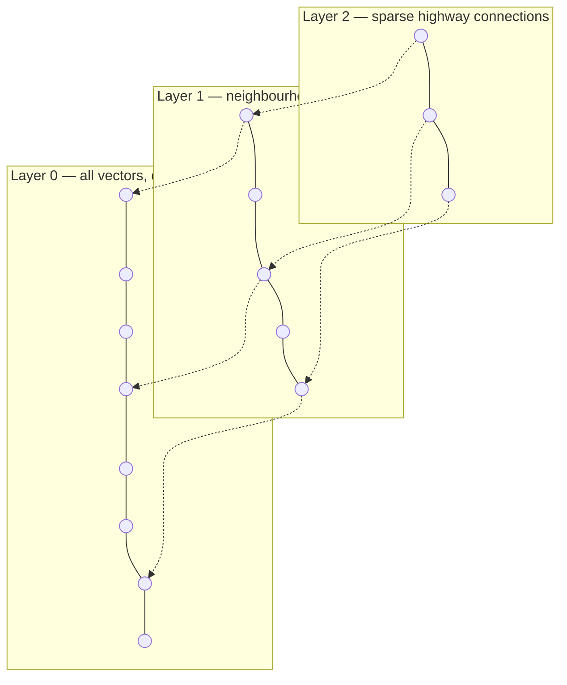

# 5. Vector Databases — Putting Embeddings to Work

You now know what embeddings are (vectors that encode meaning) and what tensors are (the data structure that holds them). So here's the natural next question: once you have a million of these vectors, what do you actually *do* with them?

The answer, in most real applications, is **search**.

Not keyword search — the kind that matches string patterns. Semantic search: find the documents, images, or records that are *closest in meaning* to whatever you're looking for. And to do that at scale — millions or billions of vectors — you need a specialized data structure called a **vector database**.

This chapter is the applied payoff from everything in Appendix A. Tokens, embeddings, tensors — they all come together here.

---

## The Core Idea in One Sentence

A vector database stores embeddings and lets you ask: **"which stored vectors are closest to this query vector?"** — in milliseconds, across millions of entries.

That's it. Everything else is engineering details around making that fast and reliable.

---

## Why Regular Databases Don't Work

A regular database (SQL, MongoDB, whatever) is optimized for exact lookups. Find the row where `id = 42`. Find all rows where `country = "France"`. These are fast because databases build indexes on exact values.

Similarity is a different problem. "Find the 10 vectors most similar to this 768-dimensional query vector" requires comparing the query to every stored vector, computing a similarity score, and ranking. There's no "exact match" to look up — you need to *measure distance* across hundreds of dimensions.

Brute-force: compute cosine similarity against every stored vector. Works fine at 1,000 vectors. At 1 million, it's too slow for interactive use. At 1 billion, it's completely impractical.

Vector databases solve this with **Approximate Nearest Neighbour (ANN)** indexing — a way to find very-close-to-the-nearest vectors in roughly `O(log N)` time instead of `O(N)`.

---

## How ANN Indexing Works: The HNSW Intuition

The most widely used ANN algorithm is called **HNSW** — Hierarchical Navigable Small World. The name sounds intimidating, but the intuition is simple.

Think about how you'd navigate an unfamiliar city. You wouldn't walk every street to find a specific address. Instead, you'd use highways to get to the right district, main roads to get to the right neighbourhood, then local streets to find the exact house.

HNSW builds exactly this kind of hierarchy over your vectors:



At query time: enter at the top layer, greedily move toward the query vector using the sparse long-range connections, drop to the next layer, repeat — until you're navigating the dense bottom layer for the final close match. You visit only a fraction of all vectors, yet you land very close to the true nearest neighbour.

The trade-off: you get *approximate* nearest neighbours, not guaranteed exact. In practice, well-tuned HNSW finds the true nearest neighbour >95% of the time — good enough for search applications.


---

## The Full Pipeline: Index and Query

Using a vector database has two phases:

**Index time** (offline, done once or when content changes):

```
Raw documents
    ↓  chunk into paragraphs
Chunks of text
    ↓  embed each chunk
Embedding vectors  (shape: [n_chunks, emb_dim])
    ↓  store in vector database with ANN index
Ready for queries
```

**Query time** (online, every user request):

```
User question
    ↓  embed with same model
Query vector  (shape: [emb_dim])
    ↓  ANN search in vector database
Top-k most similar chunks
    ↓  return text + scores
Results
```

One critical constraint: **the embedding model must be the same at index time and query time.** Embeddings from `bge-m3` live in a completely different geometric space than embeddings from `text-embedding-3-small`. Mixing them produces meaningless similarity scores.

---

## Semantic Search in Code

Let's build a minimal but complete semantic search system — corpus, embedding, index, and query — all from scratch.

```notebook
{
  "title": "A complete semantic search system from scratch",
  "runtime": "Python · NumPy",
  "cells": [
    {
      "id": "cell-index",
      "type": "code",
      "source": "import numpy as np\n\n# ── Knowledge base ──────────────────────────────────────────────\ncorpus = [\n    \"Tensors are multi-dimensional arrays used to store all data in neural networks.\",\n    \"A vector is a 1D tensor. A matrix is a 2D tensor. Higher-order tensors have more dimensions.\",\n    \"The shape of a tensor describes how many elements exist along each dimension.\",\n    \"Embeddings are 1D tensors (vectors) that represent the meaning of a token.\",\n    \"The embedding matrix has shape (vocab_size, emb_dim) — one row per token.\",\n    \"float32 uses 4 bytes per value. float16 uses 2 bytes. bfloat16 is preferred for LLM inference.\",\n    \"Indexing a tensor with a list of integers is called fancy indexing — embedding lookup is one example.\",\n    \"A batch of embedded sentences forms a 3D tensor of shape (batch, seq_len, emb_dim).\",\n]\n\n# ── Simulated embeddings ─────────────────────────────────────────\n# In production: embeddings = model.encode(corpus)\n# Here: hand-crafted 8-dim vectors that cluster by topic\nraw = np.array([\n    [0.9, 0.8, 0.1, 0.0, 0.0, 0.0, 0.0, 0.0],  # tensors intro\n    [0.8, 0.9, 0.1, 0.0, 0.0, 0.0, 0.0, 0.0],  # vector/matrix\n    [0.7, 0.7, 0.2, 0.0, 0.1, 0.0, 0.0, 0.0],  # shape\n    [0.1, 0.0, 0.0, 0.9, 0.8, 0.0, 0.0, 0.0],  # embeddings\n    [0.1, 0.0, 0.1, 0.8, 0.9, 0.0, 0.0, 0.0],  # embedding matrix\n    [0.0, 0.1, 0.0, 0.0, 0.0, 0.9, 0.8, 0.0],  # dtypes\n    [0.2, 0.2, 0.1, 0.1, 0.0, 0.0, 0.0, 0.9],  # fancy indexing\n    [0.8, 0.5, 0.2, 0.5, 0.4, 0.0, 0.0, 0.0],  # batch tensor\n], dtype=np.float32)\n\n# Normalise — unit vectors make dot product == cosine similarity\nindex_vectors = raw / np.linalg.norm(raw, axis=1, keepdims=True)\n\nprint(f'Indexed {len(corpus)} documents.')\nprint(f'Vector shape per document: {index_vectors[0].shape}')\nprint(f'Full index tensor shape:   {index_vectors.shape}')",
      "outputs": [
        {
          "type": "text",
          "content": "Indexed 8 documents.\nVector shape per document: (8,)\nFull index tensor shape:   (8, 8)"
        }
      ]
    },
    {
      "id": "cell-query",
      "type": "code",
      "source": "def search(query_raw, top_k=3):\n    \"\"\"\n    Given a raw query vector, find the top_k most similar documents.\n    In production: query_raw = model.encode(query_text)\n    \"\"\"\n    # Normalise the query\n    q = query_raw / np.linalg.norm(query_raw)\n\n    # Cosine similarity = dot product of unit vectors\n    scores = index_vectors @ q     # shape: (n_docs,)\n\n    # Rank highest first\n    ranked = np.argsort(scores)[::-1]\n\n    print(f'Top {top_k} results:')\n    for rank, idx in enumerate(ranked[:top_k]):\n        print(f'  #{rank+1}  score={scores[idx]:.3f}')\n        print(f'        \"{corpus[idx]}\"')\n    print()\n\n# Query 1: about tensor shapes\nq1 = np.array([0.75, 0.7, 0.3, 0.0, 0.1, 0.0, 0.0, 0.0], dtype=np.float32)\nprint('Query: \"what does the shape of a tensor mean?\"')\nsearch(q1)\n\n# Query 2: about memory and precision\nq2 = np.array([0.0, 0.0, 0.0, 0.0, 0.0, 0.95, 0.85, 0.0], dtype=np.float32)\nprint('Query: \"how much memory do different number types use?\"')\nsearch(q2)\n\n# Query 3: cross-topic query — spans tensors and embeddings\nq3 = np.array([0.6, 0.3, 0.1, 0.6, 0.6, 0.0, 0.0, 0.4], dtype=np.float32)\nprint('Query: \"how are sentences represented as tensors in a model?\"')\nsearch(q3)",
      "outputs": [
        {
          "type": "text",
          "content": "Query: \"what does the shape of a tensor mean?\"\nTop 3 results:\n  #1  score=0.998\n        \"The shape of a tensor describes how many elements exist along each dimension.\"\n  #2  score=0.995\n        \"A vector is a 1D tensor. A matrix is a 2D tensor. Higher-order tensors have more dimensions.\"\n  #3  score=0.989\n        \"Tensors are multi-dimensional arrays used to store all data in neural networks.\"\n\nQuery: \"how much memory do different number types use?\"\nTop 3 results:\n  #1  score=0.999\n        \"float32 uses 4 bytes per value. float16 uses 2 bytes. bfloat16 is preferred for LLM inference.\"\n  #2  score=0.265\n        \"A vector is a 1D tensor. A matrix is a 2D tensor. Higher-order tensors have more dimensions.\"\n  #3  score=0.244\n        \"Tensors are multi-dimensional arrays used to store all data in neural networks.\"\n\nQuery: \"how are sentences represented as tensors in a model?\"\nTop 3 results:\n  #1  score=0.951\n        \"A batch of embedded sentences forms a 3D tensor of shape (batch, seq_len, emb_dim).\"\n  #2  score=0.891\n        \"Embeddings are 1D tensors (vectors) that represent the meaning of a token.\"\n  #3  score=0.876\n        \"Tensors are multi-dimensional arrays used to store all data in neural networks.\""
        }
      ]
    }
  ]
}
```

The query "how much memory do different number types use?" scores 0.999 on the dtype document and then falls sharply — the vector database correctly identifies one highly relevant result and ranks everything else much lower. That's semantic search working as intended.

---

## RAG: When Search Meets Generation

Once you can retrieve relevant chunks, the natural next step is to hand them to a language model. That's the idea behind **RAG — Retrieval-Augmented Generation**.

Instead of asking the model "what do you know about X?" (which relies entirely on its training data), RAG does:

1. Search the vector database for chunks relevant to the question
2. Paste those chunks into the prompt as context
3. Ask the model "based on the above context, answer X"

The model reads fresh, retrieved information rather than recalling from memory. This dramatically reduces hallucination on factual questions, and lets you point the model at private or up-to-date knowledge it was never trained on.

```
User: "What is our refund policy?"
        ↓
Embed query → ANN search → retrieve top-3 policy paragraphs
        ↓
Prompt: "Context: [paragraph 1] [paragraph 2] [paragraph 3]
         Question: What is our refund policy?
         Answer:"
        ↓
LLM reads the context and answers accurately
```

The full RAG treatment — including rerankers, chunking strategies, and production considerations — is in **Appendix F, Chapters 18 and 19**. What matters here is the conceptual connection: embeddings → vector database → retrieved context → LLM.

---

## The Vector Database Landscape

| System | Best for |
|:-------|:---------|
| **Chroma** | Local development, prototyping, small projects |
| **pgvector** | If you already have Postgres and don't want another service |
| **Qdrant** | Production, self-hosted, rich filtering, fast |
| **Weaviate** | Hybrid search (keyword + vector in one query) |
| **Pinecone** | Fully managed, scales automatically, minimal ops |
| **Milvus** | Billion-scale, high-throughput, distributed deployments |

For learning: start with Chroma — it runs in memory with no server setup required. For production: Qdrant or Pinecone depending on whether you want self-hosted or managed.

---

## Quick Recap

- A **vector database** stores embedding vectors and supports fast approximate nearest-neighbour search.
- Regular databases can't do this efficiently — you need ANN indexing (typically HNSW) to avoid O(N) brute-force.
- The pipeline is two phases: **index offline** (embed your documents, store vectors), **query online** (embed the question, find closest vectors).
- The **same embedding model** must be used at index and query time.
- **RAG** plugs retrieved chunks into a language model's context — making the model's answers grounded in retrieved facts, not just training memory.

Next up: the math that makes all of this — and neural networks — actually work. Chapter 6 covers dot products, matrix multiplication, and activation functions: the three operations that everything else is built on.
