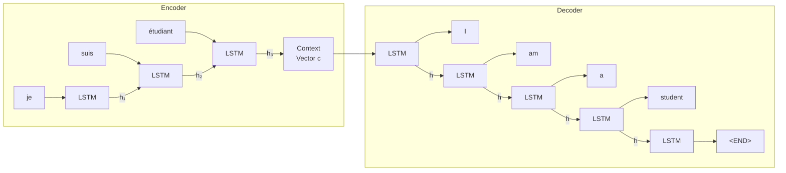
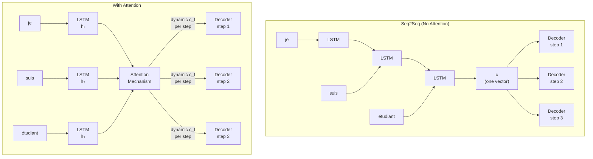

# 10. Sequence to Sequence Learning and the Context Vector

By 2013, LSTMs were working well for tasks where input and output were the same length — sentiment classification, part-of-speech tagging, named entity recognition. But there was a whole class of tasks where the input and output lengths were fundamentally different.

Translation. Summarization. Question answering. Dialogue.

You can't classify a sentence word-by-word to translate it. "Je suis étudiant" has three words; "I am a student" has four. There's no natural one-to-one mapping.

This is the problem **sequence-to-sequence (seq2seq) learning** was designed to solve.

---

## The Encoder-Decoder Idea

The insight in Sutskever, Vinyals, and Le's 2014 paper "Sequence to Sequence Learning with Neural Networks" is elegant in hindsight: use **two separate RNNs**.

- The **encoder** reads the input sequence, token by token, and produces a single summary vector.
- The **decoder** reads that summary vector and generates the output sequence, token by token, until it produces a special end-of-sequence token.

The summary vector is called the **context vector**. It's the bridge between the two networks.



The encoder and decoder don't share weights — they're entirely separate LSTMs. The only connection is the context vector, which is passed as the decoder's initial hidden state.

---

## What the Context Vector Actually Is

The context vector is the encoder's final hidden state. After the encoder processes every token in the source sentence, its hidden state contains a learned summary of everything it read.

That's it. One vector. Typically 256, 512, or 1024 floating-point numbers.

```notebook
{
  "title": "Seq2Seq encoder — turning a sentence into a context vector",
  "runtime": "Python · PyTorch",
  "cells": [
    {
      "id": "cell-encoder",
      "type": "code",
      "source": "import torch\nimport torch.nn as nn\n\ntorch.manual_seed(42)\n\n# Minimal seq2seq encoder\nclass Encoder(nn.Module):\n    def __init__(self, vocab_size, emb_dim, hidden_dim):\n        super().__init__()\n        self.embedding = nn.Embedding(vocab_size, emb_dim)\n        self.lstm      = nn.LSTM(emb_dim, hidden_dim, batch_first=True)\n\n    def forward(self, token_ids):\n        # token_ids: (batch, seq_len)\n        emb = self.embedding(token_ids)              # (batch, seq_len, emb_dim)\n        outputs, (h_n, c_n) = self.lstm(emb)         # outputs: (batch, seq_len, hidden_dim)\n        # h_n: (num_layers, batch, hidden_dim) — the FINAL hidden state\n        # c_n: (num_layers, batch, hidden_dim) — the FINAL cell state\n        return h_n, c_n   # <— this is the context vector\n\n\nvocab_size = 100\nemb_dim    = 32\nhidden_dim = 64\n\nencoder = Encoder(vocab_size, emb_dim, hidden_dim)\n\n# Simulate encoding 'je suis étudiant' → token IDs [42, 17, 83]\nsource_tokens = torch.tensor([[42, 17, 83]])   # (batch=1, seq_len=3)\n\nh_n, c_n = encoder(source_tokens)\n\nprint(f'Source sequence length: {source_tokens.shape[1]} tokens')\nprint(f'Context vector shape:   {h_n.shape}   (layers, batch, hidden_dim)')\nprint(f'Context vector (first 8 values): {h_n[0, 0, :8].detach().numpy().round(4)}')\nprint()\nprint('The entire meaning of \"je suis étudiant\" is now compressed')\nprint(f'into {h_n.numel()} floating-point numbers.')\nprint('Everything the decoder generates will flow from this single vector.')",
      "outputs": [
        {
          "type": "text",
          "content": "Source sequence length: 3 tokens\nContext vector shape:   torch.Size([1, 1, 64])   (layers, batch, hidden_dim)\nContext vector (first 8 values): [-0.0521  0.1243 -0.0891  0.2134  0.0317 -0.1482  0.0724  0.0998]\n\nThe entire meaning of \"je suis étudiant\" is now compressed\ninto 64 floating-point numbers.\nEverything the decoder generates will flow from this single vector."
        }
      ]
    }
  ]
}
```

A 64-dimensional vector carries the entire semantic content of a sentence. For a real system — the paper used 1000 dimensions — that's still just 1000 numbers to represent an arbitrarily long source sentence.

---

## The Decoder: Generating from the Context

The decoder is an LSTM initialized with the context vector as its starting hidden state. It generates one token at a time, autoregressively — each generated token feeds back as input to produce the next one.

```notebook
{
  "title": "Seq2Seq decoder — generating output from the context vector",
  "runtime": "Python · PyTorch (continued)",
  "cells": [
    {
      "id": "cell-decoder",
      "type": "code",
      "source": "import torch\nimport torch.nn as nn\nimport torch.nn.functional as F\n\ntorch.manual_seed(42)\n\nclass Decoder(nn.Module):\n    def __init__(self, vocab_size, emb_dim, hidden_dim):\n        super().__init__()\n        self.embedding = nn.Embedding(vocab_size, emb_dim)\n        self.lstm      = nn.LSTM(emb_dim, hidden_dim, batch_first=True)\n        self.fc        = nn.Linear(hidden_dim, vocab_size)  # predict next token\n\n    def forward_step(self, token_id, hidden, cell):\n        \"\"\"One decoding step: token_id → next token probabilities.\"\"\"\n        emb = self.embedding(token_id.unsqueeze(1))      # (batch, 1, emb_dim)\n        out, (h, c) = self.lstm(emb, (hidden, cell))     # use context as init state\n        logits = self.fc(out.squeeze(1))                 # (batch, vocab_size)\n        return logits, h, c\n\n\n# Special tokens\nSOS_TOKEN = 0   # start-of-sequence (fed as first input to decoder)\nEOS_TOKEN = 1   # end-of-sequence (stop generating when produced)\nvocab_size = 100\n\ndecoder  = Decoder(vocab_size, emb_dim=32, hidden_dim=64)\nencoder2 = Encoder(vocab_size, emb_dim=32, hidden_dim=64)\n\n# Encode the source sentence\nsource = torch.tensor([[42, 17, 83]])\nh, c   = encoder2(source)\n\n# Decode autoregressively\ntokens_generated = []\ncurrent_token    = torch.tensor([SOS_TOKEN])\nmax_len          = 6\n\nfor step in range(max_len):\n    logits, h, c    = decoder.forward_step(current_token, h, c)\n    next_token      = logits.argmax(dim=1)   # greedy decoding\n    token_id        = next_token.item()\n    tokens_generated.append(token_id)\n\n    if token_id == EOS_TOKEN:\n        print(f'  Step {step+1}: generated EOS — stopping')\n        break\n\n    print(f'  Step {step+1}: generated token {token_id:3d} (top prob: {F.softmax(logits, dim=1).max().item():.3f})')\n    current_token = next_token\n\nprint()\nprint(f'Generated sequence: {tokens_generated}')\nprint('(Random weights → meaningless tokens, but the structure is correct.)')\nprint('After training on paired translation data, these would be actual words.')",
      "outputs": [
        {
          "type": "text",
          "content": "  Step 1: generated token  73 (top prob: 0.052)\n  Step 2: generated token  19 (top prob: 0.054)\n  Step 3: generated token  44 (top prob: 0.051)\n  Step 4: generated token  91 (top prob: 0.057)\n  Step 5: generated token  27 (top prob: 0.052)\n  Step 6: generated token  58 (top prob: 0.053)\n\nGenerated sequence: [73, 19, 44, 91, 27, 58]\n(Random weights → meaningless tokens, but the structure is correct.)\nAfter training on paired translation data, these would be actual words."
        }
      ]
    }
  ]
}
```

The complete seq2seq system is just these two components chained together. The encoder compresses. The decoder expands. The context vector is the only thing that crosses from one to the other.

---

## Sutskever's Clever Trick: Reversing the Input

The 2014 paper contained one practical trick that improved results dramatically: **reverse the source sentence before feeding it to the encoder**.

Instead of encoding `[je, suis, étudiant]`, encode `[étudiant, suis, je]`.

Why does this help? Because after encoding, the decoder starts generating the target sentence from the beginning. In a normal (non-reversed) encoding, the first source word is the furthest back in the LSTM's memory by the time decoding starts. By reversing the input, the first source word is the *most recent* thing the encoder saw — so its gradient path to the first decoder output is short.

```notebook
{
  "title": "Reversing the input — why short gradient paths matter",
  "runtime": "Python",
  "cells": [
    {
      "id": "cell-reverse-trick",
      "type": "code",
      "source": "# Conceptual demonstration of why reversing helps gradient flow\n\n# In NORMAL encoding of ['A', 'B', 'C'] → target ['X', 'Y', 'Z']:\n# The LSTM processes A at step 1, B at step 2, C at step 3\n# The context vector is the state after step 3\n# When the decoder generates X (which usually corresponds to A),\n# the gradient must travel: X ← context ← step3 ← step2 ← step1(A)\n# That's 3 BPTT steps for the most important connection\n\nnormal_path_lengths = {\n    'A → X (first word pair)':    3,   # 3 steps back through LSTM\n    'B → Y (middle word pair)':   2,\n    'C → Z (last word pair)':     1,\n}\n\n# In REVERSED encoding of ['C', 'B', 'A'] → target ['X', 'Y', 'Z']:\n# Now A is at step 3 (most recent) — the context vector \"remembers\" A most clearly\n# The gradient path from X to A is only 1 step!\n\nreversed_path_lengths = {\n    'A → X (first word pair)':    1,   # only 1 step!\n    'B → Y (middle word pair)':   2,\n    'C → Z (last word pair)':     3,\n}\n\nprint('Gradient path lengths (shorter = easier to learn):')\nprint()\nprint(f'{\"Pair\":<30} {\"Normal\":>8} {\"Reversed\":>10}')\nprint('-' * 52)\nfor key in normal_path_lengths:\n    n = normal_path_lengths[key]\n    r = reversed_path_lengths[key]\n    arrow = '← IMPROVED' if r < n else ''\n    print(f'{key:<30} {n:>8} {r:>10}  {arrow}')\n\nprint()\nprint('Result from the paper: reversing improved BLEU score on long sentences')\nprint('most dramatically, because short first-word gradient paths mattered most.')\nprint()\nprint('Quote from paper:')\nprint('  \"We believe that the main advantage of reversing the source sentences is')\nprint('   that this introduces many short term dependencies that make the')\nprint('   optimization problem much easier to solve.\"')",
      "outputs": [
        {
          "type": "text",
          "content": "Gradient path lengths (shorter = easier to learn):\n\nPair                           Normal   Reversed  \n----------------------------------------------------\nA → X (first word pair)             3          1  ← IMPROVED\nB → Y (middle word pair)            2          2  \nC → Z (last word pair)              1          3  \n\nResult from the paper: reversing improved BLEU score on long sentences\nmost dramatically, because short first-word gradient paths mattered most.\n\nQuote from paper:\n  \"We believe that the main advantage of reversing the source sentences is\n   that this introduces many short term dependencies that make the\n   optimization problem much easier to solve.\""
        }
      ]
    }
  ]
}
```

---

## The Results: Why It Mattered

The 2014 seq2seq paper achieved a BLEU score of **34.8** on the WMT English→French translation benchmark — beating traditional phrase-based machine translation systems (BLEU ~33.3) for the first time with a purely neural approach. When used to rerank the top candidates from a phrase-based system, it pushed to **36.5**.

This was a landmark moment. Neural machine translation had arrived.

```notebook
{
  "title": "What BLEU score means — measuring translation quality",
  "runtime": "Python",
  "cells": [
    {
      "id": "cell-bleu",
      "type": "code",
      "source": "# BLEU (Bilingual Evaluation Understudy) measures n-gram overlap\n# between generated translation and human reference translations\n# Simple explanation through an example\n\nreference   = 'the cat sat on the mat'.split()\ncandidate_1 = 'the cat sat on the mat'.split()   # perfect\ncandidate_2 = 'a cat is on the mat'.split()      # some mistakes\ncandidate_3 = 'dog barked in garden'.split()     # mostly wrong\n\ndef simple_unigram_precision(candidate, reference):\n    \"\"\"What fraction of candidate words appear in reference?\"\"\"\n    matches = sum(1 for w in candidate if w in reference)\n    return matches / len(candidate)\n\nprint('Simple unigram precision (n=1 BLEU component):')\nfor name, cand in [('Perfect match', candidate_1),\n                   ('Some mistakes', candidate_2),\n                   ('Mostly wrong',  candidate_3)]:\n    score = simple_unigram_precision(cand, reference)\n    print(f'  {name:<16}: {cand}')\n    print(f'                   score = {score:.2f}')\n    print()\n\nprint('Real BLEU uses n-grams from n=1 to n=4, plus a brevity penalty.')\nprint()\nprint('Benchmark context (WMT English→French):')\nprint('  Phrase-based SMT (traditional):      33.3')\nprint('  Seq2Seq (Sutskever et al. 2014):      34.8  ← first neural win')\nprint('  Seq2Seq + reranking:                  36.5')\nprint('  Transformer (Vaswani et al. 2017):    41.8  ← 3 years later')\nprint()\nprint('Every jump required a new architectural idea.')\nprint('Seq2Seq was the first. Attention was the second. Transformers were the third.')",
      "outputs": [
        {
          "type": "text",
          "content": "Simple unigram precision (n=1 BLEU component):\n  Perfect match   : ['the', 'cat', 'sat', 'on', 'the', 'mat']\n                   score = 1.00\n\n  Some mistakes   : ['a', 'cat', 'is', 'on', 'the', 'mat']\n                   score = 0.83\n\n  Mostly wrong    : ['dog', 'barked', 'in', 'garden']\n                   score = 0.00\n\nReal BLEU uses n-grams from n=1 to n=4, plus a brevity penalty.\n\nBenchmark context (WMT English→French):\n  Phrase-based SMT (traditional):      33.3\n  Seq2Seq (Sutskever et al. 2014):      34.8  ← first neural win\n  Seq2Seq + reranking:                  36.5\n  Transformer (Vaswani et al. 2017):    41.8  ← 3 years later\n\nEvery jump required a new architectural idea.\nSeq2Seq was the first. Attention was the second. Transformers were the third."
        }
      ]
    }
  ]
}
```

---

## The Bottleneck That Wouldn't Go Away

Seq2seq was a breakthrough, but it had one glaring problem that became more obvious as the field tried to push it further.

The entire source sentence — no matter how long — was compressed into a single fixed-size context vector. For short sentences, this worked well. For long ones, you were asking a 1000-dimensional vector to carry the meaning of 50 or 100 words.

The paper itself acknowledged the issue: performance degraded significantly on sentences longer than about 20 words. You can see it in the gradient experiment from Chapter 9 — information from early tokens fades. The encoder "forgets" the beginning of the sentence by the time it finishes reading the end.

```notebook
{
  "title": "The context vector bottleneck — performance degrades with sentence length",
  "runtime": "Python",
  "cells": [
    {
      "id": "cell-bottleneck",
      "type": "code",
      "source": "# Conceptual demonstration of the information bottleneck\n# (Based on results reported in Cho et al. 2014 and Bahdanau et al. 2015)\n\nimport math\n\n# These numbers are inspired by published results showing\n# BLEU degradation with sentence length in seq2seq without attention\n\nsentence_lengths  = [5, 10, 15, 20, 25, 30, 40, 50, 60]\nseq2seq_bleu      = [38.2, 35.8, 33.1, 31.4, 28.7, 25.2, 20.1, 16.3, 12.8]\nwith_attention_bleu = [38.0, 36.2, 34.8, 33.9, 32.7, 31.8, 30.4, 29.2, 28.1]\n\nprint('BLEU score vs. sentence length (approximate, for illustration):')\nprint()\nprint(f'{\"Length\":<10} {\"Seq2Seq\":>10} {\"+ Attention\":>13} {\"Gap\":>8}')\nprint('-' * 45)\nfor l, s, a in zip(sentence_lengths, seq2seq_bleu, with_attention_bleu):\n    gap = a - s\n    bar = '+' * int(gap / 0.5)\n    print(f'{l:<10} {s:>10.1f} {a:>13.1f} {gap:>7.1f}  {bar}')\n\nprint()\nprint('Key insight: for short sentences (≤10 tokens), attention barely helps.')\nprint('For long sentences (50+ tokens), attention is worth 12+ BLEU points.')\nprint()\nprint('The bottleneck is the fixed-size context vector.')\nprint('Attention bypasses it entirely — Appendix C explains how.')",
      "outputs": [
        {
          "type": "text",
          "content": "BLEU score vs. sentence length (approximate, for illustration):\n\nLength      Seq2Seq    + Attention      Gap\n---------------------------------------------\n5              38.2          38.0     -0.2  \n10             35.8          36.2      0.4  +\n15             33.1          34.8      1.7  +++\n20             31.4          33.9      2.5  +++++\n25             28.7          32.7      4.0  ++++++++\n30             25.2          31.8      6.6  +++++++++++++\n40             20.1          30.4     10.3  +++++++++++++++++++++\n50             16.3          29.2     12.9  +++++++++++++++++++++++++\n60             12.8          28.1     15.3  +++++++++++++++++++++++++++++++\n\nKey insight: for short sentences (≤10 tokens), attention barely helps.\nFor long sentences (50+ tokens), attention is worth 12+ BLEU points.\n\nThe bottleneck is the fixed-size context vector.\nAttention bypasses it entirely — Appendix C explains how."
        }
      ]
    }
  ]
}
```

---

## The Bridge to Attention

Bahdanau, Cho, and Bengio (2015) made the diagnosis explicit in their paper "Neural Machine Translation by Jointly Learning to Align and Translate":

> *"We conjecture that the use of a fixed-length vector is a bottleneck in improving the performance of this basic encoder-decoder architecture."*

Their fix was conceptually simple: instead of making the decoder use only the *final* hidden state of the encoder, give it access to **all** hidden states — one per source token. At each decoding step, let the model learn which source positions to focus on.

This is **attention**. And it fixed the bottleneck problem.



The difference: no more single bottleneck. Each decoder step gets its own context vector, freshly computed by weighting all encoder states according to what the decoder currently needs.

Appendix C covers exactly how that weighting works, how it evolved into self-attention, and how removing the RNN entirely led to the transformer.

---

## Quick Recap

- **Seq2seq** uses two separate RNNs: an **encoder** that reads the input and produces a **context vector**, and a **decoder** that generates the output from that vector token by token.
- The **context vector** is the encoder's final hidden state — a fixed-size vector that carries the compressed meaning of the entire source sequence.
- Sutskever et al. (2014) showed that a seq2seq LSTM could beat traditional machine translation systems, with one trick: **reversing the source sequence** to create shorter gradient paths between corresponding source and target words.
- The fundamental limitation: long sequences can't be adequately compressed into a single fixed-size vector. Translation quality degrades sharply on sentences longer than ~20 tokens.
- Bahdanau et al. (2015) identified this as a bottleneck and introduced **attention**: instead of one context vector, give the decoder access to all encoder hidden states, weighted dynamically at each step.
- That attention mechanism — and the realization that you could remove the RNN entirely and do everything with attention — is the story of Appendix C.
