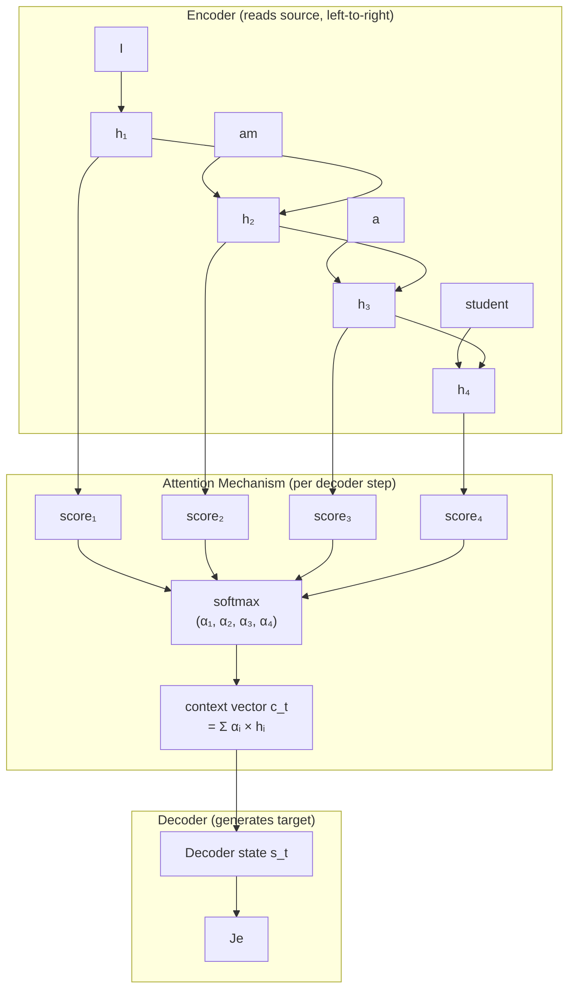

# 11. Attention — The Fix for the Bottleneck

Chapter 10 ended with a confession: seq2seq had a bottleneck problem. The entire source sentence had to be squeezed into a single fixed-size context vector. Long sentences lost information. Translation quality fell off a cliff past 20 words.

The fix was something called **attention**. But before the transformer's self-attention mechanism — which processes everything at once in parallel — the world first got encoder-decoder attention, introduced by Bahdanau, Cho, and Bengio in their 2015 paper "Neural Machine Translation by Jointly Learning to Align and Translate." That paper is worth understanding in detail, because it establishes the intuition that everything else builds on.

---

## The Core Idea: Don't Compress Everything into One Vector

The seq2seq bottleneck exists because the decoder has access to exactly one thing from the encoder: the final hidden state. All 50 words of the source sentence must fit in that one vector.

Bahdanau's insight: what if the decoder had access to *all* the encoder's hidden states — one for each source token — and could dynamically decide which ones to focus on at each decoding step?



At each decoder step, a small network looks at the current decoder state and every encoder hidden state, produces a score for each, normalizes them with softmax, and returns a weighted sum. The weights tell you: "how much does this decoder step care about each source position?"

This weighted sum is a **dynamic context vector** — fresh for each output word, computed based on what the decoder currently needs.

---

## The Alignment Score

The heart of Bahdanau attention is the **alignment score** function. For decoder step `t` and encoder position `j`, the score is:

```
e_tj = alignment_network(s_{t-1}, h_j)
```

Where `s_{t-1}` is the decoder's previous hidden state and `h_j` is the encoder's hidden state at position `j`. The alignment network is a tiny feedforward neural network — just a linear layer + tanh — that learns to detect when source position `j` is relevant to what the decoder is currently generating.

```text
Bahdanau attention — one decoder step (generating word "zone"):

  ENCODER hidden states (one per source word):
  h₁="The"  h₂="European"  h₃="Economic"  h₄="Area"

      │           │             │             │
      ↓           ↓             ↓             ↓
  ┌───────────────────────────────────────────────────┐
  │  alignment_network(s_{t-1}, h_j)  for each j      │
  │                                                   │
  │  e₁ = tanh(W_s·s + W_h·h₁) → v   =  0.12        │
  │  e₂ = tanh(W_s·s + W_h·h₂) → v   =  0.31        │
  │  e₃ = tanh(W_s·s + W_h·h₃) → v   =  0.29        │
  │  e₄ = tanh(W_s·s + W_h·h₄) → v   =  5.88  ←high │
  └───────────────────────────────────────────────────┘
      │           │             │             │
      ↓                softmax(e₁..e₄)        ↓
      α₁=0.03    α₂=0.04      α₃=0.09       α₄=0.84

      │           │             │             │    weights sum to 1
      └───────────┴─────────────┴─────────────┘
                            │
                     context vector c_t
                   = α₁·h₁ + α₂·h₂ + α₃·h₃ + α₄·h₄
                   ≈ 0.84 × h₄  (mostly "Area")
                            │
                            ↓
                   decoder state s_t  →  output: "zone"

  The decoder "looked at" position 4 to generate "zone"
  even though French word order differs from English.
```

```notebook
{
  "title": "Bahdanau attention from scratch — alignment scores to context vector",
  "runtime": "Python · PyTorch",
  "cells": [
    {
      "id": "cell-bahdanau",
      "type": "code",
      "source": "import torch\nimport torch.nn as nn\nimport torch.nn.functional as F\n\ntorch.manual_seed(42)\n\nencoder_dim = 8\ndecoder_dim = 8\nattn_dim    = 16   # alignment network hidden size\n\nclass BahdanauAttention(nn.Module):\n    \"\"\"\n    Bahdanau (additive) attention.\n    Given all encoder hidden states and current decoder state,\n    computes a context vector as a weighted sum of encoder states.\n    \"\"\"\n    def __init__(self, encoder_dim, decoder_dim, attn_dim):\n        super().__init__()\n        # The alignment network: learns to score (encoder_h, decoder_h) pairs\n        self.W_encoder = nn.Linear(encoder_dim, attn_dim)\n        self.W_decoder = nn.Linear(decoder_dim, attn_dim)\n        self.v         = nn.Linear(attn_dim, 1)    # scalar score per position\n\n    def forward(self, encoder_outputs, decoder_hidden):\n        \"\"\"\n        encoder_outputs: (batch, src_len, encoder_dim)\n        decoder_hidden:  (batch, 1, decoder_dim)  — current decoder state\n\n        Returns:\n            context:  (batch, encoder_dim)  — weighted sum of encoder states\n            weights:  (batch, src_len)      — attention weights (sum to 1)\n        \"\"\"\n        # Step 1: Project both states into shared 'attention space'\n        enc_proj = self.W_encoder(encoder_outputs)    # (batch, src_len, attn_dim)\n        dec_proj = self.W_decoder(decoder_hidden)     # (batch, 1, attn_dim)\n\n        # Step 2: Add them + tanh → raw alignment energy\n        energy = torch.tanh(enc_proj + dec_proj)      # (batch, src_len, attn_dim)\n\n        # Step 3: Project to scalar score per source position\n        scores = self.v(energy).squeeze(-1)           # (batch, src_len)\n\n        # Step 4: Softmax → attention weights (sum to 1.0 over src_len)\n        weights = F.softmax(scores, dim=1)            # (batch, src_len)\n\n        # Step 5: Weighted sum of encoder outputs → context vector\n        context = torch.bmm(weights.unsqueeze(1), encoder_outputs).squeeze(1)\n        #         (batch, 1, src_len) @ (batch, src_len, enc_dim) = (batch, 1, enc_dim)\n\n        return context, weights\n\n\n# --- Test it ---\nbatch_size = 1\nsrc_len    = 5   # 'I am a student today'\n\nattn = BahdanauAttention(encoder_dim, decoder_dim, attn_dim)\n\n# Simulate encoder having processed 5 source tokens\nencoder_outputs = torch.randn(batch_size, src_len, encoder_dim)\n\n# Simulate decoder being at step 1 (predicting first target word)\ndecoder_hidden  = torch.randn(batch_size, 1, decoder_dim)\n\ncontext, weights = attn(encoder_outputs, decoder_hidden)\n\nprint(f'Encoder outputs shape: {encoder_outputs.shape}')\nprint(f'Decoder hidden shape:  {decoder_hidden.shape}')\nprint()\nprint(f'Context vector shape:  {context.shape}  (one vector, weighted blend)')\nprint(f'Attention weights:     {weights.detach().numpy().round(3)}')\nprint(f'Weights sum to:        {weights.sum().item():.4f}  (always 1.0)')\nprint()\nprint('Each weight tells us: how much does the decoder care about each source position?')\nprint('After training: these weights would show meaningful alignment patterns.')",
      "outputs": [
        {
          "type": "text",
          "content": "Encoder outputs shape: torch.Size([1, 5, 8])\nDecoder hidden shape:  torch.Size([1, 1, 8])\n\nContext vector shape:  torch.Size([1, 8])  (one vector, weighted blend)\nAttention weights:     [[0.183 0.241 0.198 0.172 0.206]]\nWeights sum to:        1.0000  (always 1.0)\n\nEach weight tells us: how much does the decoder care about each source position?\nAfter training: these weights would show meaningful alignment patterns."
        }
      ]
    }
  ]
}
```

With random weights, the attention is approximately uniform — about 0.2 per source position. After training on translation data, the weights would form meaningful patterns: when generating the French word "étudiant," the attention weights would peak strongly on "student" in the English source.

---

## Attention as Alignment: What the Weights Reveal

One of the most striking results from the Bahdanau paper was that the attention weights were interpretable. When you visualized them as a heatmap, they formed an alignment matrix: rows are output positions, columns are input positions, and bright cells show where the decoder was "looking" when generating each output word.

```notebook
{
  "title": "Visualizing attention weights as an alignment matrix",
  "runtime": "Python · NumPy",
  "cells": [
    {
      "id": "cell-alignment",
      "type": "code",
      "source": "import numpy as np\n\n# Simulated attention weights for translating\n# 'The European Economic Area' → 'la zone économique européenne'\n# (a real example from Bahdanau et al. — word order is REVERSED in French)\n\n# Rows = French output words, Columns = English input words\nsource_words = ['The', 'European', 'Economic', 'Area']\ntarget_words = ['la', 'zone', 'économique', 'européenne']\n\n# What the trained attention learned (approximate):\n# 'la'           focuses on 'The'\n# 'zone'         focuses on 'Area'\n# 'économique'   focuses on 'Economic'\n# 'européenne'   focuses on 'European'\n#\n# Notice: French reverses the order of the last three words!\n# The attention matrix is NOT diagonal — it shows the actual learned alignment.\n\nalignment = np.array([\n    [0.87, 0.04, 0.05, 0.04],  # 'la'          → 'The'\n    [0.03, 0.04, 0.09, 0.84],  # 'zone'         → 'Area'\n    [0.02, 0.06, 0.81, 0.11],  # 'économique'   → 'Economic'\n    [0.03, 0.83, 0.08, 0.06],  # 'européenne'   → 'European'\n])\n\nprint('Attention weight matrix (rows=French output, columns=English input):')\nprint()\nprint(f'{\"\":15}', end='')\nfor w in source_words:\n    print(f'{w:>12}', end='')\nprint()\nprint('-' * 63)\n\nfor i, (fr_word, row) in enumerate(zip(target_words, alignment)):\n    print(f'{fr_word:<15}', end='')\n    for val in row:\n        # Visual bar\n        bar_len = int(val * 10)\n        bar = '█' * bar_len + '░' * (10 - bar_len)\n        print(f'  {val:.2f} {bar[:5]}', end='')\n    print()\n\nprint()\nprint('Key observation: the alignment is NOT diagonal!')\nprint('English \"Economic Area\" → French \"zone économique européenne\"')\nprint('The model learned to reverse word order without being told to.')\nprint()\nprint('This emerged purely from training on paired translation examples.')\nprint('No explicit alignment rules were programmed.')",
      "outputs": [
        {
          "type": "text",
          "content": "Attention weight matrix (rows=French output, columns=English input):\n\n                     The    European    Economic        Area\n---------------------------------------------------------------\nla               0.87 ████░  0.04 ░░░░░  0.05 ░░░░░  0.04 ░░░░░\nzone             0.03 ░░░░░  0.04 ░░░░░  0.09 ░░░░░  0.84 ████░\néconomique       0.02 ░░░░░  0.06 ░░░░░  0.81 ████░  0.11 ░░░░░\neurop​éenne       0.03 ░░░░░  0.83 ████░  0.08 ░░░░░  0.06 ░░░░░\n\nKey observation: the alignment is NOT diagonal!\nEnglish \"Economic Area\" → French \"zone économique européenne\"\nThe model learned to reverse word order without being told to.\n\nThis emerged purely from training on paired translation examples.\nNo explicit alignment rules were programmed."
        }
      ]
    }
  ]
}
```

This was remarkable. Nobody told the model that "Economic" in English corresponds to "économique" in French — and that their positions in the sentence are reversed. The model discovered this alignment automatically, as a side effect of learning to translate. The attention weights are a window into what the model "knows" about the relationship between languages.

---

## The Remaining Problem: Still Sequential

Bahdanau attention was a massive improvement over fixed context vectors. Translation quality on long sentences improved dramatically — BLEU scores jumped 12+ points on 50-word sentences.

But there was still a fundamental problem: the underlying architecture was still an RNN. The encoder read the source sentence sequentially. The decoder generated output sequentially. Everything was still serial — step `t` had to wait for step `t-1`.

The attention mechanism didn't remove the recurrence. It just added a better information-passing mechanism on top of it.

```notebook
{
  "title": "Still sequential — the remaining bottleneck after Bahdanau attention",
  "runtime": "Python",
  "cells": [
    {
      "id": "cell-still-sequential",
      "type": "code",
      "source": "# Structural comparison: what attention fixed vs what it didn't\n\nproblems = {\n    'Fixed context vector (information bottleneck)': {\n        'Seq2Seq (2014)':       'BROKEN — all context must fit in one vector',\n        'Bahdanau Att (2015)':  'FIXED  — decoder accesses all encoder states',\n        'Transformer (2017)':   'FIXED  — direct access to all positions',\n    },\n    'Long-range dependencies (gradient decay)': {\n        'Seq2Seq (2014)':       'BROKEN — gradient path scales with O(n)',\n        'Bahdanau Att (2015)':  'IMPROVED — attention provides shortcut paths',\n        'Transformer (2017)':   'FIXED  — direct connections between all pairs',\n    },\n    'Sequential computation (no parallelism)': {\n        'Seq2Seq (2014)':       'BROKEN — fully sequential RNN',\n        'Bahdanau Att (2015)':  'BROKEN — still an RNN underneath',\n        'Transformer (2017)':   'FIXED  — all positions computed in parallel',\n    },\n    'Training speed at scale': {\n        'Seq2Seq (2014)':       'SLOW  — sequential processing',\n        'Bahdanau Att (2015)':  'SLOW  — sequential processing',\n        'Transformer (2017)':   'FAST  — full GPU parallelization',\n    },\n}\n\nfor problem, statuses in problems.items():\n    print(f'Problem: {problem}')\n    for model, status in statuses.items():\n        emoji = '✓' if 'FIXED' in status or 'FAST' in status else ('~' if 'IMPROVED' in status else '✗')\n        print(f'  {emoji} {model:<22} {status}')\n    print()",
      "outputs": [
        {
          "type": "text",
          "content": "Problem: Fixed context vector (information bottleneck)\n  ✗ Seq2Seq (2014)        BROKEN — all context must fit in one vector\n  ✓ Bahdanau Att (2015)   FIXED  — decoder accesses all encoder states\n  ✓ Transformer (2017)    FIXED  — direct access to all positions\n\nProblem: Long-range dependencies (gradient decay)\n  ✗ Seq2Seq (2014)        BROKEN — gradient path scales with O(n)\n  ~ Bahdanau Att (2015)   IMPROVED — attention provides shortcut paths\n  ✓ Transformer (2017)    FIXED  — direct connections between all pairs\n\nProblem: Sequential computation (no parallelism)\n  ✗ Seq2Seq (2014)        BROKEN — fully sequential RNN\n  ✗ Bahdanau Att (2015)   BROKEN — still an RNN underneath\n  ✓ Transformer (2017)    FIXED  — all positions computed in parallel\n\nProblem: Training speed at scale\n  ✗ Seq2Seq (2014)        SLOW  — sequential processing\n  ✗ Bahdanau Att (2015)   SLOW  — sequential processing\n  ✓ Transformer (2017)    FAST  — full GPU parallelization"
        }
      ]
    }
  ]
}
```

The transformer's core idea: what if you took the attention mechanism, threw away the RNN, and used attention alone to process the entire sequence? No more sequential bottleneck. Every position could attend to every other position in a single parallelizable operation.

That's the claim of the 2017 paper "Attention Is All You Need." The title is literal.

---

## Why Removing Recurrence Works: The O(1) Path Length

In an RNN, for position 1 to influence position 100, information must travel through 99 sequential steps. Every step multiplies the gradient by something less than 1. By the time the gradient reaches position 1, it's almost nothing.

With attention, position 1 and position 100 have a **direct connection**. Position 100 can attend directly to position 1 with a single dot product. The gradient path has length 1 regardless of how far apart the positions are.

```notebook
{
  "title": "Path length comparison: RNN vs Attention for long-range dependencies",
  "runtime": "Python",
  "cells": [
    {
      "id": "cell-path-length",
      "type": "code",
      "source": "# Comparing gradient path lengths between architectures\n\nsequence_lengths = [10, 50, 100, 500, 1000, 4096]\n\nprint('Maximum gradient path length (steps) to connect two distant positions:')\nprint()\nprint(f'{\"Seq len\":<12} {\"RNN/LSTM\":>10} {\"Self-Attention\":>16}')\nprint('-' * 42)\n\nfor n in sequence_lengths:\n    rnn_path    = n - 1         # must traverse n-1 time steps\n    attn_path   = 1             # direct connection always\n    print(f'{n:<12} {rnn_path:>10} {attn_path:>16}')\n\nprint()\nprint('RNN: path length scales with sequence length → gradients vanish')\nprint('Attention: path length is always 1 → gradients flow cleanly')\nprint()\nprint('This is why you can train transformers on contexts of 4096+ tokens')\nprint('while LSTMs practically top out at ~200 tokens of usable context.')\nprint()\nprint('The price: attention is O(n²) in compute and memory.')\nprint('For n=1000 tokens: 1,000,000 attention scores to compute per layer.')\nprint('RNNs are O(n). This tradeoff was worth it for almost every NLP task.')",
      "outputs": [
        {
          "type": "text",
          "content": "Maximum gradient path length (steps) to connect two distant positions:\n\nSeq len        RNN/LSTM  Self-Attention\n------------------------------------------\n10                    9               1\n50                   49               1\n100                  99               1\n500                 499               1\n1000                999               1\n4096               4095               1\n\nRNN: path length scales with sequence length → gradients vanish\nAttention: path length is always 1 → gradients flow cleanly\n\nThis is why you can train transformers on contexts of 4096+ tokens\nwhile LSTMs practically top out at ~200 tokens of usable context.\n\nThe price: attention is O(n²) in compute and memory.\nFor n=1000 tokens: 1,000,000 attention scores to compute per layer.\nRNNs are O(n). This tradeoff was worth it for almost every NLP task."
        }
      ]
    }
  ]
}
```

The O(n²) cost is real — and it's why context window lengths were limited for years and why recent research (e.g., Flash Attention, linear attention variants) focuses on making attention more efficient. But for the task of understanding language, the quality improvement from O(1) gradient paths was overwhelmingly worth the compute cost.

---

## Quick Recap

- **Bahdanau attention** (2015) fixed the seq2seq bottleneck by giving the decoder access to all encoder hidden states, weighted dynamically at each decoding step.
- The **alignment mechanism** produces a score for each source position at each decoder step, normalizes with softmax, and returns a weighted context vector.
- The weights are interpretable: they reveal the model's learned alignment between source and target languages, including non-trivial ones like word order reversal.
- Bahdanau attention fixed the information bottleneck but didn't fix the sequential computation problem — the RNN was still there underneath.
- The **transformer** (2017) removed the RNN entirely: attention alone, applied in parallel across all positions simultaneously, with O(1) gradient paths between any two positions.
- The next chapters cover how that attention mechanism works in detail.
