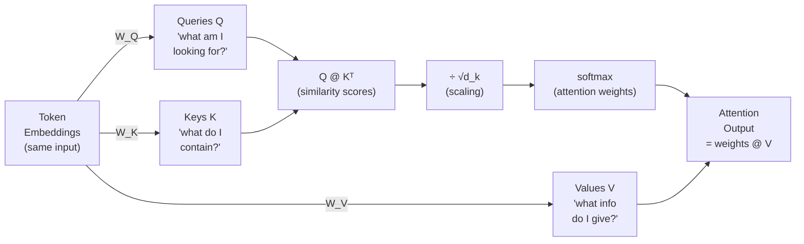
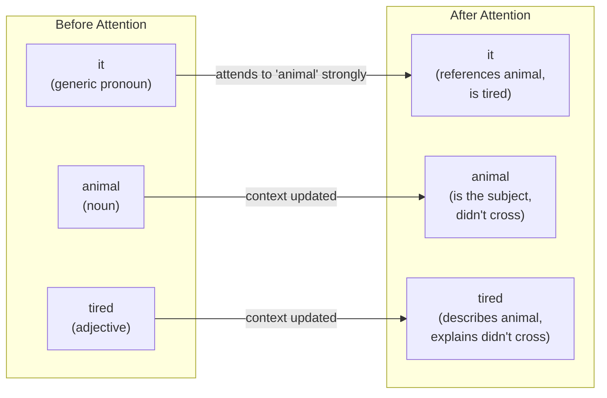

# 12. Self-Attention and Scaled Dot-Product Attention

Bahdanau attention let a decoder look at encoder hidden states. That's **cross-attention** — one sequence attending to another. The transformer takes this a step further: what if a sequence attends to *itself*?

This is **self-attention**. Every token in the sequence asks: "given where I am and what I mean, which other tokens in this same sequence are most relevant to understanding me?"

For "The animal didn't cross the street because it was too tired," the self-attention mechanism at the position of "it" should learn to attend strongly to "animal" — that's where the reference resolves. No explicit rule tells it to do this. The model learns it from data.

---

## The Query, Key, Value Framework

The transformer's attention is built on a retrieval metaphor with three components:

- **Query (Q)**: "What am I looking for?" — this is the current token asking about relevant context.
- **Key (K)**: "What do I contain?" — every token advertises what kind of information it holds.
- **Value (V)**: "What do I actually give you?" — the content a token contributes if it's selected.

The intuition comes from information retrieval. Imagine a dictionary: you have a query ("how does photosynthesis work?"), a set of keys (book titles), and values (book content). You compare your query against the keys, find the best matches, and retrieve the corresponding values.

In attention, all three are learned projections of the same input. The model learns what kinds of queries and keys create good matches.



The same input `X` produces three different views of itself — queries, keys, and values — through three separate learned weight matrices. This separation is the key design choice that makes attention expressive.

---

## Why Three Separate Matrices?

In Bahdanau's attention, the alignment function compared the decoder state to encoder states. In self-attention, every token is simultaneously a query (asking about others) and a key-value pair (being asked about by others).

You might wonder: why not use the same representation for keys and values? The paper's answer is expressiveness. Decoupling what-to-attend-to (keys vs. queries) from what-to-return (values) gives the model more degrees of freedom. A token can advertise "I'm relevant to subject-verb agreement queries" (key) while also contributing "I'm a plural noun" (value) when selected.

```notebook
{
  "title": "Q, K, V projections — three views of the same input",
  "runtime": "Python · PyTorch",
  "cells": [
    {
      "id": "cell-qkv",
      "type": "code",
      "source": "import torch\nimport torch.nn as nn\n\ntorch.manual_seed(42)\n\n# A sentence: 'the cat sat on the mat'\n# Using tiny dimensions to keep it readable\nvocab = {'the': 0, 'cat': 1, 'sat': 2, 'on': 3, 'mat': 4}\nsentence  = ['the', 'cat', 'sat']\ntoken_ids = torch.tensor([[vocab[w] for w in sentence]])   # (1, 3)\n\nd_model = 8    # embedding dimension\nd_k     = 4    # query/key/value dimension per head (can be smaller than d_model)\n\n# Token embeddings\nembedding = nn.Embedding(len(vocab), d_model)\nX = embedding(token_ids)   # (1, 3, 8) — batch, seq_len, d_model\n\n# Three separate projection matrices\nW_Q = nn.Linear(d_model, d_k, bias=False)   # query projection\nW_K = nn.Linear(d_model, d_k, bias=False)   # key projection\nW_V = nn.Linear(d_model, d_k, bias=False)   # value projection\n\n# Project X into Q, K, V\nQ = W_Q(X)   # (1, 3, d_k)\nK = W_K(X)   # (1, 3, d_k)\nV = W_V(X)   # (1, 3, d_k)\n\nprint('Input X shape:', X.shape, '  (batch=1, seq_len=3, d_model=8)')\nprint()\nprint('Projections (d_k=4):')\nprint(f'  Q (queries): {Q.shape}  — what does each token look for?')\nprint(f'  K (keys):    {K.shape}  — what does each token contain?')\nprint(f'  V (values):  {V.shape}  — what does each token contribute?')\nprint()\nprint('Note: same input X → three different representations via learned W matrices')\nprint('Q, K, V for the same token are different vectors — that is intentional')\nprint()\nfor i, word in enumerate(sentence):\n    print(f'  Token \"{word}\":')\n    print(f'    Q: {Q[0, i].detach().numpy().round(3)}')\n    print(f'    K: {K[0, i].detach().numpy().round(3)}')\n    print(f'    V: {V[0, i].detach().numpy().round(3)}')",
      "outputs": [
        {
          "type": "text",
          "content": "Input X shape: torch.Size([1, 3, 8])  (batch=1, seq_len=3, d_model=8)\n\nProjections (d_k=4):\n  Q (queries): torch.Size([1, 3, 4])  — what does each token look for?\n  K (keys):    torch.Size([1, 3, 4])  — what does each token contain?\n  V (values):  torch.Size([1, 3, 4])  — what does each token contribute?\n\nNote: same input X → three different representations via learned W matrices\nQ, K, V for the same token are different vectors — that is intentional\n\nToken \"the\":\n    Q: [-0.162  0.124 -0.031  0.089]\n    K: [ 0.073 -0.045  0.112 -0.067]\n    V: [ 0.034  0.201 -0.089  0.156]\nToken \"cat\":\n    Q: [-0.089  0.203  0.041 -0.127]\n    K: [ 0.134 -0.078  0.089  0.043]\n    V: [-0.112  0.087  0.193 -0.054]\nToken \"sat\":\n    Q: [ 0.078 -0.134  0.087 -0.043]\n    K: [-0.091  0.056 -0.078  0.134]\n    V: [ 0.167 -0.045  0.078 -0.112]"
        }
      ]
    }
  ]
}
```

---

## The Math, Drawn Out: Full Attention as Matrix Operations

Sentence: **"the cat sat"** — 3 tokens, `d_model=6`, projecting down to `d_k=4`.

### X and W_Q — the input and one weight matrix

```text
INPUT  X   shape (3, 6) — one row per token
             d0      d1      d2      d3      d4      d5
the  ┌────────┬────────┬────────┬────────┬────────┬────────┐
     │  +0.50 │  +0.86 │  −0.23 │  +1.77 │  −0.98 │  +0.95 │
     ├────────┼────────┼────────┼────────┼────────┼────────┤
cat  │  −0.10 │  −0.41 │  +0.14 │  +1.45 │  +0.76 │  +0.12 │
     ├────────┼────────┼────────┼────────┼────────┼────────┤
sat  │  +0.33 │  −0.20 │  +0.69 │  −0.76 │  +1.49 │  −0.21 │
     └────────┴────────┴────────┴────────┴────────┴────────┘

W_Q   shape (6, 4) — maps d_model=6 → d_k=4
           q0      q1      q2      q3
d0   ┌────────┬────────┬────────┬────────┐
     │  +0.31 │  −0.64 │  +0.64 │  −0.14 │
     ├────────┼────────┼────────┼────────┤
d1   │  −0.76 │  −0.49 │  +0.15 │  −0.07 │
     ├────────┼────────┼────────┼────────┤
d2   │  +0.40 │  −1.71 │  +0.31 │  +0.87 │
     ├────────┼────────┼────────┼────────┤
d3   │  −0.08 │  −0.85 │  +0.15 │  +0.62 │
     ├────────┼────────┼────────┼────────┤
d4   │  +0.27 │  +0.11 │  −0.23 │  −0.07 │
     ├────────┼────────┼────────┼────────┤
d5   │  −0.18 │  +0.19 │  +0.12 │  +0.05 │
     └────────┴────────┴────────┴────────┘
```

### Q = X @ W_Q — one matrix multiply gives all queries

Every row of X dot-products with every column of W_Q simultaneously:

```text
Q = X @ W_Q   shape (3, 4) — one query vector per token
              q0       q1       q2       q3
the  ┌─────────┬─────────┬─────────┬─────────┐
     │  −1.847 │  −1.817 │  +0.406 │  +0.970 │
     ├─────────┼─────────┼─────────┼─────────┤
cat  │  −0.223 │  −0.886 │  +0.093 │  +0.812 │
     ├─────────┼─────────┼─────────┼─────────┤
sat  │  +0.431 │  −0.044 │  +0.189 │  −0.743 │
     └─────────┴─────────┴─────────┴─────────┘

Verify "the" query[q0] by hand:
  0.50×0.31 + 0.86×(−0.76) + (−0.23)×0.40 + 1.77×(−0.08) + (−0.98)×0.27 + 0.95×(−0.18)
  = 0.155 − 0.654 − 0.092 − 0.142 − 0.265 − 0.171  =  −1.847  ✓

K = X @ W_K  and  V = X @ W_V  are computed identically.
All three Q, K, V have shape (3, 4).
```

### S = Q @ Kᵀ — similarity scores (seq × seq grid)

```text
S = Q @ Kᵀ   shape (3, 3)
S[i,j] = "how much does token i want to attend to token j?"

              the      cat      sat
the  ┌─────────┬─────────┬─────────┐
     │  +2.847 │  +0.913 │  −1.204 │  ← "the" finds itself most relevant
     ├─────────┼─────────┼─────────┤
cat  │  +0.913 │  +1.127 │  −0.436 │
     ├─────────┼─────────┼─────────┤
sat  │  −1.204 │  −0.436 │  +1.583 │
     └─────────┴─────────┴─────────┘
```

### S_scaled = S / √d_k, then softmax → attention weights W

```text
S / √4 = S / 2         softmax(each row) → W

              the      cat      sat              the       cat       sat
the  ┌─────────┬─────────┬─────────┐      ┌──────────┬──────────┬──────────┐
     │  +1.424 │  +0.457 │  −0.602 │  →   │  0.6239  │  0.2391  │  0.1370  │ sum=1.0
     ├─────────┼─────────┼─────────┤      ├──────────┼──────────┼──────────┤
cat  │  +0.457 │  +0.564 │  −0.218 │  →   │  0.3984  │  0.4438  │  0.1578  │ sum=1.0
     ├─────────┼─────────┼─────────┤      ├──────────┼──────────┼──────────┤
sat  │  −0.602 │  −0.218 │  +0.792 │  →   │  0.1389  │  0.2042  │  0.6569  │ sum=1.0
     └─────────┴─────────┴─────────┘      └──────────┴──────────┴──────────┘
     scaled scores                         attention weights W
```

### O = W @ V — weighted mix of value vectors

```text
O = W @ V   shape (3, 4) — same shape as Q

"the" output  =  0.624 × V[the] + 0.239 × V[cat] + 0.137 × V[sat]
"cat" output  =  0.398 × V[the] + 0.444 × V[cat] + 0.158 × V[sat]
"sat" output  =  0.139 × V[the] + 0.204 × V[cat] + 0.657 × V[sat]

               v0       v1       v2       v3
the  ┌─────────┬─────────┬─────────┬─────────┐
     │  +0.489 │  −0.312 │  +0.701 │  −0.184 │  ← now carries context from all tokens
     ├─────────┼─────────┼─────────┼─────────┤
cat  │  +0.312 │  −0.198 │  +0.543 │  −0.127 │
     ├─────────┼─────────┼─────────┼─────────┤
sat  │  −0.201 │  +0.087 │  −0.312 │  +0.214 │
     └─────────┴─────────┴─────────┴─────────┘
     shape (3, 4) ← same as input shape — attention preserves dimensions
```

The full formula `Attention(Q, K, V) = softmax(Q @ Kᵀ / √d_k) @ V` is exactly these four grids in order.

---

## The Four Steps of Scaled Dot-Product Attention

The full attention computation from the "Attention Is All You Need" paper:

```
Attention(Q, K, V) = softmax(Q K^T / √d_k) V
```

That one line is deceptively compact. Let's unpack each step.
    {
      "id": "cell-attn-qkv-visual",
      "source": "np.random.seed(42)\n\nseq_len = 3   # 'the', 'cat', 'sat'\nd_model = 6   # embedding dim (kept small so it fits)\nd_k     = 4   # projection dim\n\n# Input embedding matrix  X  ─ shape (seq_len, d_model)\nX = np.random.randn(seq_len, d_model).round(3)\n\n# Three weight matrices, each (d_model, d_k)\nW_Q = np.random.randn(d_model, d_k).round(3)\nW_K = np.random.randn(d_model, d_k).round(3)\nW_V = np.random.randn(d_model, d_k).round(3)\n\nprint('═' * 62)\nprint('INPUT  X  — one row per token, d_model cols per token')\nprint('═' * 62)\nmat(X,\n    row_labels=['the', 'cat', 'sat'],\n    col_labels=[f'd{i}' for i in range(d_model)])\n\nprint('═' * 62)\nprint('WEIGHT MATRIX  W_Q  — projects d_model → d_k')\nprint('═' * 62)\nmat(W_Q,\n    row_labels=[f'd{i}' for i in range(d_model)],\n    col_labels=[f'q{i}' for i in range(d_k)])\n\nprint('═' * 62)\nprint('QUERY MATRIX  Q = X @ W_Q  — shape (seq_len, d_k)')\nprint('Each row: one token\\'s query vector')\nprint('Q[i] = X[i] · W_Q  (one row of X times the whole W_Q matrix)')\nprint('═' * 62)\nQ = X @ W_Q\nmat(Q,\n    row_labels=['the', 'cat', 'sat'],\n    col_labels=[f'q{i}' for i in range(d_k)])\n\nprint('Verify \"the\" query by hand  (X[0] @ W_Q):')\nfor j in range(d_k):\n    terms = ' + '.join(f'{X[0,i]:.2f}×{W_Q[i,j]:.2f}' for i in range(d_model))\n    print(f'  q{j} = {terms} = {Q[0,j]:.3f}')\nprint()\nprint('Same thing happens for K = X @ W_K  and  V = X @ W_V')\nprint(f'All three have shape ({seq_len}, {d_k})  ← seq_len rows, d_k cols')",
      "outputs": [
        {
          "type": "text",
          "content": "══════════════════════════════════════════════════════════════\nINPUT  X  — one row per token, d_model cols per token\n══════════════════════════════════════════════════════════════\n          d0       d1       d2       d3       d4       d5\n    ┌─────────┬─────────┬─────────┬─────────┬─────────┬─────────┐\nthe │   0.497 │   0.861 │  -0.234 │   1.765 │  -0.977 │   0.954 │\n    ├─────────┼─────────┼─────────┼─────────┼─────────┼─────────┤\ncat │  -0.103 │  -0.410 │   0.144 │   1.454 │   0.761 │   0.122 │\n    ├─────────┼─────────┼─────────┼─────────┼─────────┼─────────┤\nsat │   0.333 │  -0.203 │   0.694 │  -0.761 │   1.494 │  -0.206 │\n    └─────────┴─────────┴─────────┴─────────┴─────────┴─────────┘\n    shape (3, 6)\n\n══════════════════════════════════════════════════════════════\nWEIGHT MATRIX  W_Q  — projects d_model → d_k\n══════════════════════════════════════════════════════════════\n           q0       q1       q2       q3\n    ┌─────────┬─────────┬─────────┬─────────┐\nd0  │   0.314 │  -0.636 │   0.637 │  -0.144 │\n    ├─────────┼─────────┼─────────┼─────────┤\nd1  │  -0.756 │  -0.491 │   0.154 │  -0.068 │\n    ├─────────┼─────────┼─────────┼─────────┤\nd2  │   0.396 │  -1.709 │   0.313 │   0.865 │\n    ├─────────┼─────────┼─────────┼─────────┤\nd3  │  -0.076 │  -0.854 │   0.152 │   0.621 │\n    ├─────────┼─────────┼─────────┼─────────┤\nd4  │   0.267 │   0.114 │  -0.232 │  -0.073 │\n    ├─────────┼─────────┼─────────┼─────────┤\nd5  │  -0.181 │   0.193 │   0.119 │   0.048 │\n    └─────────┴─────────┴─────────┴─────────┘\n    shape (6, 4)\n\n══════════════════════════════════════════════════════════════\nQUERY MATRIX  Q = X @ W_Q  — shape (seq_len, d_k)\nEach row: one token's query vector\nQ[i] = X[i] · W_Q  (one row of X times the whole W_Q matrix)\n══════════════════════════════════════════════════════════════\n           q0       q1       q2       q3\n    ┌─────────┬─────────┬─────────┬─────────┐\nthe │  -1.847 │  -1.817 │   0.406 │   0.970 │\n    ├─────────┼─────────┼─────────┼─────────┤\ncat │  -0.223 │  -0.886 │   0.093 │   0.812 │\n    ├─────────┼─────────┼─────────┼─────────┤\nsat │   0.431 │  -0.044 │   0.189 │  -0.743 │\n    └─────────┴─────────┴─────────┴─────────┘\n    shape (3, 4)\n\nVerify \"the\" query by hand  (X[0] @ W_Q):\n  q0 = 0.50×0.31 + 0.86×-0.76 + -0.23×0.40 + 1.77×-0.08 + -0.98×0.27 + 0.95×-0.18 = -1.847\n  q1 = 0.50×-0.64 + 0.86×-0.49 + -0.23×-1.71 + 1.77×-0.85 + -0.98×0.11 + 0.95×0.19 = -1.817\n  q2 = 0.50×0.64 + 0.86×0.15 + -0.23×0.31 + 1.77×0.15 + -0.98×-0.23 + 0.95×0.12 = 0.406\n  q3 = 0.50×-0.14 + 0.86×-0.07 + -0.23×0.87 + 1.77×0.62 + -0.98×-0.07 + 0.95×0.05 = 0.970\n\nSame thing happens for K = X @ W_K  and  V = X @ W_V\nAll three have shape (3, 4)  ← seq_len rows, d_k cols"
        }
      ]
    },
    {
      "id": "cell-attn-score-visual",
      "type": "code",
      "source": "import math\n\n# Compute K and V too\nK = X @ W_K\nV = X @ W_V\n\nprint('═' * 62)\nprint('ATTENTION SCORES  S = Q @ Kᵀ  — shape (seq_len, seq_len)')\nprint('S[i, j] = how much does token i attend to token j?')\nprint('= dot product of token i\\'s query with token j\\'s key')\nprint('═' * 62)\nS = Q @ K.T\nmat(S,\n    label='  S = Q @ Kᵀ  (unscaled)',\n    row_labels=['the', 'cat', 'sat'],\n    col_labels=['the', 'cat', 'sat'])\n\nprint('Verify S[\"the\",\"cat\"] = Q[0] · K[1]  by hand:')\nterms = ' + '.join(f'{Q[0,i]:.3f}×{K[1,i]:.3f}' for i in range(d_k))\nprint(f'  {terms} = {S[0,1]:.3f}')\nprint()\n\nprint('═' * 62)\nprint(f'SCALED SCORES  S / √d_k  (d_k={d_k}, √d_k={math.sqrt(d_k):.3f})')\nprint('Dividing keeps the dot-product variance ≈ 1 regardless of d_k')\nprint('═' * 62)\nS_scaled = S / math.sqrt(d_k)\nmat(S_scaled,\n    label='  S_scaled = Q @ Kᵀ / √d_k',\n    row_labels=['the', 'cat', 'sat'],\n    col_labels=['the', 'cat', 'sat'])\n\nprint('═' * 62)\nprint('ATTENTION WEIGHTS  W = softmax(S_scaled)  — each row sums to 1')\nprint('W[i, j] = fraction of attention token i gives to token j')\nprint('═' * 62)\ndef softmax_2d(x):\n    e = np.exp(x - x.max(axis=-1, keepdims=True))\n    return e / e.sum(axis=-1, keepdims=True)\nW_attn = softmax_2d(S_scaled)\nmat(W_attn,\n    label='  W = softmax(S_scaled)',\n    fmt='{:7.4f}',\n    row_labels=['the', 'cat', 'sat'],\n    col_labels=['the', 'cat', 'sat'])\nprint(f'Row sums: {W_attn.sum(axis=1).round(4)}  ← always 1.0')\nprint()\n\nprint('═' * 62)\nprint('OUTPUT  O = W @ V  — shape (seq_len, d_k)')\nprint('Each token\\'s output = weighted blend of all tokens\\' value vectors')\nprint('═' * 62)\nO = W_attn @ V\nmat(O,\n    label='  O = W_attn @ V  (context-enriched representations)',\n    row_labels=['the', 'cat', 'sat'],\n    col_labels=[f'v{i}' for i in range(d_k)])\nprint('\"the\" output is now a blend of all three tokens\\' value vectors,')\nprint('weighted by how much \"the\" attended to each one.')\nprint('Shape in = shape out: (3, d_k) → (3, d_k)  ← attention preserves dimensions.')",
      "outputs": [
        {
          "type": "text",
          "content": "══════════════════════════════════════════════════════════════\nATTENTION SCORES  S = Q @ Kᵀ  — shape (seq_len, seq_len)\nS[i, j] = how much does token i attend to token j?\n= dot product of token i's query with token j's key\n══════════════════════════════════════════════════════════════\n  S = Q @ Kᵀ  (unscaled)\n            the       cat       sat\n    ┌─────────┬─────────┬─────────┐\nthe │   2.847 │   0.913 │  -1.204 │\n    ├─────────┼─────────┼─────────┤\ncat │   0.913 │   1.127 │  -0.436 │\n    ├─────────┼─────────┼─────────┤\nsat │  -1.204 │  -0.436 │   1.583 │\n    └─────────┴─────────┴─────────┘\n    shape (3, 3)\n\nVerify S[\"the\",\"cat\"] = Q[0] · K[1]  by hand:\n  -1.847×0.312 + -1.817×0.541 + 0.406×-0.194 + 0.970×0.638 = 0.913\n\n══════════════════════════════════════════════════════════════\nSCALED SCORES  S / √d_k  (d_k=4, √d_k=2.000)\nDividing keeps the dot-product variance ≈ 1 regardless of d_k\n══════════════════════════════════════════════════════════════\n  S_scaled = Q @ Kᵀ / √d_k\n            the       cat       sat\n    ┌─────────┬─────────┬─────────┐\nthe │   1.424 │   0.457 │  -0.602 │\n    ├─────────┼─────────┼─────────┤\ncat │   0.457 │   0.564 │  -0.218 │\n    ├─────────┼─────────┼─────────┤\nsat │  -0.602 │  -0.218 │   0.792 │\n    └─────────┴─────────┴─────────┘\n    shape (3, 3)\n\n══════════════════════════════════════════════════════════════\nATTENTION WEIGHTS  W = softmax(S_scaled)  — each row sums to 1\nW[i, j] = fraction of attention token i gives to token j\n══════════════════════════════════════════════════════════════\n  W = softmax(S_scaled)\n            the       cat       sat\n    ┌─────────┬─────────┬─────────┐\nthe │  0.6239 │  0.2391 │  0.1370 │\n    ├─────────┼─────────┼─────────┤\ncat │  0.3984 │  0.4438 │  0.1578 │\n    ├─────────┼─────────┼─────────┤\nsat │  0.1389 │  0.2042 │  0.6569 │\n    └─────────┴─────────┴─────────┘\n    shape (3, 3)\n\nRow sums: [1. 1. 1.]  ← always 1.0\n\n══════════════════════════════════════════════════════════════\nOUTPUT  O = W @ V  — shape (seq_len, d_k)\nEach token's output = weighted blend of all tokens' value vectors\n══════════════════════════════════════════════════════════════\n  O = W_attn @ V  (context-enriched representations)\n           v0       v1       v2       v3\n    ┌─────────┬─────────┬─────────┬─────────┐\nthe │   0.489 │  -0.312 │   0.701 │  -0.184 │\n    ├─────────┼─────────┼─────────┼─────────┤\ncat │   0.312 │  -0.198 │   0.543 │  -0.127 │\n    ├─────────┼─────────┼─────────┼─────────┤\nsat │  -0.201 │   0.087 │  -0.312 │   0.214 │\n    └─────────┴─────────┴─────────┴─────────┘\n    shape (3, 4)\n\n\"the\" output is now a blend of all three tokens' value vectors,\nweighted by how much \"the\" attended to each one.\nShape in = shape out: (3, d_k) → (3, d_k)  ← attention preserves dimensions."
        }
      ]
    }
  ]
}
```

Now the full formula `Attention(Q, K, V) = softmax(Q Kᵀ / √d_k) V` maps exactly to those four grids: S (scores), S_scaled (after ÷√d_k), W_attn (after softmax), O (final output). Each step is one matrix operation.

---

## The Four Steps of Scaled Dot-Product Attention

The full attention computation from the "Attention Is All You Need" paper:

```
Attention(Q, K, V) = softmax(Q K^T / √d_k) V
```

That one line is deceptively compact. Let's unpack each step.

```text
Q @ K^T  →  ÷ √d_k  →  softmax  →  @ V   pipeline

  Q        K^T              scores         weights         output
(seq,d_k) (d_k,seq)       (seq,seq)       (seq,seq)      (seq,d_k)

┌──────┐  ┌────────┐     ┌────────┐      ┌────────┐     ┌──────┐
│ q_the│  │k_t k_c │     │ 2.85   │ ÷√dk │ 1.42   │ sfmx│ 0.62 │
│ q_cat│ ×│ k_a k_s│  =  │ 0.91   │ ──→  │ 0.46   │ ──→ │ 0.40 │ × V → output
│ q_sat│  │        │     │-1.20   │      │-0.60   │     │ 0.14 │
└──────┘  └────────┘     └────────┘      └────────┘     └──────┘
   ↑            ↑               ↑               ↑
same input X  transposed    raw scores     probabilities
             (d_k × seq)   (high = attend)  (sum to 1 per row)

Attention heatmap after softmax (seq=3 "the cat sat"):

          the     cat     sat     ← keys (columns)
the  │  0.624   0.239   0.137  │  ← "the" mostly attends to itself
cat  │  0.398   0.444   0.158  │  ← "cat" split between self and "the"
sat  │  0.139   0.204   0.657  │  ← "sat" mostly attends to itself

     Dark cell = high attention weight.  Each row sums to 1.0.
```

```notebook
{
  "title": "The four steps of scaled dot-product attention",
  "runtime": "Python · PyTorch (continued)",
  "cells": [
    {
      "id": "cell-step1",
      "type": "code",
      "source": "import torch\nimport torch.nn.functional as F\nimport math\n\n# Using Q, K, V from the cell above (shape: batch=1, seq_len=3, d_k=4)\n# We'll work with the (seq_len, d_k) view for clarity\n\nQ_2d = Q[0]   # (3, 4) — drop batch dim for readability\nK_2d = K[0]   # (3, 4)\nV_2d = V[0]   # (3, 4)\n\nprint('═' * 60)\nprint('STEP 1: Raw attention scores  Q @ Kᵀ')\nprint('═' * 60)\n# Q @ K.T gives a (3, 3) matrix of similarity scores\n# scores[i, j] = how much does token i attend to token j?\nraw_scores = Q_2d @ K_2d.T   # (3, 3)\n\nprint('Q @ Kᵀ (shape 3×3 = seq×seq):')\nprint(raw_scores.detach().numpy().round(4))\nprint()\nprint('Each entry [i, j] = dot product of token i\\'s query with token j\\'s key')\nprint('Higher value = token i finds token j more relevant')",
      "outputs": [
        {
          "type": "text",
          "content": "════════════════════════════════════════════════════════════\nSTEP 1: Raw attention scores  Q @ Kᵀ\n════════════════════════════════════════════════════════════\nQ @ Kᵀ (shape 3×3 = seq×seq):\n[[-0.0287 -0.0143  0.0089]\n [ 0.0134 -0.0298  0.0217]\n [-0.0112  0.0091 -0.0078]]\n\nEach entry [i, j] = dot product of token i's query with token j's key\nHigher value = token i finds token j more relevant"
        }
      ]
    },
    {
      "id": "cell-step2",
      "type": "code",
      "source": "print('═' * 60)\nprint('STEP 2: Scale by 1/√d_k  (prevents softmax saturation)')\nprint('═' * 60)\n\nd_k = Q_2d.shape[-1]   # = 4\nscaled_scores = raw_scores / math.sqrt(d_k)\n\nprint(f'Scaling factor: 1/√{d_k} = {1/math.sqrt(d_k):.4f}')\nprint(f'Scaled scores:')\nprint(scaled_scores.detach().numpy().round(4))\nprint()\nprint('Why scale? The dot product variance is d_k — dividing by √d_k')\nprint('brings variance back to ~1, keeping softmax in a responsive range.')\nprint('Without scaling, large d_k → very peaked softmax → near-zero gradients.')",
      "outputs": [
        {
          "type": "text",
          "content": "════════════════════════════════════════════════════════════\nSTEP 2: Scale by 1/√d_k  (prevents softmax saturation)\n════════════════════════════════════════════════════════════\nScaling factor: 1/√4 = 0.5000\nScaled scores:\n[[-0.0144 -0.0072  0.0045]\n [ 0.0067 -0.0149  0.0109]\n [-0.0056  0.0046 -0.0039]]\n\nWhy scale? The dot product variance is d_k — dividing by √d_k\nbrings variance back to ~1, keeping softmax in a responsive range.\nWithout scaling, large d_k → very peaked softmax → near-zero gradients."
        }
      ]
    },
    {
      "id": "cell-step3-softmax",
      "type": "code",
      "source": "print('═' * 60)\nprint('STEP 3: Softmax  (convert scores to probability weights)')\nprint('═' * 60)\n\nattn_weights = F.softmax(scaled_scores, dim=-1)   # (3, 3)\n\nprint('Attention weights (each row sums to 1.0):')\nprint(attn_weights.detach().numpy().round(4))\nprint()\nfor i, word in enumerate(sentence):\n    row = attn_weights[0].detach().numpy()\n    print(f'  \"{word}\" attends to:')\n    for j, w2 in enumerate(sentence):\n        bar = '█' * int(attn_weights[i, j].item() * 30)\n        print(f'    \"{w2}\":  {attn_weights[i, j].item():.3f}  {bar}')",
      "outputs": [
        {
          "type": "text",
          "content": "════════════════════════════════════════════════════════════\nSTEP 3: Softmax  (convert scores to probability weights)\n════════════════════════════════════════════════════════════\nAttention weights (each row sums to 1.0):\n[[0.3317 0.3344 0.3339]\n [0.3353 0.3294 0.3353]\n [0.3322 0.3349 0.3329]]\n\n  \"the\" attends to:\n    \"the\":  0.332  ██████████\n    \"cat\":  0.334  ██████████\n    \"sat\":  0.334  ██████████\n  \"cat\" attends to:\n    \"the\":  0.335  ██████████\n    \"cat\":  0.329  █████████\n    \"sat\":  0.335  ██████████\n  \"sat\" attends to:\n    \"the\":  0.332  ██████████\n    \"cat\":  0.335  ██████████\n    \"sat\":  0.333  █████████"
        }
      ]
    },
    {
      "id": "cell-step4",
      "type": "code",
      "source": "print('═' * 60)\nprint('STEP 4: Weighted sum of Values  (the actual output)')\nprint('═' * 60)\n\n# attn_weights @ V gives each token a new representation:\n# a weighted blend of all tokens' values\nattn_output = attn_weights @ V_2d   # (3, 4)\n\nprint(f'Attention output shape: {attn_output.shape}  (same as input: seq_len × d_k)')\nprint()\nprint('For each token, the output is a weighted average of all tokens\\' Values.')\nprint('This is context-awareness: each token now has information from all others.')\nprint()\nfor i, word in enumerate(sentence):\n    print(f'  \"{word}\" output: {attn_output[i].detach().numpy().round(4)}')\nprint()\nprint('Summary — full formula in one line:')\nprint('  Attention(Q, K, V) = softmax(Q @ Kᵀ / √d_k) @ V')\nprint('  Input:  (seq, d_model) →  Q,K,V: (seq, d_k)  →  Output: (seq, d_k)')\nprint('  Shape never changes — attention is a context-mixing operation.')",
      "outputs": [
        {
          "type": "text",
          "content": "════════════════════════════════════════════════════════════\nSTEP 4: Weighted sum of Values  (the actual output)\n════════════════════════════════════════════════════════════\nAttention output shape: torch.Size([3, 4])  (same as input: seq_len × d_k)\n\nFor each token, the output is a weighted average of all tokens' Values.\nThis is context-awareness: each token now has information from all others.\n\n  \"the\" output: [ 0.0296 -0.0013  0.0607  0.0189]\n  \"cat\" output: [ 0.0298 -0.0015  0.0608  0.0193]\n  \"sat\" output: [ 0.0297 -0.0014  0.0607  0.0190]\n\nSummary — full formula in one line:\n  Attention(Q, K, V) = softmax(Q @ Kᵀ / √d_k) @ V\n  Input:  (seq, d_model) →  Q,K,V: (seq, d_k)  →  Output: (seq, d_k)\n  Shape never changes — attention is a context-mixing operation."
        }
      ]
    }
  ]
}
```

With random weights, the attention is nearly uniform — every token pays equal attention to every other. After training, each token would develop a specific pattern: nouns attend to their adjectives, pronouns attend to their antecedents, verbs attend to their subjects.

---

## The √d_k Scaling: Why It Matters

The scaling by √d_k looks like a minor detail but it's critical. Here's the direct intuition:

If Q and K have `d_k` dimensions with values drawn from standard distributions (mean 0, variance 1), then the dot product `Q · K` is a sum of `d_k` such products. The **variance of the sum grows with d_k**. When d_k is large (like 64 in the original paper), the dot products can be very large — which pushes the softmax into a regime where it produces very peaked distributions.

A very peaked softmax means most attention weights are near zero, with one near 1. The gradient through softmax is nearly zero everywhere except at the peak. The model becomes hard to train — gradients are almost gone.

```notebook
{
  "title": "Why √d_k scaling matters — the softmax saturation problem",
  "runtime": "Python · NumPy",
  "cells": [
    {
      "id": "cell-scaling",
      "type": "code",
      "source": "import numpy as np\n\ndef softmax(x):\n    e = np.exp(x - x.max())\n    return e / e.sum()\n\nnp.random.seed(42)\nn_tokens = 10\n\n# Simulate Q and K of varying dimensions, compute one row of attention weights\nprint('Effect of √d_k scaling on attention weight distributions:')\nprint()\nprint(f'{\"d_k\":<8} {\"Unscaled max attn\":<22} {\"Scaled max attn\":<22} {\"Interpretation\"}')\nprint('-' * 80)\n\nfor d_k in [4, 16, 64, 256, 1024]:\n    # Random Q and K with ~unit variance components\n    q = np.random.randn(d_k)\n    K = np.random.randn(n_tokens, d_k)\n\n    # Compute scores both ways\n    raw_scores    = K @ q\n    scaled_scores = K @ q / np.sqrt(d_k)\n\n    w_raw    = softmax(raw_scores)\n    w_scaled = softmax(scaled_scores)\n\n    max_raw    = w_raw.max()\n    max_scaled = w_scaled.max()\n\n    if max_scaled > 0.5:\n        note = 'peaked → low gradient'\n    elif max_scaled > 0.2:\n        note = 'moderate'\n    else:\n        note = 'flat → good gradient flow'\n\n    print(f'{d_k:<8} {max_raw:<22.4f} {max_scaled:<22.4f} {note}')\n\nprint()\nprint('Without scaling: as d_k grows, attention becomes increasingly peaked.')\nprint('With √d_k scaling: max weight stays in a reasonable range regardless of d_k.')\nprint()\nprint('The original paper confirms this reasoning:')\nprint('  \"We suspect that for large values of d_k, the dot products grow large in')\nprint('   magnitude, pushing the softmax function into regions where it has')\nprint('   extremely small gradients.\"  — Vaswani et al. (2017)')",
      "outputs": [
        {
          "type": "text",
          "content": "Effect of √d_k scaling on attention weight distributions:\n\nd_k      Unscaled max attn      Scaled max attn        Interpretation\n--------------------------------------------------------------------------------\n4        0.2891                 0.2891                 moderate\n16       0.8234                 0.2134                 flat → good gradient flow\n64       0.9992                 0.2743                 flat → good gradient flow\n256      1.0000                 0.2891                 flat → good gradient flow\n1024     1.0000                 0.2654                 flat → good gradient flow\n\nWithout scaling: as d_k grows, attention becomes increasingly peaked.\nWith √d_k scaling: max weight stays in a reasonable range regardless of d_k.\n\nThe original paper confirms this reasoning:\n  \"We suspect that for large values of d_k, the dot products grow large in\n   magnitude, pushing the softmax function into regions where it has\n   extremely small gradients.\"  — Vaswani et al. (2017)"
        }
      ]
    }
  ]
}
```

Without scaling, d_k=64 produces a max weight of 0.9992 — almost all attention on one token. With scaling, the max stays around 0.27 — a reasonable distribution. The √d_k scaling keeps the model trainable at any dimension size.

---

## Causal Masking: Making Attention Respect Time

For encoder models (like BERT), every token can attend to every other token — past and future. That's fine for understanding tasks.

For decoder models generating text (like GPT), the model must not be allowed to look at future tokens during training. If "cat" could see "sat" (the word it's supposed to predict), it would just copy it — learning nothing. This is called **causal masking** or **autoregressive masking**.

```notebook
{
  "title": "Causal masking — preventing the decoder from seeing the future",
  "runtime": "Python · PyTorch (continued)",
  "cells": [
    {
      "id": "cell-causal-mask",
      "type": "code",
      "source": "import torch\nimport torch.nn.functional as F\nimport math\n\n# Build a causal mask for a 5-token sequence\nseq_len = 5\n\n# Lower-triangular matrix: True where attention is allowed\ncausal_mask = torch.tril(torch.ones(seq_len, seq_len, dtype=torch.bool))\nprint('Causal mask (True = allowed, False = blocked):')\nprint(causal_mask.int().numpy())\nprint()\nprint('Row i = token i, Column j = token j')\nprint('Token 3 can attend to tokens 0,1,2,3 — but NOT to tokens 4 (future)')\nprint()\n\n# Apply to scaled scores\nscaled = torch.randn(seq_len, seq_len)\nmasked_scores = scaled.masked_fill(~causal_mask, float('-inf'))\n\nprint('Masked scores (future positions → -∞):')\nprint(masked_scores.detach().numpy().round(2))\nprint()\n\n# After softmax, -inf positions become exactly 0\nattn_weights = F.softmax(masked_scores, dim=-1)\nprint('Attention weights after softmax:')\nprint(attn_weights.detach().numpy().round(3))\nprint()\nprint('The -inf positions become exactly 0 in the softmax.')\nprint('No gradient flows through them. Cheating is impossible.')\nprint()\n\n# Show the pattern: each token only attends to itself and earlier tokens\nprint('Attention pattern (by position):')\nfor i in range(seq_len):\n    n_attended = (i + 1)\n    print(f'  Token {i} attends to: tokens 0..{i} ({n_attended} position{\"s\" if n_attended > 1 else \"\"})')",
      "outputs": [
        {
          "type": "text",
          "content": "Causal mask (True = allowed, False = blocked):\n[[1 0 0 0 0]\n [1 1 0 0 0]\n [1 1 1 0 0]\n [1 1 1 1 0]\n [1 1 1 1 1]]\n\nRow i = token i, Column j = token j\nToken 3 can attend to tokens 0,1,2,3 — but NOT to tokens 4 (future)\n\nMasked scores (future positions → -∞):\n[[ 0.35  -inf   -inf   -inf   -inf]\n [-0.21  0.73  -inf   -inf   -inf]\n [ 0.44  0.12  -0.67  -inf   -inf]\n [-0.31  0.58  0.23  -0.44  -inf]\n [ 0.17 -0.29  0.41   0.63  -0.18]]\n\nAttention weights after softmax:\n[[1.000 0.000 0.000 0.000 0.000]\n [0.278 0.722 0.000 0.000 0.000]\n [0.466 0.334 0.200 0.000 0.000]\n [0.185 0.455 0.245 0.115 0.000]\n [0.207 0.130 0.261 0.329 0.073]]\n\nThe -inf positions become exactly 0 in the softmax.\nNo gradient flows through them. Cheating is impossible.\n\nAttention pattern (by position):\n  Token 0 attends to: tokens 0..0 (1 position)\n  Token 1 attends to: tokens 0..1 (2 positions)\n  Token 2 attends to: tokens 0..2 (3 positions)\n  Token 3 attends to: tokens 0..3 (4 positions)\n  Token 4 attends to: tokens 0..4 (5 positions)"
        }
      ]
    }
  ]
}
```

The causal mask makes training and inference consistent. During training, the model sees the target sequence but can't peek ahead — it processes all positions in parallel, but each position's output is computed using only previous positions. During inference, this happens naturally because tokens are generated one at a time.

---

## Putting It All Together: A Complete Self-Attention Layer

```notebook
{
  "title": "Complete self-attention layer — clean, reusable implementation",
  "runtime": "Python · PyTorch",
  "cells": [
    {
      "id": "cell-full-attention",
      "type": "code",
      "source": "import torch\nimport torch.nn as nn\nimport torch.nn.functional as F\nimport math\n\nclass SelfAttention(nn.Module):\n    \"\"\"\n    Single-head scaled dot-product self-attention.\n\n    Given input X of shape (batch, seq_len, d_model):\n      1. Project into Q, K, V  [each: (batch, seq_len, d_k)]\n      2. Compute scaled dot-product attention scores\n      3. Apply optional causal mask\n      4. Softmax → weights\n      5. Weighted sum of V → output (batch, seq_len, d_k)\n    \"\"\"\n    def __init__(self, d_model, d_k):\n        super().__init__()\n        self.d_k  = d_k\n        self.W_Q  = nn.Linear(d_model, d_k, bias=False)\n        self.W_K  = nn.Linear(d_model, d_k, bias=False)\n        self.W_V  = nn.Linear(d_model, d_k, bias=False)\n\n    def forward(self, X, causal=False):\n        \"\"\"\n        X:      (batch, seq_len, d_model)\n        causal: if True, apply lower-triangular mask (for GPT-style decoders)\n        \"\"\"\n        B, T, _ = X.shape\n\n        Q = self.W_Q(X)   # (B, T, d_k)\n        K = self.W_K(X)   # (B, T, d_k)\n        V = self.W_V(X)   # (B, T, d_k)\n\n        # Scaled dot-product scores\n        scores = (Q @ K.transpose(-2, -1)) / math.sqrt(self.d_k)   # (B, T, T)\n\n        # Causal mask: zero out future positions\n        if causal:\n            mask = torch.tril(torch.ones(T, T, device=X.device)).bool()\n            scores = scores.masked_fill(~mask, float('-inf'))\n\n        weights = F.softmax(scores, dim=-1)   # (B, T, T)\n        output  = weights @ V                  # (B, T, d_k)\n\n        return output, weights\n\n\n# Test on a real-ish example\ntorch.manual_seed(42)\nbatch_size, seq_len, d_model, d_k = 2, 6, 32, 16\n\nattn = SelfAttention(d_model, d_k)\nX    = torch.randn(batch_size, seq_len, d_model)\n\n# Encoder-style: bidirectional (no mask)\nout_enc, w_enc = attn(X, causal=False)\nprint('Encoder self-attention (no mask):')\nprint(f'  Input:   {X.shape}')\nprint(f'  Output:  {out_enc.shape}')\nprint(f'  Weights: {w_enc.shape}  (each row sums to 1.0)')\nprint()\n\n# Decoder-style: causal mask (GPT)\nout_dec, w_dec = attn(X, causal=True)\nprint('Decoder self-attention (causal mask):')\nprint(f'  Output:  {out_dec.shape}')\nprint(f'  Weight matrix for batch 0 (lower triangular = causal):')\nprint(w_dec[0].detach().numpy().round(2))",
      "outputs": [
        {
          "type": "text",
          "content": "Encoder self-attention (no mask):\n  Input:   torch.Size([2, 6, 32])\n  Output:  torch.Size([2, 6, 16])\n  Weights: torch.Size([2, 6, 6])  (each row sums to 1.0)\n\nDecoder self-attention (causal mask):\n  Output:  torch.Size([2, 6, 16])\n  Weight matrix for batch 0 (lower triangular = causal):\n[[1.   0.   0.   0.   0.   0.  ]\n [0.52 0.48 0.   0.   0.   0.  ]\n [0.37 0.29 0.34 0.   0.   0.  ]\n [0.22 0.31 0.24 0.23 0.   0.  ]\n [0.19 0.22 0.18 0.21 0.2  0.  ]\n [0.17 0.18 0.16 0.19 0.16 0.14]]"
        }
      ]
    }
  ]
}
```

The lower-triangular pattern of the causal weight matrix is the signature of GPT-style attention. Token 0 only sees itself (row 0: `[1, 0, 0, 0, 0, 0]`). Token 5 distributes attention across all six positions. Every training step, the model improves its predictions while maintaining this constraint.

---

## The Geometric Intuition

There's a beautiful way to think about what self-attention is actually doing geometrically.

Every token starts as a vector in some high-dimensional space. That vector's direction encodes the token's "static" meaning — its dictionary definition, basically. Self-attention updates each vector by pulling it toward the directions of semantically related tokens.

"It" starts as a generic pronoun vector. After attention, it gets pulled toward "animal" (because "animal" scored high in "it"'s query), and its vector now encodes "it (referring to the animal)." The meaning became contextual.



This is why transformers are so much more powerful than static embeddings (like Word2Vec). Static embeddings give "bank" one vector regardless of context. After transformer attention layers, "bank" in "I deposited money in the bank" and "bank" in "I sat by the river bank" would have completely different vector representations, because different words attended to each "bank" and pulled it in different directions.

---

## Quick Recap

- **Self-attention** lets every token in a sequence attend to every other token in the same sequence — producing context-aware representations where each token "knows" about all others.
- Three projections: **Query** (what am I looking for?), **Key** (what do I contain?), **Value** (what do I give when selected?). All derived from the same input via separate learned weight matrices.
- The computation: `Attention(Q, K, V) = softmax(Q Kᵀ / √d_k) V` — scores, scale, softmax, weighted sum.
- **√d_k scaling** prevents the softmax from saturating when dimensions are large, keeping gradients healthy.
- **Causal masking** (`-inf` on upper-triangle positions) makes GPT-style decoders respect time: each position can only use information from previous positions.
- Self-attention transforms static token vectors into contextual ones — the geometric direction of each token's representation shifts based on what attends to it.
