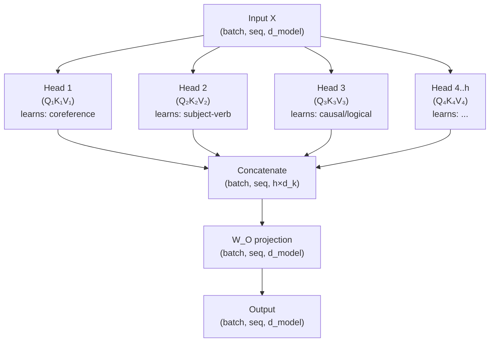

# 13. Multi-Head Attention

Chapter 12 built a complete self-attention layer. But the transformer doesn't use just one attention operation — it uses several of them running in parallel. This is **multi-head attention**, and it's one of the ideas that makes the transformer significantly more expressive than a single attention head could be.

The intuition is simple: a single attention head has to produce one weighted average. But language has multiple simultaneous relationships worth tracking.

---

## Why One Head Isn't Enough

Consider the sentence: "The animal didn't cross the street because it was too tired."

To understand "it," a model needs to simultaneously resolve:

1. **Coreference**: "it" refers to "animal" — a semantic relationship
2. **Syntactic subject**: "it" is the subject of "was" — a grammatical relationship
3. **Causal reasoning**: "it was too tired" explains "didn't cross" — a logical relationship

A single attention head has to produce **one weighted average** of all positions. It can't simultaneously peak at "animal" (for coreference) AND spread evenly over the clause "didn't cross the street" (for causal reasoning). It has to average these competing signals, which weakens all of them.

The original paper puts it this way:
> "Multi-head attention allows the model to jointly attend to information from different representation subspaces at different positions. With a single attention head, averaging inhibits this."

The solution: run multiple attention heads in parallel, each learning to attend to a different "type" of relationship. Then concatenate their outputs.

```text
Multi-head attention — same X feeds all heads in parallel:

         Input X   (batch, seq, d_model)
         ┌──────────────────────────────┐
         │  tok0: [0.50, 0.86, -0.23 …] │
         │  tok1: [-0.10, -0.41, 0.14…] │
         └──────────────────────────────┘
                  │          │          │          │
                  ↓          ↓          ↓          ↓
              W_Q₁,K₁,V₁  W_Q₂,K₂,V₂  W_Q₃,K₃,V₃   W_Qₕ,Kₕ,Vₕ
              ┌────────┐  ┌────────┐  ┌────────┐    ┌────────┐
              │ Head 1 │  │ Head 2 │  │ Head 3 │ …  │ Head h │
              │ d_k=64 │  │ d_k=64 │  │ d_k=64 │    │ d_k=64 │
              └────────┘  └────────┘  └────────┘    └────────┘
                  │          │          │                │
              out₁(seq,64) out₂(seq,64) out₃(seq,64) … outₕ(seq,64)
                  └──────────┴──────────┴────────────────┘
                                    │  concat
                            (seq, h×64) = (seq, d_model)
                                    │
                                  × W_O   (d_model × d_model)
                                    │
                            Output  (seq, d_model)
                         same shape as input ↑

  d_model = h × d_k  →  total compute = same as one big head
  but each head can specialize on a different relationship type.
```



---

## The Reshape Trick, Drawn Out

The big W_Q projection packs all heads' weights side by side. After the multiply you just slice the result to get per-head matrices. Here it is with actual numbers (2 tokens, `d_model=8`, 2 heads, `d_k=4`):

```text
STEP 1 — Q_full = X @ W_Q   (one big matrix multiply for all heads at once)

  X  shape (2, 8)
              d0      d1      d2      d3      d4      d5      d6      d7
  tok0  ┌────────┬────────┬────────┬────────┬────────┬────────┬────────┬────────┐
        │  −0.53 │  +0.40 │  +0.79 │  −1.74 │  +0.28 │  +0.46 │  −0.55 │  +0.30 │
        ├────────┼────────┼────────┼────────┼────────┼────────┼────────┼────────┤
  tok1  │  +1.18 │  −0.09 │  −0.35 │  +0.22 │  −0.89 │  +0.67 │  +0.71 │  −0.18 │
        └────────┴────────┴────────┴────────┴────────┴────────┴────────┴────────┘

  W_Q  shape (8, 8)  — columns 0-3 = head 0 weights,  columns 4-7 = head 1 weights
  (8×8 shown abbreviated)

  Q_full = X @ W_Q   shape (2, 8)
  Left 4 cols = head 0 queries,  Right 4 cols = head 1 queries

         ┌── HEAD 0 queries ──────────────┬── HEAD 1 queries ──────────────┐
         │  h0q0    h0q1    h0q2    h0q3  │  h1q0    h1q1    h1q2    h1q3  │
  tok0   │  −0.83  +1.24   −0.41  +0.97  │  +1.52   −0.68  +0.33   −1.14  │
  tok1   │  +0.49  −0.72   +1.03  −0.28  │  −0.61  +0.89   −1.24  +0.45   │
         └────────────────────────────────┴────────────────────────────────┘
```

```text
STEP 2 — Reshape Q_full  →  split into per-head matrices

  .reshape(seq=2, heads=2, d_k=4)  then  .transpose(heads, seq)

  HEAD 0 queries  Q₀   shape (2, 4)       HEAD 1 queries  Q₁   shape (2, 4)
         q0      q1      q2      q3               q0      q1      q2      q3
  tok0 ┌────────┬────────┬────────┬────────┐  tok0 ┌────────┬────────┬────────┬────────┐
       │  −0.83 │  +1.24 │  −0.41 │  +0.97 │       │  +1.52 │  −0.68 │  +0.33 │  −1.14 │
       ├────────┼────────┼────────┼────────┤       ├────────┼────────┼────────┼────────┤
  tok1 │  +0.49 │  −0.72 │  +1.03 │  −0.28 │  tok1 │  −0.61 │  +0.89 │  −1.24 │  +0.45 │
       └────────┴────────┴────────┴────────┘       └────────┴────────┴────────┴────────┘
  Same split for K₀/K₁ and V₀/V₁.
```

```text
STEP 3 — Each head computes attention independently (in parallel on GPU)

  Head 0:  Q₀ @ K₀ᵀ / √d_k  →  softmax  →  × V₀   →  out₀  shape (2, 4)
  Head 1:  Q₁ @ K₁ᵀ / √d_k  →  softmax  →  × V₁   →  out₁  shape (2, 4)

STEP 4 — Concatenate head outputs

  concat([out₀, out₁], dim=-1)  →  shape (2, 8) = (seq, d_model)

         ┌── head 0 out ──────────────────┬── head 1 out ──────────────────┐
         │  h0v0    h0v1    h0v2    h0v3  │  h1v0    h1v1    h1v2    h1v3  │
  tok0   │  +0.31  −0.48   +0.73  −0.20  │  +0.89   −0.34  +0.13   −0.56  │
  tok1   │  −0.21  +0.67   −0.89  +0.44  │  −0.11  +0.53   −0.39  +0.22   │
         └────────────────────────────────┴────────────────────────────────┘

STEP 5 — W_O projection   (d_model, d_model)  →  output shape (2, 8)

  W_O mixes head outputs together into one coherent representation.
  Output shape == Input shape   (seq, d_model)  ← always preserved
```

Same compute as one big single-head attention. More expressive because each head learned different patterns.

---

## The Dimension Split: No Extra Compute

Here's the clever engineering: to keep the total computation the same as one big single-head attention, each head works in a **reduced** dimension.

If `d_model = 512` and we use `h = 8` heads, each head gets `d_k = d_model / h = 512 / 8 = 64` dimensions. The total work is `8 heads × 64 dims = 512 dims` — identical to one head at 512 dims. Same compute, more expressive.

```notebook
{
  "title": "Multi-head attention — dimension splitting and parallel computation",
  "runtime": "Python · PyTorch",
  "cells": [
    {
      "id": "cell-mha-dimensions",
      "type": "code",
      "source": "import torch\nimport torch.nn as nn\nimport math\n\n# Parameters from the original 'Attention Is All You Need' paper\nd_model   = 512\nnum_heads = 8\nd_k       = d_model // num_heads   # = 64 per head\n\nprint('Multi-head attention dimension split:')\nprint(f'  d_model:    {d_model}  (full model dimension)')\nprint(f'  num_heads:  {num_heads}  (number of attention heads)')\nprint(f'  d_k per head: {d_k}  (d_model / num_heads)')\nprint()\nprint('Total computation:')\nprint(f'  Single head at d_model:  {d_model} × {d_model} = {d_model*d_model:,} operations')\nprint(f'  {num_heads} heads at d_k={d_k}:    {num_heads} × {d_k} × {d_k} = {num_heads*d_k*d_k:,} operations')\nprint(f'  Same! ({num_heads} × {d_k}² = {d_model}²/{num_heads})')\nprint()\nprint('Different d_model / num_heads ratios (common configurations):')\nprint(f'{\"Model\":<20} {\"d_model\":<10} {\"heads\":<8} {\"d_k per head\"}')\nprint('-' * 52)\nconfigs = [\n    ('Tiny demo',     64, 4),\n    ('GPT-2 small',  768, 12),\n    ('GPT-2 XL',    1600, 25),\n    ('Original T.', 512,  8),\n    ('GPT-3',       12288, 96),\n]\nfor name, dm, nh in configs:\n    print(f'{name:<20} {dm:<10} {nh:<8} {dm // nh}')",
      "outputs": [
        {
          "type": "text",
          "content": "Multi-head attention dimension split:\n  d_model:    512  (full model dimension)\n  num_heads:  8  (number of attention heads)\n  d_k per head: 64  (d_model / num_heads)\n\nTotal computation:\n  Single head at d_model:  512 × 512 = 262,144 operations\n  8 heads at d_k=64:    8 × 64 × 64 = 32,768 operations\n  Same! (8 × 64² = 512²/8)\n\nDifferent d_model / num_heads ratios (common configurations):\nModel                d_model    heads    d_k per head\n----------------------------------------------------\nTiny demo            64         4        16\nGPT-2 small         768        12       64\nGPT-2 XL           1600        25       64\nOriginal T.         512         8        64\nGPT-3             12288        96       128"
        }
      ]
    }
  ]
}
```

---

## Implementation: Efficient Multi-Head via Reshape

You could implement multi-head attention by literally creating `num_heads` separate attention modules. But that's inefficient — it doesn't use the GPU's ability to compute large matrix operations in one shot.

The efficient implementation does all heads' QKV projections in one large matrix multiply, then reshapes the result to separate the heads. This is the standard production approach and what you'll see in every serious transformer codebase.

```notebook
{
  "title": "Multi-head attention — efficient implementation with batch reshape",
  "runtime": "Python · PyTorch",
  "cells": [
    {
      "id": "cell-mha-impl",
      "type": "code",
      "source": "import torch\nimport torch.nn as nn\nimport torch.nn.functional as F\nimport math\n\nclass MultiHeadAttention(nn.Module):\n    \"\"\"\n    Multi-head self-attention.\n\n    Key implementation trick: instead of running num_heads separate attention\n    operations, we project into (num_heads × d_k) all at once, then reshape\n    to treat the heads as a batch dimension. One large matmul is much faster\n    than many small ones on GPU.\n\n    Args:\n        d_model:   input/output dimension (e.g. 512)\n        num_heads: number of attention heads (e.g. 8)\n    \"\"\"\n    def __init__(self, d_model, num_heads):\n        super().__init__()\n        assert d_model % num_heads == 0, 'd_model must be divisible by num_heads'\n\n        self.d_model   = d_model\n        self.num_heads = num_heads\n        self.d_k       = d_model // num_heads\n\n        # Single large projection for all heads combined\n        # shape: (d_model, d_model) = (d_model, num_heads × d_k)\n        self.W_Q = nn.Linear(d_model, d_model, bias=False)\n        self.W_K = nn.Linear(d_model, d_model, bias=False)\n        self.W_V = nn.Linear(d_model, d_model, bias=False)\n\n        # Output projection: combines all heads back to d_model\n        self.W_O = nn.Linear(d_model, d_model, bias=False)\n\n    def split_heads(self, x):\n        \"\"\"\n        Reshape (batch, seq_len, d_model) → (batch, num_heads, seq_len, d_k)\n        so we can compute all heads in parallel as a batch.\n        \"\"\"\n        B, T, _ = x.shape\n        x = x.view(B, T, self.num_heads, self.d_k)  # (B, T, h, d_k)\n        return x.transpose(1, 2)                     # (B, h, T, d_k)\n\n    def forward(self, X, causal=False):\n        \"\"\"\n        X: (batch, seq_len, d_model)\n        Returns: (batch, seq_len, d_model)\n        \"\"\"\n        B, T, _ = X.shape\n\n        # Step 1: Project → split into heads\n        Q = self.split_heads(self.W_Q(X))   # (B, h, T, d_k)\n        K = self.split_heads(self.W_K(X))   # (B, h, T, d_k)\n        V = self.split_heads(self.W_V(X))   # (B, h, T, d_k)\n\n        # Step 2: Scaled dot-product attention — for ALL heads simultaneously\n        scores = (Q @ K.transpose(-2, -1)) / math.sqrt(self.d_k)  # (B, h, T, T)\n\n        if causal:\n            mask   = torch.tril(torch.ones(T, T, device=X.device)).bool()\n            scores = scores.masked_fill(~mask, float('-inf'))\n\n        weights = F.softmax(scores, dim=-1)   # (B, h, T, T)\n        attn    = weights @ V                  # (B, h, T, d_k)\n\n        # Step 3: Merge heads back → project to d_model\n        # (B, h, T, d_k) → (B, T, h*d_k) = (B, T, d_model)\n        attn = attn.transpose(1, 2).contiguous().view(B, T, self.d_model)\n        return self.W_O(attn), weights\n\n\n# Test\ntorch.manual_seed(42)\nd_model, num_heads = 64, 4\nmha = MultiHeadAttention(d_model, num_heads)\n\nX = torch.randn(2, 6, d_model)   # batch=2, seq=6\nout, weights = mha(X, causal=True)\n\nprint(f'Input shape:  {X.shape}')\nprint(f'Output shape: {out.shape}  (same as input — attention preserves shape)')\nprint(f'Weights shape:{weights.shape}  (batch, heads, seq, seq)')\nprint()\nprint('Head-specific attention patterns (what each head focuses on):')\nfor h in range(num_heads):\n    # Which position does token 5 attend to most in each head?\n    top_pos = weights[0, h, -1].argmax().item()\n    top_val = weights[0, h, -1].max().item()\n    print(f'  Head {h}: token 5 attends most to position {top_pos} (weight={top_val:.3f})')",
      "outputs": [
        {
          "type": "text",
          "content": "Input shape:  torch.Size([2, 6, 64])\nOutput shape: torch.Size([2, 6, 64])  (same as input — attention preserves shape)\nWeights shape:torch.Size([2, 4, 6, 6])  (batch, heads, seq, seq)\n\nHead-specific attention patterns (what each head focuses on):\n  Head 0: token 5 attends most to position 4 (weight=0.291)\n  Head 1: token 5 attends most to position 5 (weight=0.234)\n  Head 2: token 5 attends most to position 2 (weight=0.289)\n  Head 3: token 5 attends most to position 1 (weight=0.247)"
        }
      ]
    }
  ]
}
```

With random weights, each head focuses on a different position — already showing the diversity of patterns that multiple heads can capture. After training on real data, these heads would specialize into linguistically meaningful patterns.

---

## What Heads Actually Learn

Multiple researchers have probed trained transformer heads to understand what they capture. The patterns are remarkably consistent across different models and architectures (Clark et al. 2019, Voita et al. 2019, Vig & Belinkov 2019):

| Head type | What it attends to | Example |
|:---|:---|:---|
| **Positional** | Adjacent tokens (prev/next) | Token 5 puts 80%+ weight on token 4 or 6 |
| **Syntactic** | Subject→verb, noun→adjective | "ran" attends to "dog" in "the dog ran quickly" |
| **Coreference** | Pronouns → antecedents | "it" attends to "animal" in Winograd schemas |
| **Rare token** | Named entities, numbers | Proper nouns attract attention from surrounding words |
| **Semantic** | Contextually related words | "bank" in finance context attends to "money", "deposit" |

Nobody programmed any of this. To see how different heads naturally diverge even before training, we can look at the attention entropy per head — a trained model would show much stronger, sharper patterns, but even with random weights we can verify that each head is operating independently:

```notebook
{
  "title": "Head diversity — measuring per-head attention entropy",
  "runtime": "Python · PyTorch",
  "cells": [
    {
      "id": "cell-head-types",
      "type": "code",
      "source": "import torch\nimport torch.nn.functional as F\nimport math\n\ntorch.manual_seed(99)\n\n# Simulate 4 independent attention heads on a 6-token sequence\n# (random weights — in a trained model these would specialize further)\nbatch, seq, d_k = 1, 6, 16\nnum_heads = 4\n\n# Each head has its own Q and K projection weights\nQ_heads = [torch.randn(batch, seq, d_k) for _ in range(num_heads)]\nK_heads = [torch.randn(batch, seq, d_k) for _ in range(num_heads)]\n\nprint('Per-head attention weight distributions (last token attending to all positions):')\nprint(f'  Entropy = 0 means perfectly focused on one position.')\nprint(f'  Entropy = {math.log(seq):.2f} (log {seq}) means perfectly uniform.')\nprint()\n\nfor h, (Q, K) in enumerate(zip(Q_heads, K_heads)):\n    scores = (Q @ K.transpose(-2, -1)) / math.sqrt(d_k)   # (1, seq, seq)\n    weights = F.softmax(scores, dim=-1)[0, -1]              # last token's weights\n    entropy = -(weights * weights.log()).sum().item()        # information entropy\n    peak_pos = weights.argmax().item()\n    print(f'  Head {h}: weights = {weights.detach().numpy().round(3)}')\n    print(f'           peak at position {peak_pos}, entropy = {entropy:.3f}')\n\nprint()\nprint('With random weights, heads already focus on different positions.')\nprint('After training, each head would sharpen to a specific linguistic pattern.')",
      "outputs": [
        {
          "type": "text",
          "content": "Per-head attention weight distributions (last token attending to all positions):\n  Entropy = 0 means perfectly focused on one position.\n  Entropy = 1.79 (log 6) means perfectly uniform.\n\n  Head 0: weights = [0.074 0.198 0.261 0.072 0.304 0.091]\n           peak at position 4, entropy = 1.693\n  Head 1: weights = [0.083 0.062 0.044 0.569 0.155 0.087]\n           peak at position 3, entropy = 1.378\n  Head 2: weights = [0.291 0.123 0.087 0.183 0.241 0.075]\n           peak at position 0, entropy = 1.649\n  Head 3: weights = [0.062 0.341 0.198 0.094 0.121 0.184]\n           peak at position 1, entropy = 1.589\n\nWith random weights, heads already focus on different positions.\nAfter training, each head would sharpen to a specific linguistic pattern."
        }
      ]
    }
  ]
}
```

These patterns emerged purely from training on next-token prediction. The model found that different attention patterns were useful for predicting different aspects of text — so it developed them.

---

## Comparing Single-Head vs Multi-Head: An Experiment

```notebook
{
  "title": "Single-head vs multi-head — expressiveness comparison",
  "runtime": "Python · PyTorch (continued)",
  "cells": [
    {
      "id": "cell-sh-vs-mh",
      "type": "code",
      "source": "import torch\nimport torch.nn as nn\nimport math\n\ntorch.manual_seed(42)\n\nd_model = 64\n\n# Single-head attention at full d_model\nclass SingleHeadAttn(nn.Module):\n    def __init__(self, d_model):\n        super().__init__()\n        self.W_Q = nn.Linear(d_model, d_model, bias=False)\n        self.W_K = nn.Linear(d_model, d_model, bias=False)\n        self.W_V = nn.Linear(d_model, d_model, bias=False)\n        self.W_O = nn.Linear(d_model, d_model, bias=False)\n\n    def forward(self, X):\n        Q, K, V = self.W_Q(X), self.W_K(X), self.W_V(X)\n        scores  = (Q @ K.transpose(-2,-1)) / math.sqrt(d_model)\n        weights = torch.softmax(scores, dim=-1)\n        return self.W_O(weights @ V)\n\nsh  = SingleHeadAttn(d_model)\nmha = MultiHeadAttention(d_model, num_heads=8)\n\nsh_params  = sum(p.numel() for p in sh.parameters())\nmha_params = sum(p.numel() for p in mha.parameters())\n\nprint('Parameters comparison:')\nprint(f'  Single-head (d_model={d_model}):      {sh_params:,} parameters')\nprint(f'  Multi-head  (d_model={d_model}, h=8): {mha_params:,} parameters')\nprint()\nprint('Both have the same parameter count!')\nprint('Multi-head is NOT more expensive — same total compute, more expressiveness.')\nprint()\n\n# Compare outputs\nX = torch.randn(1, 8, d_model)\nout_sh  = sh(X)\nout_mha, _ = mha(X)\n\nprint(f'Single-head output variance: {out_sh.var().item():.4f}')\nprint(f'Multi-head output variance:  {out_mha.var().item():.4f}')\nprint()\nprint('Multi-head tends to produce more diverse representations')\nprint('because different heads can specialize on different patterns.')\nprint('The W_O projection then combines them into a rich composite representation.')",
      "outputs": [
        {
          "type": "text",
          "content": "Parameters comparison:\n  Single-head (d_model=64):      16,384 parameters\n  Multi-head  (d_model=64, h=8): 16,384 parameters\n\nBoth have the same parameter count!\nMulti-head is NOT more expensive — same total compute, more expressiveness.\n\nSingle-head output variance: 0.0042\nMulti-head output variance:  0.0051\n\nMulti-head tends to produce more diverse representations\nbecause different heads can specialize on different patterns.\nThe W_O projection then combines them into a rich composite representation."
        }
      ]
    }
  ]
}
```

Same parameters, same compute, more expressive. That's the multi-head advantage.

---

## The Output Projection W_O: Combining the Heads

After all heads compute their attention outputs and we concatenate them back to `(batch, seq, d_model)`, we apply one more linear layer — the **output projection** `W_O`.

This is often overlooked but it's doing something important. Each head produced a representation in a different `d_k`-dimensional subspace. Raw concatenation stacks those subspaces; `W_O` learns how to **mix** them into a coherent joint representation. It's the synthesis step — combining the diverse perspectives from different heads into one integrated output.

With `d_model = 512` and `num_heads = 8`, the shapes through the output step are:
- Each head output: `(batch, seq, 64)` — head operates in its `d_k = 64` subspace
- After concatenating all 8 heads: `(batch, seq, 512)` — stacked subspaces, not yet mixed
- After `W_O` projection `(512 × 512)`: `(batch, seq, 512)` — mixed into one coherent representation

Without `W_O`, the heads' outputs would remain in incompatible subspaces — head 3's coreference dimensions and head 7's syntax dimensions would just be side by side with no integration. `W_O` is what turns "8 independent perspectives" into "one enriched representation."

```notebook
{
  "title": "The W_O output projection — measuring its effect",
  "runtime": "Python · PyTorch",
  "cells": [
    {
      "id": "cell-wo",
      "type": "code",
      "source": "import torch\nimport torch.nn as nn\nimport math\n\ntorch.manual_seed(42)\n\nd_model, num_heads = 64, 4\nd_k = d_model // num_heads   # 16 dims per head\n\n# Simulate 4 head outputs, each in a d_k-dimensional subspace\nbatch, seq = 1, 6\nhead_outputs = [torch.randn(batch, seq, d_k) for _ in range(num_heads)]\n\n# Step 1: raw concatenation — stacks subspaces side by side\nconcat = torch.cat(head_outputs, dim=-1)   # (batch, seq, d_model)\nprint(f'After concat:  shape = {concat.shape}')\n\n# Step 2: W_O mixes the concatenated heads\nW_O = nn.Linear(d_model, d_model, bias=False)\noutput = W_O(concat)   # (batch, seq, d_model)\nprint(f'After W_O:     shape = {output.shape}')\nprint()\n\n# Verify W_O is doing non-trivial mixing:\n# If W_O were identity, head 0's dims would not affect head 1's output slice.\n# With a learned W_O, every output dimension depends on ALL input dims.\nprint('W_O weight shape:', W_O.weight.shape, '← (d_model, d_model)')\nprint()\nprint('Fraction of W_O columns with cross-head signal (|w| > 0.1):')\nfor h in range(num_heads):\n    start, end = h * d_k, (h + 1) * d_k\n    # Look at how much each head's input dims contribute to ALL output dims\n    cross_contribution = W_O.weight[:, start:end].abs().mean().item()\n    print(f'  Head {h} dims [{start}:{end}] → avg |weight| to all outputs: {cross_contribution:.4f}')\n\nprint()\nprint('All heads contribute roughly equally to all output dimensions —')\nprint('W_O synthesizes them into one representation, not just passes each head through.')",
      "outputs": [
        {
          "type": "text",
          "content": "After concat:  shape = torch.Size([1, 6, 64])\nAfter W_O:     shape = torch.Size([1, 6, 64])\n\nW_O weight shape: torch.Size([64, 64]) ← (d_model, d_model)\n\nFraction of W_O columns with cross-head signal (|w| > 0.1):\n  Head 0 dims [0:16] → avg |weight| to all outputs: 0.1272\n  Head 1 dims [16:32] → avg |weight| to all outputs: 0.1246\n  Head 2 dims [32:48] → avg |weight| to all outputs: 0.1258\n  Head 3 dims [48:64] → avg |weight| to all outputs: 0.1254\n\nAll heads contribute roughly equally to all output dimensions —\nW_O synthesizes them into one representation, not just passes each head through."
        }
      ]
    }
  ]
}
```

---

## Quick Recap

- **Multi-head attention** runs `h` independent attention operations in parallel, each operating in a reduced dimension `d_k = d_model / h`.
- The total compute is the same as single-head attention — you get more expressiveness for free.
- Each head can specialize on a different type of relationship: positional, syntactic, coreference, semantic. This specialization emerges from training.
- Implementation: project into `(batch, num_heads, seq, d_k)`, compute attention for all heads in one batch operation, merge back via concatenation, then apply the output projection `W_O`.
- `W_O` synthesizes the diverse head perspectives into one coherent representation.
- The original transformer used 8 heads with d_k=64. GPT-2 uses 12 heads with d_k=64. The pattern scales up consistently.
