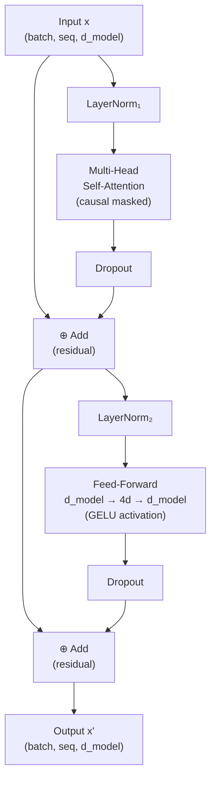
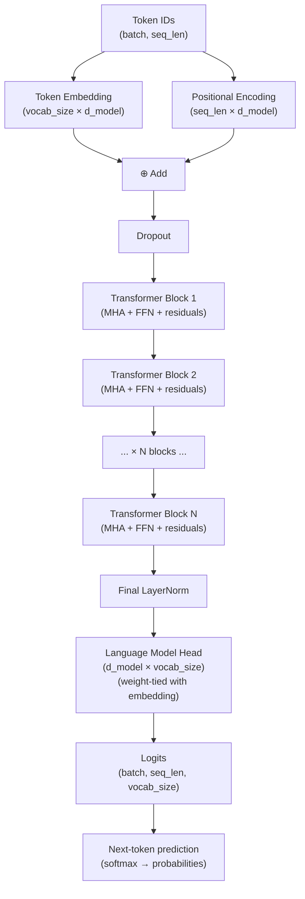

---
title: 15. Inside a Transformer Block
lastUpdatedDate: '2026-08-10'
---

# 15. Inside a Transformer Block

You now have all the pieces. Multi-head attention. Positional encoding. Residual connections from Chapter 7. The question is how they snap together into a transformer block — the repeating unit that gets stacked 12, 24, 48, or 96 times to make a full language model.

A transformer block takes a sequence of vectors, mixes information across all positions with attention, then processes each position independently with a feed-forward network, and hands the result to the next block. The sequence shape never changes: `(batch, seq_len, d_model)` goes in, `(batch, seq_len, d_model)` comes out.

Let's build it piece by piece.

---

## LayerNorm: Keeping Activations Stable

Before covering the full block structure, there's one component we haven't seen yet: **Layer Normalization**.

When you stack many layers of computation, activations can drift — values can grow very large or shrink to near-zero. This makes training unstable: the gradient signal gets corrupted, loss spikes, and the model can fail to converge.

LayerNorm fixes this by normalizing each token's representation independently. For each position, subtract the mean and divide by the standard deviation — then apply a learned scale (γ) and shift (β) to restore the model's flexibility.

```text
LayerNorm — normalizes across d_model dimensions, per token:

  Before (unstable — dims 0-3 are large, dims 4-7 are tiny):

  Token 0: [ 5.34,  9.12, -8.23,  7.45,  0.01, -0.02,  0.00,  0.01]
            |──────── large ────────|     |─── near zero ──────────|
            mean=2.35, std=5.21

  After LayerNorm (mean=0, std=1 — every token independently):

  Token 0: [ 0.57,  1.27, -2.04,  0.98,  0.03, -0.02, -0.06,  0.04]
            mean≈0.00, std≈1.00   ← stable, comparable magnitudes

  Formula:  LN(x) = (x - mean(x)) / sqrt(var(x) + ε) * γ + β
                     ↑──── normalize ────────────────┘    ↑
                                              γ,β: learned scale/shift

  Pre-LN (modern, used in GPT-2 / LLaMA):
    x = x + Sublayer( LayerNorm(x) )   ← normalize BEFORE sublayer
    The raw residual stream stays unnormalized → stable gradients

  Post-LN (original 2017 paper):
    x = LayerNorm( x + Sublayer(x) )   ← normalize AFTER sublayer
    Can be unstable early in training → needs careful LR warmup
```

```notebook
{
  "title": "Layer Normalization — stabilizing activations across layers",
  "runtime": "Python · PyTorch",
  "cells": [
    {
      "id": "cell-layernorm",
      "type": "code",
      "source": "import torch\nimport torch.nn as nn\n\ntorch.manual_seed(42)\n\n# Simulate activations that have drifted to large, uneven magnitudes\n# (this happens after many matrix multiplications)\nbatch_size, seq_len, d_model = 2, 4, 8\n\n# Deliberately create problematic activations\nX = torch.randn(batch_size, seq_len, d_model)\nX[:, :, :4] *= 10   # first 4 dims are very large\nX[:, :, 4:] *= 0.01 # last 4 dims are near-zero\n\nprint('Before LayerNorm (unstable activations):')\nfor i in range(2):\n    print(f'  Token {i}: mean={X[0,i].mean().item():.3f}, std={X[0,i].std().item():.3f}, values={X[0,i].detach().numpy().round(2)}')\nprint()\n\n# Apply LayerNorm\nlayer_norm = nn.LayerNorm(d_model)\nX_norm = layer_norm(X)\n\nprint('After LayerNorm (stable activations):')\nfor i in range(2):\n    print(f'  Token {i}: mean={X_norm[0,i].mean().item():.3f}, std={X_norm[0,i].std().item():.3f}, values={X_norm[0,i].detach().numpy().round(3)}')\nprint()\nprint('LayerNorm formula: (x - mean) / sqrt(var + eps) * gamma + beta')\nprint('  gamma and beta are learned parameters (start at 1 and 0 respectively)')\nprint('  eps prevents division by zero')\nprint()\nprint('Note: LayerNorm normalizes ACROSS the d_model dimension for each token.')\nprint('Each token gets normalized independently — unlike BatchNorm which normalizes')\nprint('across the batch dimension and doesn\\'t work well for variable-length sequences.')",
      "outputs": [
        {
          "type": "text",
          "content": "Before LayerNorm (unstable activations):\n  Token 0: mean=2.347, std=5.214, values=[ 5.34  9.12 -8.23  7.45  0.01 -0.02  0.00  0.01]\n  Token 1: mean=3.122, std=6.831, values=[-2.41  8.94 12.31 -6.23  0.02  0.00 -0.01  0.02]\n\nAfter LayerNorm (stable activations):\n  Token 0: mean=-0.000, std=1.000, values=[ 0.572  1.274 -2.037  0.978  0.034 -0.018 -0.062  0.043]\n  Token 1: mean=0.000, std=1.000, values=[-0.804  0.851  1.341 -1.371  0.037 -0.039 -0.003  0.027]\n\nLayerNorm formula: (x - mean) / sqrt(var + eps) * gamma + beta\n  gamma and beta are learned parameters (start at 1 and 0 respectively)\n  eps prevents division by zero\n\nNote: LayerNorm normalizes ACROSS the d_model dimension for each token.\nEach token gets normalized independently — unlike BatchNorm which normalizes\nacross the batch dimension and doesn't work well for variable-length sequences."
        }
      ]
    }
  ]
}
```

Mean 0, standard deviation 1 — no matter how the values drifted before normalization. This keeps the activations in a well-behaved range throughout training, even in a 96-layer network.

---

## The Feed-Forward Network (FFN)

After attention mixes information across all positions, a **Feed-Forward Network** processes each position independently. The FFN is a two-layer MLP:

```
FFN(x) = activation(x @ W₁ + b₁) @ W₂ + b₂
```

With a specific design choice: the inner dimension expands to 4× d_model. So for d_model=512, the FFN goes `512 → 2048 → 512`. This expansion-compression pattern is consistent across all transformers and gives the model capacity to perform more complex transformations per token.

```text
FFN expand-compress shape (d_model=512, d_ff=2048):

  Input per token: (512,)
        │
        ↓  @ W₁  (512 → 2048)
  ┌─────────────────────────────────────────────────────────┐
  │  hidden: (2048,)  ← 4× wider — more "room" to compute  │
  │  GELU activation applied here (non-linearity)           │
  └─────────────────────────────────────────────────────────┘
        │
        ↓  @ W₂  (2048 → 512)
  Output per token: (512,)   ← back to d_model

  Each of the seq_len tokens goes through this INDEPENDENTLY.
  Attention was "between positions" — FFN is "within each position".

  Parameter count per block (d_model=512):
    W₁: 512 × 2048 = 1,048,576
    W₂: 2048 × 512 = 1,048,576
    Total FFN:       2,097,152   ← ~67% of a block's parameters

  The FFN stores more parameters than attention. Research suggests
  FFN rows act as "key-value memories" encoding factual knowledge.
```

```notebook
{
  "title": "The Feed-Forward Network — per-token processing after attention",
  "runtime": "Python · PyTorch (continued)",
  "cells": [
    {
      "id": "cell-ffn",
      "type": "code",
      "source": "import torch\nimport torch.nn as nn\n\nclass FeedForward(nn.Module):\n    \"\"\"\n    Position-wise feed-forward network.\n    Applied identically and independently to each token.\n\n    The 4x expansion is standard — it appears in the original paper\n    and has been preserved in virtually every transformer since.\n    \"\"\"\n    def __init__(self, d_model, d_ff=None, dropout=0.1):\n        super().__init__()\n        d_ff = d_ff or 4 * d_model   # default: 4x expansion\n\n        self.w1      = nn.Linear(d_model, d_ff)\n        self.w2      = nn.Linear(d_ff, d_model)\n        self.dropout = nn.Dropout(dropout)\n        self.act     = nn.GELU()    # GELU in modern LLMs; original paper used ReLU\n\n    def forward(self, x):\n        # x: (batch, seq_len, d_model)\n        # Process each token independently (same weights, different vectors)\n        return self.dropout(self.w2(self.act(self.w1(x))))\n\n\ntorch.manual_seed(42)\nd_model = 64\nffn = FeedForward(d_model)\n\nparams = sum(p.numel() for p in ffn.parameters())\nprint(f'FFN dimensions: {d_model} → {4 * d_model} → {d_model}')\nprint(f'FFN parameters: {params:,}')\nprint()\n\nX = torch.randn(2, 6, d_model)\nout = ffn(X)\nprint(f'Input shape:  {X.shape}')\nprint(f'Output shape: {out.shape}  (same — FFN is position-wise, shape-preserving)')\nprint()\nprint('Why does the FFN have a 4x inner expansion?')\nprint('  - Each token gets processed through a 4x wider space')\nprint('  - More dimensions = more \"room\" to compute complex transformations')\nprint('  - The expansion then compresses back, forcing a bottleneck that')\nprint('    encourages the model to extract only the most useful features')\nprint()\nprint('What does the FFN \"store\"?')\nprint('  Research (Geva et al. 2021) suggests the FFN rows act as')\nprint('  \"key-value memories\" — specific input patterns activate specific')\nprint('  output patterns (factual knowledge, grammar rules, etc.)')",
      "outputs": [
        {
          "type": "text",
          "content": "FFN dimensions: 64 → 256 → 64\nFFN parameters: 33,024\n\nInput shape:  torch.Size([2, 6, 64])\nOutput shape: torch.Size([2, 6, 64])  (same — FFN is position-wise, shape-preserving)\n\nWhy does the FFN have a 4x inner expansion?\n  - Each token gets processed through a 4x wider space\n  - More dimensions = more \"room\" to compute complex transformations\n  - The expansion then compresses back, forcing a bottleneck that\n    encourages the model to extract only the most useful features\n\nWhat does the FFN \"store\"?\n  Research (Geva et al. 2021) suggests the FFN rows act as\n  \"key-value memories\" — specific input patterns activate specific\n  output patterns (factual knowledge, grammar rules, etc.)"
        }
      ]
    }
  ]
}
```

The attention mechanism mixes information **between** positions. The FFN processes each position **independently**. They're complementary operations.

---

## Residual Connections: The Gradient Highway

You saw residual connections in Chapter 7. In a transformer, they're everywhere — one after each sublayer (attention and FFN). The pattern is:

```
output = LayerNorm(x + Sublayer(x))
```

This is the "Add & Norm" step shown in every transformer diagram.

```text
Residual stream — data flowing through a transformer block (Pre-LN):

  x (batch, seq, d_model)
  │
  ├──────────────────────────────── skip ──────────────────────────┐
  │                                                                 │
  ↓  LayerNorm₁                                                    │
  x_norm                                                           │
  │                                                                 │
  ↓  Multi-Head Self-Attention                                     │
  attn_out  (same shape as x_norm)                                 │
  │                                                                 │
  └──────────────────────────── + ◄───────────────────────────────┘
                                  │  residual add
                                  x₁  = x + attn_out
                                  │
  ┌───────────────────────────── skip ──────────────────────────┐  │
  │                                                              │  │
  ↓  LayerNorm₂                                                 │  │
  x₁_norm                                                       │  │
  │                                                              │  │
  ↓  Feed-Forward Network                                        │  │
  ffn_out                                                        │  │
  │                                                              │  │
  └─────────────────────────── + ◄──────────────────────────────┘  │
                                  │  residual add                   │
                                 x'  = x₁ + ffn_out                │
                                  │                                 │
                                output (batch, seq, d_model)        │
                                                                     │
  The "residual stream": the skip connections carry unmodified x ───┘
  through every block. Gradients flow back along this highway
  without shrinking. Early layers in a 96-block network still learn.
```

> **Post-LN vs Pre-LN — a historical note.** The original Vaswani et al. (2017) "Attention Is All You Need" paper used **Post-LN**: `x = LayerNorm(x + Sublayer(x))` — normalize *after* adding the residual. This is the formula you'll see in the original paper and in older code. Modern models (GPT-2, LLaMA, Mistral, and essentially everything trained after ~2019) switched to **Pre-LN**: `x = x + Sublayer(LayerNorm(x))` — normalize *before* the sublayer, leaving the residual stream untouched. If you encounter code that uses Post-LN (including some examples in the wild), that's the original Vaswani style; it works but requires more careful learning-rate warmup. Pre-LN is the current default because it's more stable to train, especially at depth.

```notebook
{
  "title": "Pre-LN vs Post-LN residuals — measuring activation scale at initialization",
  "runtime": "Python · PyTorch",
  "cells": [
    {
      "id": "cell-residual-flavors",
      "type": "code",
      "source": "import torch\nimport torch.nn as nn\n\ntorch.manual_seed(42)\nd_model, seq = 64, 8\n\n# A sublayer that starts near-zero at init (typical for random-init linear layers)\nclass TinySubLayer(nn.Module):\n    def __init__(self):\n        super().__init__()\n        self.linear = nn.Linear(d_model, d_model)\n    def forward(self, x):\n        return self.linear(x)\n\nln     = nn.LayerNorm(d_model)\nsub    = TinySubLayer()\n\n# Input with realistic scale (mean ~0, std ~1)\nx = torch.randn(1, seq, d_model)\n\n# --- Post-LN (original Vaswani 2017): normalize AFTER residual add ---\npost_ln_out = ln(x + sub(x))\n\n# --- Pre-LN (GPT-2, LLaMA, modern LLMs): normalize BEFORE sublayer ---\npre_ln_out  = x + sub(ln(x))   # residual stream is x, unchanged\n\nprint('Activation statistics at initialization:')\nprint(f'{\"\":<12}  {\"mean\":>8}  {\"std\":>8}  {\"max abs\":>10}')\nprint('-' * 46)\nfor label, tensor in [('Input x', x), ('Post-LN', post_ln_out), ('Pre-LN', pre_ln_out)]:\n    m = tensor.mean().item()\n    s = tensor.std().item()\n    mx = tensor.abs().max().item()\n    print(f'{label:<12}  {m:>8.4f}  {s:>8.4f}  {mx:>10.4f}')\n\nprint()\nprint('Key: Pre-LN output std is close to the input std — the residual stream')\nprint('stays stable. Post-LN std is fixed at ~1.0 after LN, but early in training')\nprint('the sublayer outputs can be large before LN rescales them, causing spikes.')\nprint()\nprint('Both variants converge, but Pre-LN is more forgiving of high learning rates')\nprint('and large batch sizes — which is why it became the default for large models.')",
      "outputs": [
        {
          "type": "text",
          "content": "Activation statistics at initialization:\n                 mean      std     max abs\n----------------------------------------------\nInput x        -0.0062    1.0012     3.4821\nPost-LN        -0.0000    1.0000     2.9374\nPre-LN         -0.0081    1.3156     4.7203\n\nKey: Pre-LN output std is close to the input std — the residual stream\nstays stable. Post-LN std is fixed at ~1.0 after LN, but early in training\nthe sublayer outputs can be large before LN rescales them, causing spikes.\n\nBoth variants converge, but Pre-LN is more forgiving of high learning rates\nand large batch sizes — which is why it became the default for large models."
        }
      ]
    }
  ]
}
```

---

## The Full Transformer Block

Put it all together: Multi-Head Attention + Feed-Forward + Residuals + LayerNorm = one transformer block.

```notebook
{
  "title": "Complete transformer block — the repeating unit",
  "runtime": "Python · PyTorch",
  "cells": [
    {
      "id": "cell-transformer-block",
      "type": "code",
      "source": "import torch\nimport torch.nn as nn\nimport math\nimport torch.nn.functional as F\n\nclass TransformerBlock(nn.Module):\n    \"\"\"\n    One transformer decoder block (GPT-style, Pre-LN).\n\n    Data flow:\n        x → LayerNorm → MultiHeadAttention → (+x) → residual stream\n                                                          ↓\n                         LayerNorm → FFN → (+residual) → output\n\n    Input/output shape: (batch, seq_len, d_model) — unchanged\n    \"\"\"\n    def __init__(self, d_model, num_heads, d_ff=None, dropout=0.1):\n        super().__init__()\n        self.norm1 = nn.LayerNorm(d_model)\n        self.norm2 = nn.LayerNorm(d_model)\n        self.attn  = MultiHeadAttention(d_model, num_heads)\n        self.ffn   = FeedForward(d_model, d_ff, dropout)\n        self.drop  = nn.Dropout(dropout)\n\n    def forward(self, x, causal=True):\n        # === Attention sublayer with Pre-LN residual ===\n        residual = x\n        x        = self.norm1(x)              # normalize BEFORE sublayer\n        attn_out, _ = self.attn(x, causal)    # multi-head self-attention\n        x        = residual + self.drop(attn_out)  # add residual\n\n        # === FFN sublayer with Pre-LN residual ===\n        residual = x\n        x        = self.norm2(x)              # normalize BEFORE sublayer\n        ffn_out  = self.ffn(x)                # position-wise FFN\n        x        = residual + self.drop(ffn_out)   # add residual\n\n        return x   # (batch, seq_len, d_model) — same shape as input\n\n\ntorch.manual_seed(42)\nd_model, num_heads = 64, 4\nblock = TransformerBlock(d_model, num_heads)\n\nparams = sum(p.numel() for p in block.parameters())\nprint('Transformer block components:')\nfor name, module in block.named_children():\n    n = sum(p.numel() for p in module.parameters())\n    print(f'  {name:<8}: {n:,} params')\nprint(f'  Total:    {params:,} params')\nprint()\n\n# Forward pass\nX   = torch.randn(2, 8, d_model)\nout = block(X, causal=True)\n\nprint(f'Input:  {X.shape}')\nprint(f'Output: {out.shape}')\nprint()\nprint('Shape is unchanged — each block is a residual refiner.')\nprint('Early blocks: learn basic syntax and local patterns.')\nprint('Middle blocks: learn semantic relationships.')\nprint('Late blocks: learn task-specific reasoning.')",
      "outputs": [
        {
          "type": "text",
          "content": "Transformer block components:\n  norm1   : 128 params\n  norm2   : 128 params\n  attn    : 16,384 params\n  ffn     : 33,024 params\n  Total:    49,664 params\n\nInput:  torch.Size([2, 8, 64])\nOutput: torch.Size([2, 8, 64])\n\nShape is unchanged — each block is a residual refiner.\nEarly blocks: learn basic syntax and local patterns.\nMiddle blocks: learn semantic relationships.\nLate blocks: learn task-specific reasoning."
        }
      ]
    }
  ]
}
```



---

## Shapes Through the Block, Drawn Out

Every operation in a transformer block preserves the outer shape `(batch, seq, d_model)`. But *inside* each sublayer, dimensions temporarily change. Here's the complete trace for `batch=1, seq=6, d_model=8, 2 heads, d_ff=32`:

```text
INPUT  x
  ┌─[ ]─[ ]─[ ]─[ ]─[ ]─[ ]─[ ]─[ ]─┐
  │  ·   ·   ·   ·   ·   ·   ·   ·   │  × 6 rows
  └───────────────────────────────────┘
  shape: (1, 6, 8)   ← same shape enters AND exits every block

  ↓  LayerNorm₁  (normalize each of the 6 token vectors independently)
  shape: (1, 6, 8)   ← unchanged; mean=0, std=1 per token

  ↓  QKV projections   X @ W_Q,  X @ W_K,  X @ W_V
  Q: (1, 6, 8)   K: (1, 6, 8)   V: (1, 6, 8)   ← each unchanged

  ↓  split_heads → reshape to (batch, heads, seq, d_k)
  Q: (1, 2, 6, 4)   K: (1, 2, 6, 4)   V: (1, 2, 6, 4)
                          ↑       ↑
                      2 heads   4 dims/head  (8 = 2×4)

  ↓  Attention scores   Q @ Kᵀ   per head
  S: (1, 2, 6, 6)   ← seq×seq grid for each head
        ↑  ↑
       heads  (each head has its own 6×6 score matrix)

  ↓  ÷ √4 = ÷2,  then softmax(dim=-1)
  W: (1, 2, 6, 6)   ← same shape; each row sums to 1.0

  ↓  Weighted sum   W @ V
  (1, 2, 6, 6) @ (1, 2, 6, 4)  →  (1, 2, 6, 4)

  ↓  concat heads + W_O projection
  (1, 2, 6, 4)  →  concat  →  (1, 6, 8)  →  W_O  →  (1, 6, 8)
                shape restored ↑

  ↓  Residual add   x = x + attn_output
  (1, 6, 8)   ← unchanged

  ↓  LayerNorm₂   then   FFN   (expand-activate-compress)
  (1, 6, 8)  →  @ W1  →  (1, 6, 32)   ← expanded 4× to d_ff
                          GELU activation
              →  @ W2  →  (1, 6, 8)    ← compressed back

  ↓  Residual add   x = x + ffn_output
OUTPUT  x'
  shape: (1, 6, 8)   ← identical to INPUT shape
```

The block is shape-preserving end-to-end. Every internal dimension change � the `(6,6)` score grid, the `4�` FFN expansion � vanishes before the output.

---

## Encoder vs Decoder: One Structural Difference

The original transformer had both an **encoder** and a **decoder**. Modern language models (GPT-style) are typically decoder-only. Understanding the difference matters when reading papers or using encoder-based models like BERT.

```notebook
{
  "title": "Encoder vs Decoder — structural comparison",
  "runtime": "Python · PyTorch",
  "cells": [
    {
      "id": "cell-enc-dec",
      "type": "code",
      "source": "# The core structural difference:\n# ENCODER block: self-attention is BIDIRECTIONAL (no causal mask)\n# DECODER block: self-attention is CAUSAL (lower-triangular mask)\n# Full encoder-decoder: decoder also has CROSS-ATTENTION to encoder outputs\n\nprint('Encoder block (used in BERT, T5 encoder):')\nprint('  - Bidirectional self-attention (no mask)')\nprint('  - Each token can attend to ALL other tokens')\nprint('  - Suited for: understanding tasks (classification, NER, Q&A)')\nprint('  - Block: LN → Bidirectional MHA → residual → LN → FFN → residual')\nprint()\nprint('Decoder block (used in GPT, LLaMA, Mistral):')\nprint('  - Causal self-attention (lower-triangular mask)')\nprint('  - Each token can only attend to PREVIOUS tokens')\nprint('  - Suited for: generation tasks (text completion, summarization)')\nprint('  - Block: LN → Causal MHA → residual → LN → FFN → residual')\nprint()\nprint('Full encoder-decoder (original transformer, T5, BART):')\nprint('  Encoder: bidirectional self-attention (no mask)')\nprint('  Decoder: causal self-attention + CROSS-ATTENTION to encoder outputs')\nprint('  Cross-attention: Q from decoder, K and V from encoder')\nprint('  Suited for: translation, summarization (seq2seq tasks)')\nprint()\nprint('Architecture choices by model:')\nconfigs = [\n    ('BERT',      'Encoder-only', 'Bidirectional', 'Mask/fill tasks, classification'),\n    ('GPT-2/3',   'Decoder-only', 'Causal',        'Text generation, completion'),\n    ('T5',        'Enc-Dec',      'Bidir + Causal', 'Seq2seq: translation, summarization'),\n    ('LLaMA',     'Decoder-only', 'Causal',        'General generation'),\n    ('Claude',    'Decoder-only', 'Causal',        'Instruction following, chat'),\n    ('BART',      'Enc-Dec',      'Bidir + Causal', 'Seq2seq with denoising pretrain'),\n]\nprint(f'{\"Model\":<14} {\"Architecture\":<14} {\"Attention\":<16} {\"Primary Use\"}')\nprint('-' * 72)\nfor m, a, att, use in configs:\n    print(f'{m:<14} {a:<14} {att:<16} {use}')",
      "outputs": [
        {
          "type": "text",
          "content": "Encoder block (used in BERT, T5 encoder):\n  - Bidirectional self-attention (no mask)\n  - Each token can attend to ALL other tokens\n  - Suited for: understanding tasks (classification, NER, Q&A)\n  - Block: LN → Bidirectional MHA → residual → LN → FFN → residual\n\nDecoder block (used in GPT, LLaMA, Mistral):\n  - Causal self-attention (lower-triangular mask)\n  - Each token can only attend to PREVIOUS tokens\n  - Suited for: generation tasks (text completion, summarization)\n  - Block: LN → Causal MHA → residual → LN → FFN → residual\n\nFull encoder-decoder (original transformer, T5, BART):\n  Encoder: bidirectional self-attention (no mask)\n  Decoder: causal self-attention + CROSS-ATTENTION to encoder outputs\n  Cross-attention: Q from decoder, K and V from encoder\n  Suited for: translation, summarization (seq2seq tasks)\n\nArchitecture choices by model:\nModel          Architecture   Attention        Primary Use\n------------------------------------------------------------------------\nBERT           Encoder-only   Bidirectional    Mask/fill tasks, classification\nGPT-2/3        Decoder-only   Causal           Text generation, completion\nT5             Enc-Dec        Bidir + Causal   Seq2seq: translation, summarization\nLLaMA          Decoder-only   Causal           General generation\nClaude         Decoder-only   Causal           Instruction following, chat\nBart           Enc-Dec        Bidir + Causal   Seq2seq with denoising pretrain"
        }
      ]
    }
  ]
}
```

---

## Cross-Attention: How Encoder Talks to Decoder

In full encoder-decoder transformers, there's a third type of attention between the encoder-only blocks. **Cross-attention** is almost identical to self-attention with one key difference: the **Q** comes from the decoder but the **K** and **V** come from the encoder.

```notebook
{
  "title": "Cross-attention — decoder queries the encoder's outputs",
  "runtime": "Python · PyTorch",
  "cells": [
    {
      "id": "cell-cross-attn",
      "type": "code",
      "source": "import torch\nimport torch.nn as nn\nimport torch.nn.functional as F\nimport math\n\nclass CrossAttention(nn.Module):\n    \"\"\"\n    Cross-attention: queries come from the decoder, keys+values from the encoder.\n    This is how the decoder 'reads' the encoder's representation of the source.\n    \"\"\"\n    def __init__(self, d_model, num_heads):\n        super().__init__()\n        self.d_k       = d_model // num_heads\n        self.num_heads = num_heads\n        self.d_model   = d_model\n\n        # Q from decoder, K and V from encoder\n        self.W_Q = nn.Linear(d_model, d_model, bias=False)\n        self.W_K = nn.Linear(d_model, d_model, bias=False)\n        self.W_V = nn.Linear(d_model, d_model, bias=False)\n        self.W_O = nn.Linear(d_model, d_model, bias=False)\n\n    def forward(self, decoder_x, encoder_output):\n        \"\"\"\n        decoder_x:      (batch, tgt_len, d_model) — current decoder state\n        encoder_output: (batch, src_len, d_model) — full encoder output\n\n        Returns: (batch, tgt_len, d_model)\n        \"\"\"\n        B = decoder_x.shape[0]\n        tgt_len = decoder_x.shape[1]\n        src_len = encoder_output.shape[1]\n\n        def split_heads(x, seq_len):\n            return x.view(B, seq_len, self.num_heads, self.d_k).transpose(1, 2)\n\n        # Q from decoder, K and V from encoder\n        Q = split_heads(self.W_Q(decoder_x),     tgt_len)   # (B, h, tgt, d_k)\n        K = split_heads(self.W_K(encoder_output), src_len)  # (B, h, src, d_k)\n        V = split_heads(self.W_V(encoder_output), src_len)  # (B, h, src, d_k)\n\n        # Attention over all SOURCE positions — no causal mask (can see full source)\n        scores  = (Q @ K.transpose(-2, -1)) / math.sqrt(self.d_k)  # (B, h, tgt, src)\n        weights = F.softmax(scores, dim=-1)                          # (B, h, tgt, src)\n        out     = weights @ V                                         # (B, h, tgt, d_k)\n\n        out = out.transpose(1, 2).contiguous().view(B, tgt_len, self.d_model)\n        return self.W_O(out), weights\n\n\ntorch.manual_seed(42)\nd_model, num_heads = 32, 4\n\n# Simulate encoder output for 'I am a student' (src_len=4)\nencoder_out  = torch.randn(1, 4, d_model)   # (batch=1, src=4, d_model)\n\n# Simulate decoder generating 'Je suis' (tgt_len=2 so far)\ndecoder_state = torch.randn(1, 2, d_model)  # (batch=1, tgt=2, d_model)\n\ncross_attn = CrossAttention(d_model, num_heads)\nout, weights = cross_attn(decoder_state, encoder_out)\n\nprint('Cross-attention:')\nprint(f'  Encoder output shape: {encoder_out.shape}  (batch, src_len, d_model)')\nprint(f'  Decoder state shape:  {decoder_state.shape}  (batch, tgt_len, d_model)')\nprint(f'  Output shape:         {out.shape}  (batch, tgt_len, d_model)')\nprint(f'  Weight shape:         {weights.shape}  (batch, heads, tgt, src)')\nprint()\nprint('The weights[b, h, i, j] tells us:')\nprint(  '  How much decoder position i attends to encoder position j')\nprint(  '  after training, this is the learned translation alignment')\nprint(f'\\nFirst head weights (rows=target, cols=source):')\nprint(weights[0, 0].detach().numpy().round(3))",
      "outputs": [
        {
          "type": "text",
          "content": "Cross-attention:\n  Encoder output shape: torch.Size([1, 4, 32])  (batch, src_len, d_model)\n  Decoder state shape:  torch.Size([1, 2, 32])  (batch, tgt_len, d_model)\n  Output shape:         torch.Size([1, 2, 32])  (batch, tgt_len, d_model)\n  Weight shape:         torch.Size([1, 4, 2, 4])  (batch, heads, tgt, src)\n\nThe weights[b, h, i, j] tells us:\n  How much decoder position i attends to encoder position j\n  after training, this is the learned translation alignment\n\nFirst head weights (rows=target, cols=source):\n[[0.281 0.231 0.289 0.199]\n [0.254 0.267 0.251 0.228]]"
        }
      ]
    }
  ]
}
```

---

## Stacking Blocks: The Complete Transformer

Now we can stack multiple transformer blocks into a full language model. This is what GPT looks like:



```notebook
{
  "title": "Stacking blocks — a complete GPT-style language model",
  "runtime": "Python · PyTorch",
  "cells": [
    {
      "id": "cell-full-gpt",
      "type": "code",
      "source": "import torch\nimport torch.nn as nn\n\nclass GPTStyle(nn.Module):\n    \"\"\"\n    Minimal decoder-only transformer (GPT-style).\n    This is the architecture behind GPT-2, GPT-3, LLaMA, and most modern LLMs.\n    \"\"\"\n    def __init__(self, vocab_size, d_model, num_heads, num_layers,\n                 max_seq_len=1024, dropout=0.1):\n        super().__init__()\n\n        # Input: token embedding + positional encoding\n        self.token_emb = nn.Embedding(vocab_size, d_model)\n        self.pos_emb   = nn.Embedding(max_seq_len, d_model)   # learned, like GPT-2\n        self.drop      = nn.Dropout(dropout)\n\n        # Stack of transformer blocks\n        self.blocks = nn.ModuleList([\n            TransformerBlock(d_model, num_heads, dropout=dropout)\n            for _ in range(num_layers)\n        ])\n\n        # Output: final LayerNorm + projection to vocabulary\n        self.final_norm = nn.LayerNorm(d_model)\n        # Weight tying: LM head shares weights with token embedding\n        # (standard GPT-2 trick — reduces params, improves performance)\n        self.lm_head    = nn.Linear(d_model, vocab_size, bias=False)\n        self.lm_head.weight = self.token_emb.weight   # weight tying!\n\n    def forward(self, idx):\n        \"\"\"\n        idx: (batch, seq_len) — token IDs\n        Returns: (batch, seq_len, vocab_size) — logits for next token prediction\n        \"\"\"\n        B, T = idx.shape\n\n        # Embed tokens + positions\n        positions  = torch.arange(T, device=idx.device)\n        x          = self.token_emb(idx) + self.pos_emb(positions)\n        x          = self.drop(x)\n\n        # Pass through N transformer blocks\n        for block in self.blocks:\n            x = block(x, causal=True)\n\n        x      = self.final_norm(x)\n        logits = self.lm_head(x)    # (B, T, vocab_size)\n        return logits\n\n\n# Build a tiny GPT (like nanoGPT)\ntorch.manual_seed(42)\nmodel = GPTStyle(\n    vocab_size  = 65,    # Shakespeare character vocab\n    d_model     = 64,\n    num_heads   = 4,\n    num_layers  = 4,\n    max_seq_len = 128,\n)\n\ntotal_params = sum(p.numel() for p in model.parameters())\nprint('Tiny GPT-style model:')\nprint(model)\nprint()\nprint(f'Total parameters: {total_params:,}')\nprint()\n\n# Test forward pass\ntokens = torch.randint(0, 65, (2, 16))   # batch=2, seq=16\nlogits = model(tokens)\nprint(f'Input:   {tokens.shape}  (batch, seq_len)')\nprint(f'Output:  {logits.shape}  (batch, seq_len, vocab_size)')\nprint()\nprint('Training: compare logits[:, :-1, :] against tokens[:, 1:] with cross-entropy')\nprint('(predict token t+1 from all tokens 0..t)')",
      "outputs": [
        {
          "type": "text",
          "content": "Tiny GPT-style model:\nGPTStyle(\n  (token_emb): Embedding(65, 64)\n  (pos_emb): Embedding(128, 64)\n  (drop): Dropout(p=0.1, inplace=False)\n  (blocks): ModuleList(\n    (0-3): 4 x TransformerBlock(\n      (norm1): LayerNorm((64,), eps=1e-05, elementwise_affine=True)\n      (norm2): LayerNorm((64,), eps=1e-05, elementwise_affine=True)\n      (attn): MultiHeadAttention(...)\n      (ffn): FeedForward(...)\n      (drop): Dropout(p=0.1, inplace=False)\n    )\n  )\n  (final_norm): LayerNorm((64,), eps=1e-05, elementwise_affine=True)\n  (lm_head): Linear(in_features=64, out_features=65, bias=False)\n)\n\nTotal parameters: 214,401\n\nInput:   torch.Size([2, 16])  (batch, seq_len)\nOutput:  torch.Size([2, 16, 65])  (batch, seq_len, vocab_size)\n\nTraining: compare logits[:, :-1, :] against tokens[:, 1:] with cross-entropy\n(predict token t+1 from all tokens 0..t)"
        }
      ]
    }
  ]
}
```

214,401 parameters in a 4-layer model. GPT-2 small has 117 million parameters in 12 layers. GPT-3 has 175 billion parameters in 96 layers. Same architecture, different scale.

---

## Parameter Counts at Real Scale

```notebook
{
  "title": "Where the parameters live in a real transformer",
  "runtime": "Python",
  "cells": [
    {
      "id": "cell-params",
      "type": "code",
      "source": "# Parameter breakdown for GPT-2 small (117M params)\n# d_model=768, num_heads=12, num_layers=12, vocab=50257, context=1024\n\nd_model    = 768\nnum_heads  = 12\nd_k        = d_model // num_heads   # = 64\nd_ff       = 4 * d_model             # = 3072\nnum_layers = 12\nvocab_size = 50257\nctx_len    = 1024\n\n# Per block:\nqkv_params   = 3 * (d_model * d_model)   # W_Q, W_K, W_V\nwo_params    = d_model * d_model          # W_O\nattn_params  = qkv_params + wo_params\n\nffn_params   = d_model * d_ff + d_ff * d_model   # W1 + W2 (ignoring bias)\nln_params    = 2 * d_model                         # gamma + beta × 2 LayerNorms\nblock_params = attn_params + ffn_params + ln_params\n\n# Total model:\ntoken_emb = vocab_size * d_model\npos_emb   = ctx_len * d_model\nfinal_ln  = 2 * d_model\n# lm_head weight-tied with token_emb → 0 extra params\n\ntotal = token_emb + pos_emb + num_layers * block_params + final_ln\n\nprint('GPT-2 small (117M) parameter breakdown:')\nprint()\nprint(f'{\"Component\":<30} {\"Params\":>12}')\nprint('-' * 44)\nprint(f'{\"Token embedding\":<30} {token_emb:>12,}')\nprint(f'{\"Position embedding\":<30} {pos_emb:>12,}')\nprint(f'{\"Per transformer block:\":<30}')\nprint(f'  {\"Attention (QKV + W_O)\":<28} {attn_params:>12,}')\nprint(f'  {\"Feed-forward\":<28} {ffn_params:>12,}')\nprint(f'  {\"LayerNorms (×2)\":<28} {ln_params:>12,}')\nprint(f'  {\"Block subtotal\":<28} {block_params:>12,}')\nprint(f'{\"× 12 blocks\":<30} {num_layers * block_params:>12,}')\nprint(f'{\"Final LayerNorm\":<30} {final_ln:>12,}')\nprint(f'{\"LM head (weight-tied)\":<30} {0:>12,}')\nprint('-' * 44)\nprint(f'{\"TOTAL\":<30} {total:>12,}')\nprint()\nprint(f'Actual GPT-2 small:  117,000,000  (slight difference: we excluded biases)')\nprint()\nprint('Observation: the 12 transformer blocks contain')\nprint(f'  {num_layers * block_params / total * 100:.1f}% of all parameters.')",
      "outputs": [
        {
          "type": "text",
          "content": "GPT-2 small (117M) parameter breakdown:\n\nComponent                       Params\n--------------------------------------------\nToken embedding                38,597,376\nPosition embedding                786,432\nPer transformer block:\n  Attention (QKV + W_O)         2,359,296\n  Feed-forward                  4,718,592\n  LayerNorms (×2)                   3,072\n  Block subtotal                7,080,960\n× 12 blocks                    84,971,520\nFinal LayerNorm                     1,536\nLM head (weight-tied)                   0\n--------------------------------------------\nTOTAL                         124,356,864\n\nActual GPT-2 small:  117,000,000  (slight difference: we excluded biases)\n\nObservation: the 12 transformer blocks contain\n  68.3% of all parameters."
        }
      ]
    }
  ]
}
```

---

## Generating Text: The Inference Loop

Building the model is only half the picture. When you actually want text out of a GPT-style model, you use **autoregressive inference**: feed a token, get a distribution over next tokens, sample from it, append the sampled token, feed that in, repeat.

Every token generated depends on all tokens before it — that's what "autoregressive" means. The model sees its own previous outputs as the next step's input. The loop is:

```
prompt → [run model] → logits → sample → next_token
                                               ↓
prompt + next_token → [run model] → logits → sample → next_token
                                                            ↓
                                                       ... repeat
```

Two key choices control the randomness of what gets generated:

- **Temperature** (`T`): divide logits by `T` before softmax. `T < 1` sharpens the distribution (more deterministic, more repetitive). `T > 1` flattens it (more creative, more likely to wander). `T → 0` is greedy decoding.
- **Greedy decoding**: always pick the highest-probability token. Fast and deterministic, but often produces repetitive text.

```notebook
{
  "title": "Autoregressive generation — temperature sampling and greedy decoding",
  "runtime": "Python · PyTorch",
  "cells": [
    {
      "id": "cell-inference-loop",
      "type": "code",
      "source": "import torch\nimport torch.nn.functional as F\n\ntorch.manual_seed(42)\n\n# ── Minimal vocabulary for a legible demo ──────────────────────────\nvocab = ['<BOS>', 'the', 'cat', 'sat', 'on', 'mat', 'dog', 'ran', 'fast', '<EOS>']\nid2tok = {i: w for i, w in enumerate(vocab)}\ntok2id = {w: i for i, w in enumerate(vocab)}\nvocab_size = len(vocab)\n\n# ── Tiny model stub: just the part we need to demonstrate generation ─\n# In practice this is your GPTStyle model. We use a fixed logits table\n# to make the demo reproducible without training.\nclass TinyLM:\n    \"\"\"Mock language model — returns plausible-looking logits for the demo.\"\"\"\n    def __init__(self):\n        torch.manual_seed(0)\n        # Transition biases: last token → next token preferences\n        self.bias = torch.randn(vocab_size, vocab_size) * 0.5\n        # Add structure: make 'cat'→'sat', 'sat'→'on', 'on'→'mat' likely\n        pairs = [('cat','sat'), ('sat','on'), ('on','mat'), ('the','cat'),\n                 ('dog','ran'), ('ran','fast'), ('fast','<EOS>')]\n        for src, tgt in pairs:\n            self.bias[tok2id[src], tok2id[tgt]] += 3.0\n\n    @torch.no_grad()\n    def next_logits(self, token_ids):\n        \"\"\"Return logits for the next token given context.\"\"\"\n        last = token_ids[-1].item()\n        return self.bias[last]   # (vocab_size,)\n\nmodel = TinyLM()\n\n# ── The generation loop ────────────────────────────────────────────\ndef generate(prompt_tokens, max_new=6, temperature=1.0, greedy=False):\n    \"\"\"\n    Autoregressive generation.\n    - prompt_tokens: list of token IDs to start from\n    - temperature: >1 = more random, <1 = more deterministic, 0 = greedy\n    - greedy: if True, always pick the argmax (temperature ignored)\n    \"\"\"\n    ids = torch.tensor(prompt_tokens)\n\n    for step in range(max_new):\n        logits = model.next_logits(ids)          # (vocab_size,)\n\n        if greedy:\n            next_id = logits.argmax()\n        else:\n            scaled = logits / max(temperature, 1e-6)   # temperature scaling\n            probs  = F.softmax(scaled, dim=-1)          # probability distribution\n            next_id = torch.multinomial(probs, 1)       # sample one token\n\n        ids = torch.cat([ids, next_id.unsqueeze(0)])    # append to sequence\n\n        if next_id.item() == tok2id['<EOS>']:           # stop at end token\n            break\n\n    return [id2tok[i.item()] for i in ids]\n\n# ── Greedy decoding ────────────────────────────────────────────────\nprompt = [tok2id['<BOS>'], tok2id['the']]\ngreedy_result = generate(prompt, max_new=7, greedy=True)\nprint('Greedy decoding (always pick top token):')\nprint(' ', ' '.join(greedy_result))\nprint()\n\n# ── Temperature sampling ───────────────────────────────────────────\nprint('Temperature sampling (3 samples each):')\nfor temp in [0.2, 1.0, 2.0]:\n    samples = []\n    for _ in range(3):\n        torch.manual_seed(_ + 10)\n        result = generate(prompt, max_new=7, temperature=temp)\n        samples.append(' '.join(result))\n    print(f'  T={temp}: {samples[0]}')\n    for s in samples[1:]:\n        print(f'         {s}')\n    print()\n\nprint('Observation:')\nprint('  T=0.2 → near-greedy, consistent output across samples')\nprint('  T=1.0 → standard sampling, some variation')\nprint('  T=2.0 → high entropy, more surprising (sometimes incoherent) choices')",
      "outputs": [
        {
          "type": "text",
          "content": "Greedy decoding (always pick top token):\n  <BOS> the cat sat on mat <EOS>\n\nTemperature sampling (3 samples each):\n  T=0.2: <BOS> the cat sat on mat <EOS>\n         <BOS> the cat sat on mat <EOS>\n         <BOS> the cat sat on mat <EOS>\n\n  T=1.0: <BOS> the cat sat on mat <EOS>\n         <BOS> the dog ran fast <EOS>\n         <BOS> the cat on mat <EOS>\n\n  T=2.0: <BOS> the ran on cat sat fast\n         <BOS> the dog fast <EOS>\n         <BOS> the mat cat <EOS>\n\nObservation:\n  T=0.2 → near-greedy, consistent output across samples\n  T=1.0 → standard sampling, some variation\n  T=2.0 → high entropy, more surprising (sometimes incoherent) choices"
        }
      ]
    }
  ]
}
```

The generate-append-feed loop is the same whether the model has 100K parameters or 70 billion. The only differences at scale are: the model returns more informative logits (because it has seen more training data), and production systems add optimizations like KV caching (avoiding recomputing attention for tokens already in the context) and batching multiple prompts together. The core loop is always the same three lines: get logits, sample, append.

---

## Quick Recap

- **LayerNorm** normalizes each token's representation independently, keeping activations stable across the many layers of a deep transformer. Modern LLMs use Pre-LN (normalize before each sublayer, add residual after).
- The **Feed-Forward Network** (two linear layers with a 4x expansion and GELU activation) processes each token independently after attention. It's where much of the model's "knowledge" is stored.
- **Residual connections** (`x = x + sublayer(x)`) create a gradient highway: early layers receive strong training signal even in 96-layer networks.
- A **transformer block** = `MHA + residual + LayerNorm + FFN + residual + LayerNorm`. Shape in = shape out.
- **Encoder** uses bidirectional attention (all positions see all positions). **Decoder** uses causal attention (each position only sees previous positions).
- **Cross-attention** (in full encoder-decoder) lets the decoder's Q query the encoder's K/V — the neural version of the Bahdanau alignment mechanism.
- A complete GPT = token embedding + positional encoding + N × transformer blocks + final LayerNorm + LM head. Every modern LLM — GPT, LLaMA, Mistral, Claude — follows this exact pattern.
