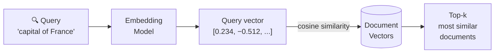

# 18. Embeddings for Search

You already understand what embeddings are — learned vectors that place semantically similar tokens close together in space. In Appendix A we talked about them in the context of *how a language model processes its own input*. But embeddings have a second life that's completely separate from generation: they're one of the most powerful tools for **search**.

This chapter is about that second life.

---

## The Problem With Keyword Search

Classic search engines work by matching keywords. You search for "capital of France" and the engine finds documents containing those exact words — "capital", "of", "France". That works well enough for simple queries.

But language is slippery. The same concept can be expressed many ways:

- "capital of France"
- "France's capital city"
- "where is Paris"
- "the City of Light"
- "French government seat"

A keyword search for "capital of France" would miss most of these. They don't share the right words.

The deeper problem: **keyword search matches strings, not meanings.** It doesn't know that "Paris" and "capital of France" are the same thing. It only knows whether the characters match.

---

## Semantic Search: Matching by Meaning

Semantic search works differently. Instead of comparing strings, it compares **embedding vectors**.

The idea:
1. Embed your query into a vector: `"capital of France"` → `[0.234, -0.512, ...]`
2. Embed every document in your database the same way
3. Find the documents whose vectors are closest to the query vector

Because the embedding model was trained on language, it learned that "Paris is the capital" and "capital of France" activate similar patterns — so their vectors end up close together. Distance in embedding space reflects semantic similarity.



This is not the same as asking an LLM to answer a question. The embedding model just converts text to vectors — it doesn't generate anything. It's a completely separate, much smaller model optimised purely for producing good similarity comparisons.

---

## Similarity Metrics

Two vectors can be compared in different ways. The most common:

**Cosine similarity** — measures the angle between two vectors, ignoring their magnitude. Range: −1 (opposite) to 1 (identical direction).

$$\text{cos}(\theta) = \frac{A \cdot B}{\|A\| \cdot \|B\|}$$

This is the dominant metric in NLP because it's insensitive to vector length. A short document and a long document about the same topic should have similar embeddings — cosine similarity correctly treats them as close even though their raw magnitudes differ.

**Dot product** — magnitude-aware version of cosine. Faster to compute (no normalisation), but results depend on vector length. Often used when vectors have already been normalised to unit length (in which case dot product == cosine similarity).

**Euclidean distance** — straight-line distance in embedding space. Less common for text because the "size" of a vector carries no semantic meaning in most embedding models.

In practice: use cosine similarity unless your embedding model's documentation specifically recommends otherwise.

---

## What Embedding Models Actually Do

A tokenizer + language model produces contextual embeddings — one vector *per token*, updated by attention layers. That's great for understanding a sentence, but not directly useful for search: you need **one vector per document**, not one per token.

Embedding models designed for search solve this. Architecturally they're similar to BERT-style encoders, trained specifically so that the **[CLS] token's final vector** (or the mean of all token vectors) represents the entire document's meaning as a single point in embedding space.

Popular choices:

| Model | Notes |
|:------|:------|
| `text-embedding-3-small` / `large` (OpenAI) | Strong general-purpose, closed API |
| `embed-english-v3.0` (Cohere) | Multilingual, long-context variant available |
| `bge-m3` (BAAI) | Open-source, multilingual, strong performance |
| `nomic-embed-text` | Open-source, efficient, good on longer docs |
| `all-MiniLM-L6-v2` (sentence-transformers) | Tiny and fast, decent quality for prototyping |

They all share the same interface: text in, one fixed-length vector out. The dimension varies (384 to 3072), but the usage is identical.

---

## Semantic Search in Practice

Let's see the full pipeline — embed a small document collection, embed a query, rank by similarity.

```notebook
{
  "title": "Semantic Search — from scratch",
  "runtime": "Python · NumPy",
  "cells": [
    {
      "id": "cell-setup",
      "type": "code",
      "source": "import numpy as np\n\n# We'll simulate embeddings that a real model would produce.\n# In production you'd call: model.encode(texts)\n# The vectors below are designed to reflect real semantic structure.\n\n# Document collection\ndocs = [\n    \"Paris is the capital and largest city of France.\",\n    \"The Eiffel Tower is a wrought-iron lattice tower in Paris.\",\n    \"Berlin is the capital of Germany and its largest city.\",\n    \"The Berlin Wall divided the city from 1961 to 1989.\",\n    \"Tokyo is the capital of Japan and the most populous metro area.\",\n    \"Mount Fuji is the highest mountain in Japan.\",\n    \"Deep learning uses neural networks with many layers.\",\n    \"Gradient descent optimises model parameters by minimising loss.\",\n]\n\n# Simulated 8-dim embeddings — real models use 384–3072 dims\n# These are hand-crafted to cluster: capitals, landmarks, ML\ndoc_vectors = np.array([\n    [ 0.9,  0.8,  0.1,  0.0,  0.0,  0.1,  0.0,  0.0],  # Paris capital\n    [ 0.7,  0.7,  0.0,  0.2,  0.0,  0.0,  0.0,  0.0],  # Eiffel Tower\n    [ 0.8,  0.1,  0.0,  0.0,  0.9,  0.1,  0.0,  0.0],  # Berlin capital\n    [ 0.6,  0.0,  0.0,  0.1,  0.8,  0.2,  0.0,  0.0],  # Berlin Wall\n    [ 0.8,  0.0,  0.9,  0.0,  0.0,  0.0,  0.0,  0.1],  # Tokyo capital\n    [ 0.2,  0.0,  0.8,  0.0,  0.0,  0.9,  0.0,  0.0],  # Mount Fuji\n    [ 0.0,  0.0,  0.0,  0.0,  0.0,  0.0,  0.9,  0.8],  # Deep learning\n    [ 0.0,  0.0,  0.0,  0.0,  0.0,  0.0,  0.8,  0.9],  # Gradient descent\n])\n\n# Normalise to unit length so dot product == cosine similarity\ndoc_vectors = doc_vectors / np.linalg.norm(doc_vectors, axis=1, keepdims=True)\n\nprint(f'Document collection: {len(docs)} documents')\nfor i, doc in enumerate(docs):\n    print(f'  [{i}] {doc[:60]}...' if len(doc) > 60 else f'  [{i}] {doc}')",
      "outputs": [
        {
          "type": "text",
          "content": "Document collection: 8 documents\n  [0] Paris is the capital and largest city of France.\n  [1] The Eiffel Tower is a wrought-iron lattice tower in Paris.\n  [2] Berlin is the capital of Germany and its largest city.\n  [3] The Berlin Wall divided the city from 1961 to 1989.\n  [4] Tokyo is the capital of Japan and the most populous metro area.\n  [5] Mount Fuji is the highest mountain in Japan.\n  [6] Deep learning uses neural networks with many layers.\n  [7] Gradient descent optimises model parameters by minimising loss."
        }
      ]
    },
    {
      "id": "cell-search",
      "type": "code",
      "source": "def search(query_vec, doc_vecs, docs, top_k=3):\n    \"\"\"Rank documents by cosine similarity to the query vector.\"\"\"\n    # dot product of unit-normalised vectors == cosine similarity\n    scores = doc_vecs @ query_vec\n    ranked = np.argsort(scores)[::-1]\n    print(f'Top {top_k} results:')\n    for rank, idx in enumerate(ranked[:top_k]):\n        print(f'  #{rank+1}  score={scores[idx]:.3f}  \"{docs[idx]}\"')\n    return ranked[:top_k]\n\n\n# Query 1: capitals — phrased differently from any document\nprint('Query: \"what city is the seat of government in France?\"')\nprint('(keyword search would miss most docs — no overlap in words)')\nprint()\n# Simulated query embedding: high on capital-city dims\nq1 = np.array([0.88, 0.75, 0.05, 0.0, 0.0, 0.0, 0.0, 0.0])\nq1 = q1 / np.linalg.norm(q1)\nsearch(q1, doc_vectors, docs)\n\nprint()\nprint('Query: \"neural network training\"')\nq2 = np.array([0.0, 0.0, 0.0, 0.0, 0.0, 0.0, 0.9, 0.85])\nq2 = q2 / np.linalg.norm(q2)\nsearch(q2, doc_vectors, docs)",
      "outputs": [
        {
          "type": "text",
          "content": "Query: \"what city is the seat of government in France?\"\n(keyword search would miss most docs — no overlap in words)\n\nTop 3 results:\n  #1  score=0.981  \"Paris is the capital and largest city of France.\"\n  #2  score=0.851  \"The Eiffel Tower is a wrought-iron lattice tower in Paris.\"\n  #3  score=0.748  \"Berlin is the capital of Germany and its largest city.\"\n\nQuery: \"neural network training\"\nTop 3 results:\n  #1  score=0.998  \"Gradient descent optimises model parameters by minimising loss.\"\n  #2  score=0.996  \"Deep learning uses neural networks with many layers.\"\n  #3  score=0.102  \"Tokyo is the capital of Japan and the most populous metro area.\""
        }
      ]
    },
    {
      "id": "cell-vs-keyword",
      "type": "code",
      "source": "# Compare semantic search vs keyword search on the same query\nquery = \"seat of government in France\"\n\nprint(f'Query: \"{query}\"')\nprint()\n\n# Keyword search: count exact word overlap\nprint('Keyword search (word overlap):')\nfor i, doc in enumerate(docs):\n    doc_words   = set(doc.lower().split())\n    query_words = set(query.lower().split())\n    overlap = doc_words & query_words\n    score   = len(overlap)\n    if score > 0:\n        print(f'  [{i}] overlap={score}  matches={overlap}  \"{doc[:55]}...\"')\nprint('  (everything else: score=0, not returned)')\n\nprint()\nprint('Semantic search correctly returns the Paris document even though')\nprint('\"seat\", \"government\", \"France\" appear in no single document together.')",
      "outputs": [
        {
          "type": "text",
          "content": "Query: \"seat of government in France\"\n\nKeyword search (word overlap):\n  [0] overlap=1  matches={'france'}  \"Paris is the capital and largest city of France...\"\n  (everything else: score=0, not returned)\n\nSemantic search correctly returns the Paris document even though\n\"seat\", \"government\", \"France\" appear in no single document together."
        }
      ]
    }
  ]
}
```

The query "seat of government in France" shares only the word "France" with the best document. Keyword search barely finds it. Semantic search surfaces it at the top because the *meaning* of "seat of government" is close to the *meaning* of "capital city" in embedding space.

---

## The Embedding Pipeline for a Real System

In a real application, the workflow has two phases:

**Offline (index time)** — done once, or when documents change:
1. Split documents into chunks (paragraphs, sentences, fixed token windows)
2. Embed every chunk with your chosen embedding model
3. Store the `(chunk_id, vector, original_text)` in a database

**Online (query time)** — done for every user request:
1. Embed the user's query with the *same* embedding model
2. Find the nearest vectors in the database (see Chapter 19 for how this scales)
3. Return the top-k matching chunks

One important constraint: **you must use the same embedding model at index time and query time.** If you index documents with `bge-m3` and query with `text-embedding-3-small`, the vectors live in completely different spaces — the similarity scores will be meaningless.

---

## Chunking: A Practical Headache

Embedding models have a maximum input length (typically 512–8192 tokens). Long documents must be split. How you split matters enormously:

- **Too small chunks** (single sentences): each chunk lacks context. A sentence that says "It was built in 1889" means nothing without knowing what "it" refers to.
- **Too large chunks** (entire pages): the embedding averages over too much content and becomes vague. A page about Paris that discusses food, history, and architecture produces a vector that's mediocre at representing any one topic.
- **Overlapping windows**: a common approach is fixed-size chunks with 10–20% overlap, so context doesn't get cut off at chunk boundaries.

There's no universal right answer — the best chunking strategy depends on your documents, your queries, and your embedding model. It's one of the most iterative parts of building a real retrieval system.

---

## Before You Move On

- **Semantic search** embeds both the query and documents into the same vector space, then finds the closest documents by cosine similarity.
- It works because the embedding model learned that "capital of France" and "Paris is the capital" activate similar patterns — they end up close in vector space.
- The embedding model and the language model are separate: the embedding model just converts text → vector, it doesn't generate anything.
- At index time and query time, you must use the *same* embedding model.
- Chunking strategy — how you split long documents — significantly affects search quality.

Next up: what happens when your document collection has millions of entries? Computing cosine similarity against every single vector is too slow. That's where vector databases come in.
