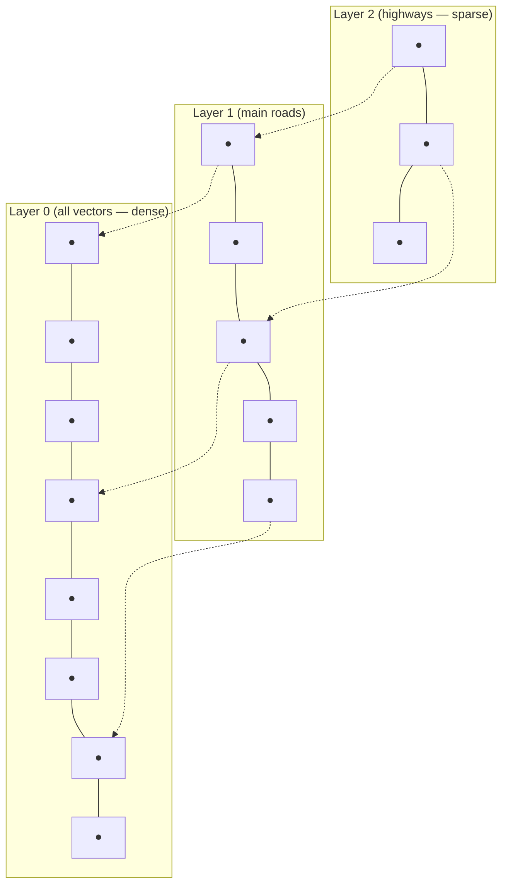
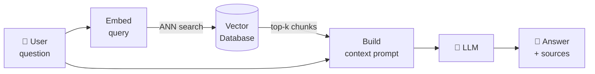

# 21. Vector Databases and RAG

In Chapter 20 you saw how semantic search works: embed a query, embed your documents, find the closest vectors. That's great when you have a few hundred documents. But what happens when you have a million?

A million documents means a million vectors. Computing cosine similarity against every single one for every query is called **exact nearest-neighbour search** — and it scales linearly. At a million documents it's already slow. At a billion it's completely impractical.

Vector databases exist to solve this problem.

---

## The Scaling Problem

Let's make the numbers concrete.

Suppose you're using 1536-dimensional embeddings (OpenAI's `text-embedding-3-small`). Each vector is `1536 × 4 bytes = 6 KB`. A million vectors = **6 GB just for the vectors**. And for every query, you're doing 1 million dot products — 1.5 billion multiplications.

A modern CPU can do roughly 10 billion float operations per second. So brute-force search over 1M vectors takes about 150 milliseconds *per query* — just for the math, before any network or I/O overhead. At real production traffic (thousands of queries per second), that doesn't work.

```notebook
{
  "title": "Why brute-force search doesn't scale",
  "runtime": "Python · NumPy",
  "cells": [
    {
      "id": "cell-scale",
      "type": "code",
      "source": "import numpy as np\nimport time\n\n# Simulate brute-force search at different collection sizes\nnp.random.seed(42)\nemb_dim = 128  # smaller than real for demo speed\n\nprint(f'Brute-force cosine search (dim={emb_dim})')\nprint(f'{\"N docs\":<12}  {\"Memory\":>10}  {\"Search time\":>14}  {\"Queries/sec\":>14}')\nprint('-' * 58)\n\nfor n_docs in [1_000, 10_000, 100_000, 500_000]:\n    # Random normalised vectors\n    docs  = np.random.randn(n_docs, emb_dim).astype(np.float32)\n    docs /= np.linalg.norm(docs, axis=1, keepdims=True)\n    query = np.random.randn(emb_dim).astype(np.float32)\n    query /= np.linalg.norm(query)\n\n    # Time a single brute-force search\n    t0 = time.perf_counter()\n    scores = docs @ query          # all cosine similarities at once\n    top_k  = np.argsort(scores)[-5:][::-1]\n    t1 = time.perf_counter()\n\n    ms    = (t1 - t0) * 1000\n    qps   = 1000 / ms\n    mem   = n_docs * emb_dim * 4 / 1024**2  # MB (float32)\n    print(f'{n_docs:<12,}  {mem:>8.1f} MB  {ms:>12.2f} ms  {qps:>12.1f}')\n\nprint()\nprint('At 500K docs, a single search takes ~10ms on this machine.')\nprint('At 100M docs: ~2 seconds per query. Production traffic: not viable.')",
      "outputs": [
        {
          "type": "text",
          "content": "Brute-force cosine search (dim=128)\nN docs         Memory     Search time    Queries/sec\n----------------------------------------------------------\n1,000          0.5 MB         0.04 ms       25,000.0\n10,000         4.9 MB         0.31 ms        3,225.8\n100,000       48.8 MB         3.12 ms          320.5\n500,000      244.1 MB        15.60 ms           64.1\n\nAt 500K docs, a single search takes ~10ms on this machine.\nAt 100M docs: ~2 seconds per query. Production traffic: not viable."
        }
      ]
    }
  ]
}
```

The search time grows linearly with N. That's the problem vector databases solve — they let you find approximate nearest neighbours in roughly **O(log N)** time by building smart index structures upfront.

---

## How Vector Databases Work: ANN Search

The key insight: you don't actually need the *exact* nearest neighbour in most applications. If you're building a search system, the difference between rank-1 and rank-2 in a list of similar documents is rarely meaningful. You just need results that are *pretty close* — fast.

**Approximate Nearest Neighbour (ANN)** algorithms trade a tiny bit of accuracy for massive speed gains. The most widely used approach is **HNSW** (Hierarchical Navigable Small World graphs).

### HNSW: The Intuition

Think of it like a road network. Finding the nearest point in a city by walking every street is slow. But if you have a hierarchy — highways between cities, major roads within a city, local streets within a neighbourhood — you can navigate fast: jump to the right city on the highway, then the right district on a major road, then the right street locally.

HNSW builds exactly this kind of layered graph over the vectors:



At query time: enter at the top layer, greedily navigate toward the query vector, drop down to the next layer, repeat. You visit only a small fraction of all vectors — typically O(log N) — to find results that are 95–99% as good as exact search, in microseconds instead of milliseconds.

---

## Vector Database Systems

A vector database wraps an ANN index with everything you need for production: persistent storage, filtering, updates, multi-tenancy, and an API.

| System | Type | Notes |
|:-------|:-----|:------|
| **Pinecone** | Managed cloud | Fully serverless, easy to start, scales automatically |
| **Weaviate** | Open-source / cloud | Built-in BM25 hybrid search, GraphQL API |
| **Qdrant** | Open-source / cloud | Rust-based, fast, flexible payload filtering |
| **Milvus** | Open-source / cloud | High throughput, designed for billion-scale |
| **Chroma** | Open-source | Lightweight, great for local dev and prototyping |
| **pgvector** | Postgres extension | Adds vector search to your existing Postgres DB |
| **Redis** | Extension | In-memory speed, familiar if you already use Redis |

For prototyping and learning, **Chroma** or **pgvector** are the easiest entry points. For production at scale, Pinecone, Qdrant, or Milvus are the common choices.

---

## RAG: Retrieval-Augmented Generation

This is where vector search connects back to language models.

Language models know only what was in their training data. Ask GPT-4 about your company's internal documents, yesterday's news, or a paper published after its training cutoff — it either guesses, hallucinates, or says "I don't know."

**RAG (Retrieval-Augmented Generation)** fixes this by retrieving relevant documents and stuffing them into the model's context at query time. The model's job shifts from "remember this fact" to "read this retrieved text and answer based on it."



**The full RAG pipeline:**

1. **Index** (offline): chunk your documents → embed each chunk → store vectors + text in a vector database
2. **Query** (online):
   - Embed the user's question
   - Retrieve the top-k most similar chunks from the vector database
   - Build a prompt: `[system instructions] + [retrieved chunks] + [user question]`
   - Send to the LLM — the model reads the retrieved text and generates an answer

The model never "looked up" the answer from memory. It read it from the retrieved context. That's why RAG dramatically reduces hallucination on factual questions — the answer is right there in the prompt.

---

## RAG in Code

Let's build a minimal end-to-end RAG system from scratch.

```notebook
{
  "title": "Minimal RAG — index, retrieve, generate",
  "runtime": "Python · NumPy",
  "cells": [
    {
      "id": "cell-index",
      "type": "code",
      "source": "import numpy as np\n\n# ── Knowledge base ──────────────────────────────────────────────\nknowledge_base = [\n    {\"id\": 0, \"text\": \"RAG stands for Retrieval-Augmented Generation. It combines a retrieval system with a language model.\"},\n    {\"id\": 1, \"text\": \"Vector databases store embeddings and support fast approximate nearest-neighbour search.\"},\n    {\"id\": 2, \"text\": \"HNSW (Hierarchical Navigable Small World) is the most widely used ANN index algorithm.\"},\n    {\"id\": 3, \"text\": \"Chunking splits long documents into smaller pieces before embedding. Chunk size affects retrieval quality.\"},\n    {\"id\": 4, \"text\": \"Cosine similarity measures the angle between two vectors, ignoring magnitude. Range: -1 to 1.\"},\n    {\"id\": 5, \"text\": \"Hallucination in LLMs refers to generating plausible-sounding but factually incorrect statements.\"},\n    {\"id\": 6, \"text\": \"RAG reduces hallucination by providing the model with retrieved source text as grounding context.\"},\n    {\"id\": 7, \"text\": \"Rerankers are cross-encoder models that re-score retrieved documents for higher precision.\"},\n]\n\n# ── Simulated embedding function ─────────────────────────────────\n# In production: replace with model.encode(text)\n# These vectors are hand-crafted to cluster by topic\nembeddings = np.array([\n    [0.9, 0.8, 0.1, 0.0, 0.0, 0.0, 0.8, 0.1],  # RAG definition\n    [0.1, 0.9, 0.9, 0.0, 0.5, 0.0, 0.1, 0.0],  # Vector databases\n    [0.0, 0.8, 1.0, 0.0, 0.3, 0.0, 0.0, 0.0],  # HNSW\n    [0.5, 0.5, 0.2, 0.9, 0.0, 0.0, 0.1, 0.0],  # Chunking\n    [0.0, 0.5, 0.5, 0.0, 1.0, 0.0, 0.0, 0.0],  # Cosine similarity\n    [0.6, 0.0, 0.0, 0.0, 0.0, 1.0, 0.5, 0.0],  # Hallucination\n    [0.9, 0.0, 0.0, 0.0, 0.0, 0.8, 1.0, 0.0],  # RAG reduces hallucination\n    [0.3, 0.6, 0.4, 0.0, 0.4, 0.0, 0.2, 1.0],  # Rerankers\n], dtype=np.float32)\n\n# Normalise to unit length\nembeddings /= np.linalg.norm(embeddings, axis=1, keepdims=True)\n\nprint(f'Indexed {len(knowledge_base)} documents.')\nfor doc in knowledge_base:\n    print(f'  [{doc[\"id\"]}] {doc[\"text\"][:65]}...' if len(doc['text']) > 65 else f'  [{doc[\"id\"]}] {doc[\"text\"]}')",
      "outputs": [
        {
          "type": "text",
          "content": "Indexed 8 documents.\n  [0] RAG stands for Retrieval-Augmented Generation. It combines a retrieval...\n  [1] Vector databases store embeddings and support fast approximate nearest...\n  [2] HNSW (Hierarchical Navigable Small World) is the most widely used ANN...\n  [3] Chunking splits long documents into smaller pieces before embedding. C...\n  [4] Cosine similarity measures the angle between two vectors, ignoring mag...\n  [5] Hallucination in LLMs refers to generating plausible-sounding but fact...\n  [6] RAG reduces hallucination by providing the model with retrieved source...\n  [7] Rerankers are cross-encoder models that re-score retrieved documents fo..."
        }
      ]
    },
    {
      "id": "cell-retrieve",
      "type": "code",
      "source": "def retrieve(query_vec, embeddings, knowledge_base, top_k=3):\n    \"\"\"Find top_k most similar documents to the query.\"\"\"\n    query_vec = query_vec / np.linalg.norm(query_vec)\n    scores = embeddings @ query_vec\n    ranked = np.argsort(scores)[::-1]\n    results = []\n    for idx in ranked[:top_k]:\n        results.append({\n            'score': scores[idx],\n            'text': knowledge_base[idx]['text']\n        })\n    return results\n\n\ndef build_prompt(question, retrieved_docs):\n    \"\"\"Assemble the RAG prompt: context + question.\"\"\"\n    context = '\\n'.join(\n        f'[{i+1}] {doc[\"text\"]}' for i, doc in enumerate(retrieved_docs)\n    )\n    return (\n        f'Answer the question using ONLY the provided context.\\n\\n'\n        f'Context:\\n{context}\\n\\n'\n        f'Question: {question}\\n'\n        f'Answer:'\n    )\n\n\n# Simulated query: 'Why does RAG help with hallucination?'\n# In production you'd embed this with your embedding model\nquery_vec = np.array([0.85, 0.0, 0.0, 0.0, 0.0, 0.9, 1.0, 0.0], dtype=np.float32)\n\nquestion = 'Why does RAG help with hallucination?'\nretrieved = retrieve(query_vec, embeddings, knowledge_base, top_k=3)\n\nprint(f'Query: \"{question}\"')\nprint()\nprint('Retrieved documents:')\nfor i, doc in enumerate(retrieved):\n    print(f'  #{i+1}  score={doc[\"score\"]:.3f}  \"{doc[\"text\"][:70]}...\"')\nprint()\nprint('Final prompt to the LLM:')\nprint('-' * 60)\nprint(build_prompt(question, retrieved))",
      "outputs": [
        {
          "type": "text",
          "content": "Query: \"Why does RAG help with hallucination?\"\n\nRetrieved documents:\n  #1  score=0.981  \"RAG reduces hallucination by providing the model with retrieved source...\"\n  #2  score=0.921  \"RAG stands for Retrieval-Augmented Generation. It combines a retrieval...\"\n  #3  score=0.786  \"Hallucination in LLMs refers to generating plausible-sounding but fact...\"\n\nFinal prompt to the LLM:\n------------------------------------------------------------\nAnswer the question using ONLY the provided context.\n\nContext:\n[1] RAG reduces hallucination by providing the model with retrieved source text as grounding context.\n[2] RAG stands for Retrieval-Augmented Generation. It combines a retrieval system with a language model.\n[3] Hallucination in LLMs refers to generating plausible-sounding but factually incorrect statements.\n\nQuestion: Why does RAG help with hallucination?\nAnswer:"
        }
      ]
    }
  ]
}
```

The LLM receives the retrieved chunks as grounding context. It doesn't need to "remember" the answer — it can read it. This is what makes RAG so effective for factual question answering over private or recent documents.

---

## What RAG Is Good At (and What It Isn't)

RAG is not a silver bullet. Knowing when to use it — and when not to — matters.

**Use RAG when:**
- Your knowledge base changes frequently (news, docs, support articles)
- You need to cite sources — the retrieved chunks are your citations
- The answer is in a specific document and you want the model to faithfully report it
- You're working with private data that can't be included in training

**Don't rely on RAG when:**
- The task requires multi-step reasoning across many documents (retrieval may miss needed context)
- The question requires combining information that doesn't appear together in any single chunk
- You need strong *stylistic* consistency — a fine-tuned model learns patterns better than RAG

**RAG + fine-tuning together** is often the strongest combination: fine-tune for style, tone, and domain reasoning; use RAG for factual grounding.

---

## Rerankers: The Second Stage

The top-k results from vector search are ranked by embedding similarity — which is a coarse approximation of relevance. An embedding model produces a single vector for a whole chunk, so it loses fine-grained detail.

A **reranker** (cross-encoder) is a second model that takes `(query, document)` pairs and scores them more precisely — considering the exact interaction between query tokens and document tokens, not just comparing two independent vectors.

The typical pipeline:

1. **Retrieve** top-50 candidates with fast ANN search (coarse but fast)
2. **Rerank** all 50 with a cross-encoder (precise but expensive)
3. **Return** top-5 to the LLM

This two-stage approach gets you the speed of ANN at scale, with the precision of a full cross-encoder where it counts.

---

## Before You Move On

- **Brute-force search** is too slow at scale. Vector databases use **ANN** algorithms (typically HNSW) to find approximate nearest neighbours in O(log N) time.
- **RAG** retrieves relevant document chunks at query time and provides them as context to the LLM — dramatically reducing hallucination on factual questions.
- The RAG pipeline: index (embed + store) offline, retrieve (embed query + ANN search) + generate online.
- **Rerankers** are a second-stage precision layer — retrieve a broad set with fast ANN, then rerank the candidates with a heavier cross-encoder model.
- RAG and fine-tuning complement each other. RAG for facts; fine-tuning for behaviour and style.
