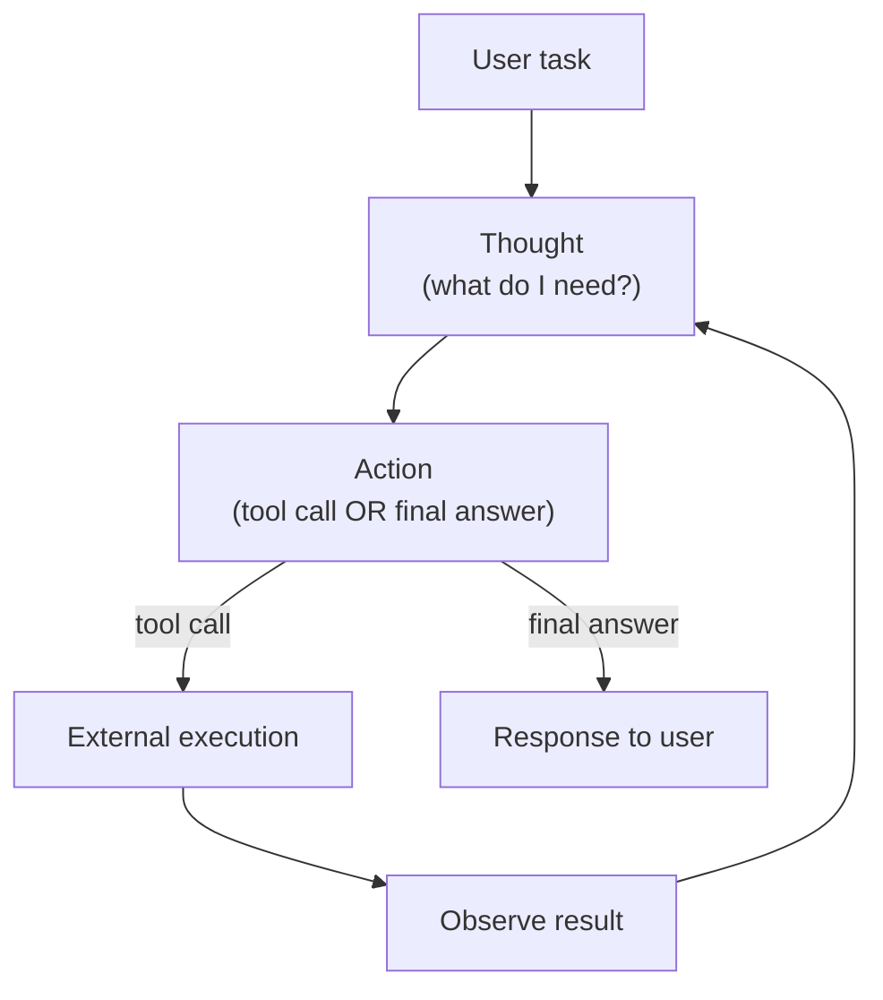

# 22. Tool Calling and AI Agents

Language models are powerful reasoners — but they have two fundamental limitations that no amount of training can fully fix:

```text
Limitation 1 — Knowledge cutoff:
  Training data has a timestamp. The model can't know today's weather,
  current stock prices, recent news, or anything that happened after
  its training cutoff. It can only guess from historical patterns.

Limitation 2 — Numerical computation:
  Transformers do matrix multiplication and softmax — not arithmetic.
  Ask for 357 × 289 and you might get 103,173 (correct) or 104,407
  (plausible-looking but wrong). The model approximates; it doesn't calculate.

Demonstration:
  "What's today's weather in Beijing?"
  → "This season the temperature is usually around 20-30°C" (statistical guess)

  "What is 357 × 289?"
  → "103,407" (wrong — correct is 103,173)
```

**Tool calling** (also called function calling) is the solution. The model doesn't execute code or call APIs — it decides *when* to call a tool and *what arguments to pass*. An external program does the actual execution. The results come back into the conversation, and the model generates its final response based on real data.

```text
Without tools:              With tools:
  User: "357 × 289?"          User: "357 × 289?"
  Model: "103,407"  ✗         Model: {"tool_call": {"name": "calculate",
                                                     "arguments": {"expression": "357*289"}}}
                               → external: eval("357*289") = 103173
                               Model: "357 × 289 = 103,173"  ✓
```

---

## The Six-Step Flow

Tool calling follows a fixed six-step protocol:

```text
STEP 1 — Define tools (JSON schema)
  Each tool has: name, description, parameters
  This schema tells the model what tools exist and how to call them.

  {
    "name": "get_weather",
    "description": "Query current weather for a city",
    "parameters": {
      "city": {"type": "string", "description": "City name"},
      "unit": {"type": "string", "enum": ["celsius", "fahrenheit"]}
    }
  }

STEP 2 — Inject into system prompt
  The tool definitions are added to the system prompt.
  The model reads them before generating its response.

STEP 3 — Model outputs structured JSON (not natural language)
  If the model decides a tool is needed, it outputs:
  {"tool_call": {"name": "get_weather", "arguments": {"city": "Beijing", "unit": "celsius"}}}
  Not natural language. Structured JSON that the external program can parse.

STEP 4 — External program executes
  Your code parses the JSON, calls the actual function/API, gets the result.
  result = get_weather("Beijing", "celsius")  → {"temperature": 22, "condition": "sunny"}

STEP 5 — Result injected back as a conversation message
  {"role": "tool", "name": "get_weather", "content": '{"temperature": 22, "condition": "sunny"}'}
  This is appended to the conversation history.

STEP 6 — Model generates final natural-language response
  The model now sees the tool result and produces a proper answer:
  "Beijing is 22°C and sunny today."
```

The model is the **decision maker**. The external program is the **executor**. Neither can do the other's job.

---

## Tool Schema and the Full Conversation Structure

The message structure for tool calling has four roles:

```text
role: "system"     → tool definitions + persona, set by developer
role: "user"       → the user's question
role: "assistant"  → the model's output (may contain a tool_call field)
role: "tool"       → the execution result from the external program
```

A complete single-tool conversation looks like:

```text
[system]     You are an assistant with access to:
             - get_weather(city, unit): queries current weather
             - calculate(expression): evaluates math

[user]       What's the temperature in Beijing today?

[assistant]  {"tool_call": {"name": "get_weather",
                            "arguments": {"city": "Beijing", "unit": "celsius"}}}

[tool]       {"temperature": 22, "condition": "sunny", "humidity": 45}
(name: get_weather)

[assistant]  Beijing is 22°C and sunny today with 45% humidity.
```

The user sees only the first and last messages. The tool call and result are internal — the model coordinates them.

```notebook
{
  "title": "Tool calling — complete 6-step implementation from scratch",
  "runtime": "Python",
  "cells": [
    {
      "id": "cell-tools-setup",
      "type": "code",
      "source": "import json\n\n# ── Step 1: Define tools ──────────────────────────────────────────\ntools = [\n    {\n        \"name\": \"get_weather\",\n        \"description\": \"Query the current weather for a given city\",\n        \"parameters\": {\n            \"city\": {\"type\": \"string\", \"description\": \"City name\"},\n            \"unit\": {\"type\": \"string\", \"enum\": [\"celsius\", \"fahrenheit\"],\n                     \"description\": \"Temperature unit\"}\n        }\n    },\n    {\n        \"name\": \"calculate\",\n        \"description\": \"Evaluate a mathematical expression precisely\",\n        \"parameters\": {\n            \"expression\": {\"type\": \"string\",\n                           \"description\": \"Valid Python math expression, e.g. '357*289'\"}\n        }\n    }\n]\n\n# ── Step 2: Build system prompt with tool descriptions ────────────\ndef build_system_prompt(tools):\n    lines = [\n        \"You are a helpful assistant. When you need external information \"\n        \"or precise computation, output a JSON tool call instead of guessing.\",\n        \"\",\n        \"Available tools:\"\n    ]\n    for t in tools:\n        lines.append(f\"  {t['name']}: {t['description']}\")\n        for pname, pinfo in t['parameters'].items():\n            enum_note = f\" (options: {pinfo['enum']})\" if 'enum' in pinfo else ''\n            lines.append(f\"    - {pname}: {pinfo['description']}{enum_note}\")\n    return \"\\n\".join(lines)\n\nsystem_prompt = build_system_prompt(tools)\nprint(system_prompt)\nprint()\nprint(f'System prompt length: {len(system_prompt.split())} words')",
      "outputs": [
        {
          "type": "text",
          "content": "You are a helpful assistant. When you need external information or precise computation, output a JSON tool call instead of guessing.\n\nAvailable tools:\n  get_weather: Query the current weather for a given city\n    - city: City name\n    - unit: Temperature unit (options: ['celsius', 'fahrenheit'])\n  calculate: Evaluate a mathematical expression precisely\n    - expression: Valid Python math expression, e.g. '357*289'\n\nSystem prompt length: 57 words"
        }
      ]
    },
    {
      "id": "cell-tools-execute",
      "type": "code",
      "source": "# ── Step 3: Model output (what a real LLM would generate) ─────────\n# In production this comes from model(messages) — here we simulate it\nuser_query = \"What's the temperature in Beijing today?\"\n\n# Simulated model decision: call get_weather\nmodel_tool_call = json.dumps({\n    \"tool_call\": {\n        \"name\": \"get_weather\",\n        \"arguments\": {\"city\": \"Beijing\", \"unit\": \"celsius\"}\n    }\n}, indent=2)\n\nprint(\"User:\", user_query)\nprint()\nprint(\"Model output (JSON, not natural language):\")\nprint(model_tool_call)\n\n# ── Step 4: External program executes ────────────────────────────\ndef execute_tool(name, arguments):\n    \"\"\"The REAL work happens here — outside the model.\"\"\"\n    if name == \"get_weather\":\n        city = arguments.get(\"city\", \"\")\n        # In production: call a weather API\n        mock_data = {\n            \"Beijing\":   {\"temperature\": 22, \"condition\": \"sunny\",  \"humidity\": 45},\n            \"Shanghai\":  {\"temperature\": 18, \"condition\": \"cloudy\", \"humidity\": 72},\n            \"Guangzhou\": {\"temperature\": 28, \"condition\": \"rainy\",  \"humidity\": 88},\n        }\n        if city in mock_data:\n            return mock_data[city]\n        return {\"error\": f\"City not found: {city}\"}\n    elif name == \"calculate\":\n        expr = arguments.get(\"expression\", \"\")\n        # In production: use a real math parser (not eval in production!)\n        try:\n            result = eval(expr, {\"__builtins__\": {}})  # restricted eval\n            return {\"result\": result, \"expression\": expr}\n        except Exception as e:\n            return {\"error\": str(e)}\n    return {\"error\": f\"Unknown tool: {name}\"}\n\n\nparsed = json.loads(model_tool_call)\ncall = parsed[\"tool_call\"]\ntool_result = execute_tool(call[\"name\"], call[\"arguments\"])\n\n# ── Step 5: Inject result back as a message ───────────────────────\nconversation = [\n    {\"role\": \"system\",    \"content\": system_prompt},\n    {\"role\": \"user\",      \"content\": user_query},\n    {\"role\": \"assistant\", \"content\": model_tool_call},\n    {\"role\": \"tool\",      \"name\": call[\"name\"],\n                         \"content\": json.dumps(tool_result)},\n]\n\nprint()\nprint(\"Tool result:\", tool_result)\nprint()\nprint(\"Conversation after injecting tool result:\")\nfor msg in conversation:\n    role = msg['role'].upper()\n    content = msg['content'][:60] + '...' if len(msg.get('content',''))>60 else msg.get('content','')\n    print(f\"  [{role:10s}] {content}\")",
      "outputs": [
        {
          "type": "text",
          "content": "User: What's the temperature in Beijing today?\n\nModel output (JSON, not natural language):\n{\n  \"tool_call\": {\n    \"name\": \"get_weather\",\n    \"arguments\": {\n      \"city\": \"Beijing\",\n      \"unit\": \"celsius\"\n    }\n  }\n}\n\nTool result: {'temperature': 22, 'condition': 'sunny', 'humidity': 45}\n\nConversation after injecting tool result:\n  [SYSTEM    ] You are a helpful assistant. When you need external ...\n  [USER      ] What's the temperature in Beijing today?\n  [ASSISTANT ] {\"tool_call\": {\"name\": \"get_weather\", \"arguments\": ...\n  [TOOL      ] {\"temperature\": 22, \"condition\": \"sunny\", \"humidity\": 45}"
        }
      ]
    },
    {
      "id": "cell-tools-final",
      "type": "code",
      "source": "# ── Step 6: Model sees result, generates natural language ─────────\n# In production: final_reply = model(conversation)\n# The model reads the tool result and composes a natural response.\n\n# Simulated final reply\nfinal_reply = (\n    f\"Beijing is currently {tool_result['temperature']}°C and \"\n    f\"{tool_result['condition']} with {tool_result['humidity']}% humidity.\"\n)\n\nprint(\"=\" * 55)\nprint(\"FINAL CONVERSATION (what the user experiences):\")\nprint(\"=\" * 55)\nprint(f\"User:  {user_query}\")\nprint(f\"Model: {final_reply}\")\nprint()\nprint(\"What happened internally:\")\nprint(\"  1. Model decided get_weather was needed\")\nprint(\"  2. Model output structured JSON (not text)\")\nprint(\"  3. External code called the weather API\")\nprint(\"  4. Result injected back into conversation\")\nprint(\"  5. Model read the real data and answered accurately\")\nprint()\nprint(\"The user saw none of steps 1-4. Just a clean, accurate answer.\")",
      "outputs": [
        {
          "type": "text",
          "content": "=======================================================\nFINAL CONVERSATION (what the user experiences):\n=======================================================\nUser:  What's the temperature in Beijing today?\nModel: Beijing is currently 22°C and sunny with 45% humidity.\n\nWhat happened internally:\n  1. Model decided get_weather was needed\n  2. Model output structured JSON (not text)\n  3. External code called the weather API\n  4. Result injected back into conversation\n  5. Model read the real data and answered accurately\n\nThe user saw none of steps 1-4. Just a clean, accurate answer."
        }
      ]
    }
  ]
}
```

---

## Parallel vs Sequential Tool Calls

When a task requires multiple tools, there are two patterns:

```text
PARALLEL (no dependency between calls):
  User: "What's the weather in Beijing AND what is 357 × 289?"
  
  Model output: {"tool_calls": [
      {"name": "get_weather", "arguments": {"city": "Beijing", "unit": "celsius"}},
      {"name": "calculate",   "arguments": {"expression": "357*289"}}
  ]}
  
  External: execute both simultaneously → results back in one round
  Note: key is "tool_calls" (plural list), not "tool_call" (singular dict)

SEQUENTIAL (second call depends on first result):
  User: "What's the weather in Beijing? What should I wear?"
  
  Round 1 — Model calls get_weather (needs temperature first)
  Round 1 — Result: temperature=22, condition=sunny
  
  Round 2 — Model now knows it's warm → calls get_outfit_suggestion(temp=22)
  Round 2 — Result: "Light shirt and sunglasses"
  
  Model: "It's 22°C and sunny — I'd wear a light shirt with sunglasses."
```

```notebook
{
  "title": "Parallel vs sequential — when to use each pattern",
  "runtime": "Python",
  "cells": [
    {
      "id": "cell-parallel-calls",
      "type": "code",
      "source": "import json\n\n# ── PARALLEL: both calls are independent ─────────────────────────\nparallel_request = json.dumps({\n    \"tool_calls\": [\n        {\"name\": \"get_weather\", \"arguments\": {\"city\": \"Beijing\", \"unit\": \"celsius\"}},\n        {\"name\": \"calculate\",   \"arguments\": {\"expression\": \"357*289\"}}\n    ]\n}, indent=2)\n\nprint(\"PARALLEL tool calls (note: 'tool_calls' is a list)\")\nprint(parallel_request)\nprint()\n\n# Execute both (in practice: run concurrently)\ndef execute_tool(name, arguments):\n    if name == \"get_weather\":\n        return {\"temperature\": 22, \"condition\": \"sunny\"}\n    elif name == \"calculate\":\n        return {\"result\": eval(arguments[\"expression\"], {\"__builtins__\": {}})}\n    return {\"error\": f\"Unknown: {name}\"}\n\nparsed = json.loads(parallel_request)\nresults = []\nfor call in parsed[\"tool_calls\"]:\n    result = execute_tool(call[\"name\"], call[\"arguments\"])\n    results.append({\"tool\": call[\"name\"], \"result\": result})\n    print(f\"  {call['name']}({call['arguments']}) → {result}\")\n\nprint()\nprint(\"Both executed in one round — no waiting between calls.\")\nprint(\"Final model response: 'Beijing is 22°C and sunny. 357 × 289 = 103,173.'\")",
      "outputs": [
        {
          "type": "text",
          "content": "PARALLEL tool calls (note: 'tool_calls' is a list)\n{\n  \"tool_calls\": [\n    {\"name\": \"get_weather\", \"arguments\": {\"city\": \"Beijing\", \"unit\": \"celsius\"}},\n    {\"name\": \"calculate\",   \"arguments\": {\"expression\": \"357*289\"}}\n  ]\n}\n\n  get_weather({'city': 'Beijing', 'unit': 'celsius'}) → {'temperature': 22, 'condition': 'sunny'}\n  calculate({'expression': '357*289'}) → {'result': 103173}\n\nBoth executed in one round — no waiting between calls.\nFinal model response: 'Beijing is 22°C and sunny. 357 × 289 = 103,173.'"
        }
      ]
    }
  ]
}
```

---

## Training a Model to Use Tools

Tool calling is a **trained capability**, not an innate one. A base GPT has no concept of outputting structured JSON tool calls — it was never trained on that pattern. Models like GPT-4 or LLaMA-3-Instruct support tool calling because their fine-tuning data contained examples of the full call flow.

The training data looks exactly like a regular SFT sample, but includes the full multi-turn structure with tool roles:

```text
Training sample structure:
  [system]     You are an assistant with access to tools: ...
  [user]       What's the weather in Beijing?
  [assistant]  {"tool_call": {"name": "get_weather", "arguments": {...}}}   ← LOSS COMPUTED
  [tool]       {"temperature": 22, "condition": "sunny"}
  [assistant]  Beijing is 22°C and sunny.                                   ← LOSS COMPUTED

Loss mask: same rule as regular SFT (Chapter 16):
  system / user / tool  →  -100  (masked, no loss)
  assistant             →  compute loss

The model learns:
  - When to decide a tool is needed
  - Which tool to select
  - What JSON format to output
  - How to compose a final answer from the tool result
```

**Three sources of training data:**

| Source | How | Pros / Cons |
|:---|:---|:---|
| Human annotation | Annotators write (question, expected tool call, result, final answer) | Highest quality; expensive to scale |
| Strong-model distillation | GPT-4 generates call samples → use as training data | Easy to scale; capped by strong model's ability |
| Real production logs | Filter correct examples from live system logs | Best real-world distribution; requires existing system |

In practice: seed with hundreds of human-annotated examples, scale to tens of thousands via distillation, continuously improve from production logs.

---

## Common Failure Modes and How to Handle Them

```notebook
{
  "title": "The 4 failure modes of tool calling — with mitigations",
  "runtime": "Python",
  "cells": [
    {
      "id": "cell-failures",
      "type": "code",
      "source": "import json\n\nprint(\"FAILURE MODE 1: Tool execution failure\")\nprint(\"-\" * 50)\ndef execute_tool_safe(name, arguments):\n    if name == \"get_weather\":\n        city = arguments.get(\"city\", \"\")\n        known = {\"Beijing\": 22, \"Shanghai\": 18}\n        if city not in known:\n            return {\"error\": f\"City not found: '{city}'. Supported: {list(known.keys())}\"}\n        return {\"temperature\": known[city]}\n    return {\"error\": f\"Unknown tool: {name}\"}\n\nresult = execute_tool_safe(\"get_weather\", {\"city\": \"Atlantis\"})\nprint(f\"Result: {result}\")\nprint(\"Mitigation: feed error back to model as tool result\")\nprint(\"Model response: 'Atlantis wasn\\'t found. Did you mean a different city?'\")\nprint()\n\nprint(\"FAILURE MODE 2: Model picks the wrong tool\")\nprint(\"-\" * 50)\nwrong_call = {\"name\": \"get_weather\", \"arguments\": {\"city\": \"357*289\"}}\nprint(f\"User asked for math, model called: {wrong_call['name']}({wrong_call['arguments']})\")\nprint(\"Mitigation: more training examples mapping 'math question → calculate tool'\")\nprint(\"           Add clearer tool descriptions distinguishing math from weather\")\nprint()\n\nprint(\"FAILURE MODE 3: Invalid argument values\")\nprint(\"-\" * 50)\nbad_call = {\"name\": \"get_weather\", \"arguments\": {\"city\": \"Beijing\", \"unit\": \"kelvin\"}}\nvalid_units = [\"celsius\", \"fahrenheit\"]\nunit = bad_call[\"arguments\"][\"unit\"]\nif unit not in valid_units:\n    print(f\"Validation failed: unit='{unit}' not in {valid_units}\")\n    print(\"Mitigation: JSON Schema validation before execution\")\n    print(\"           Feed validation error back to model for retry\")\nprint()\n\nprint(\"FAILURE MODE 4: Infinite tool call loop\")\nprint(\"-\" * 50)\nMAX_TOOL_CALLS = 3\ncall_count = 0\nfor i in range(MAX_TOOL_CALLS + 2):\n    call_count += 1\n    if call_count > MAX_TOOL_CALLS:\n        print(f\"Call #{call_count}: exceeds MAX={MAX_TOOL_CALLS} → force stop\")\n        print(\"Fallback: 'I was unable to complete this task. Please try rephrasing.'\")\n        break\n    print(f\"Call #{call_count}: get_weather(city='Beijing')  ← model keeps calling same tool\")\nprint()\nprint(\"Mitigation: hard cap on tool calls per turn (typically 3-10)\")",
      "outputs": [
        {
          "type": "text",
          "content": "FAILURE MODE 1: Tool execution failure\n--------------------------------------------------\nResult: {'error': \"City not found: 'Atlantis'. Supported: ['Beijing', 'Shanghai']\"}\nMitigation: feed error back to model as tool result\nModel response: 'Atlantis wasn't found. Did you mean a different city?'\n\nFAILURE MODE 2: Model picks the wrong tool\n--------------------------------------------------\nUser asked for math, model called: get_weather({'city': '357*289'})\nMitigation: more training examples mapping 'math question → calculate tool'\n           Add clearer tool descriptions distinguishing math from weather\n\nFAILURE MODE 3: Invalid argument values\n--------------------------------------------------\nValidation failed: unit='kelvin' not in ['celsius', 'fahrenheit']\nMitigation: JSON Schema validation before execution\n           Feed validation error back to model for retry\n\nFAILURE MODE 4: Infinite tool call loop\n--------------------------------------------------\nCall #1: get_weather(city='Beijing')  ← model keeps calling same tool\nCall #2: get_weather(city='Beijing')  ← model keeps calling same tool\nCall #3: get_weather(city='Beijing')  ← model keeps calling same tool\nCall #4: exceeds MAX=3 → force stop\nFallback: 'I was unable to complete this task. Please try rephrasing.'"
        }
      ]
    }
  ]
}
```

---

## The Agent Loop

When tool calling becomes reliable, you can extend it into an **agent loop**: a system that keeps calling tools, observing results, and deciding the next step — until the task is complete.

```text
AGENT LOOP (ReAct pattern):

  while task_not_done:
    Thought:  What do I know? What do I need next?
    Action:   Call a tool (or output final answer)
    Observe:  Read the tool result
    Thought:  Does this complete the task? What's next?

Example — "Analyze Q3 sales and summarize top performers":

  [Turn 1]
    Thought: I need the sales data first
    Action:  query_database(table="sales", period="Q3")
    Observe: {rows: [...], total: 2.4M, top_product: "Widget X"}

  [Turn 2]
    Thought: I have sales data but need employee names for top performers
    Action:  query_database(table="employees", filter="dept=sales")
    Observe: {employees: [{name: "Alice", region: "North"}, ...]}

  [Turn 3]
    Thought: I have everything — generate the report
    Action:  (final answer) "Q3 sales totalled $2.4M. Top performer: Alice
              in the North region, driven by Widget X sales..."
```



The key property: the model drives the loop. It decides at each step whether to call another tool or produce a final answer. This makes agents flexible — they can handle tasks that require an unknown number of steps.

---

## Token Economics of Tool Calling

Tool calling adds tokens to every request. This has real cost and latency implications:

```text
Token budget for a simple tool call:

  System prompt (tool descriptions):   ~100-200 tokens
  User message:                          ~20 tokens
  Model's tool call JSON output:         ~40 tokens
  Tool result injected back:             ~30 tokens
  Model's final response:                ~50 tokens
  ─────────────────────────────────────────────────
  Total per turn:                        ~240 tokens

  vs. a simple Q&A turn: ~90 tokens

Tool calling uses ~2.7× the tokens of a plain response.
For a 10-step agent loop: 10 × 240 = 2,400 tokens minimum.
This matters for: latency (more tokens = slower), cost (charged per token),
and context limits (context fills up faster with long loops).
```

---

## From Function Call to Tool Use to MCP

The naming and protocols have evolved:

```text
June 2023:    OpenAI introduces "Function Call"
              API parameter: functions
              Field name:    function_call

Late 2023:    OpenAI renames to "Tool Use"
              API parameter: tools
              Field name:    tool_calls
              Reason: "tool" is more general than "function"
              (a tool can be a retriever, code interpreter, file system, API...)

Late 2024:    Anthropic proposes MCP (Model Context Protocol)
              Goal: standardize the tool schema so any MCP-compatible tool
              works with any MCP-supporting model — no per-model adaptation.
              Evolution: Function Call → Tool Use → MCP

Agent Loop:   When tool calling is reliable and the loop is formalized,
              you get agents: model-driven autonomous systems that call tools,
              observe results, and decide next steps until a goal is achieved.
```

---

## Quick Recap

- LLMs have two hard limits: **knowledge cutoff** and **imprecise arithmetic**. Tool calling solves both without changing the model architecture.
- The **six-step flow**: define tools → inject into system prompt → model outputs JSON → external execution → inject result → model answers.
- **Parallel calls** (`"tool_calls"` list): no dependency between tools, execute concurrently. **Sequential calls**: second tool's arguments depend on first result, must span multiple rounds.
- Tool calling is **trained in**: the model learned to output structured JSON and interpret results from fine-tuning data with the full call/result/answer structure.
- **Loss mask**: same rule as SFT — only assistant tokens (the JSON call and final reply) contribute to loss. System/user/tool messages are inputs.
- **Four failure modes**: execution error (feed error back), wrong tool (better training data), invalid arguments (JSON Schema validation), infinite loop (hard call limit).
- The **agent loop** (ReAct pattern): Thought → Action → Observe → Thought → ... until done. The model drives; tools execute.
- **Token cost** of tool calling: ~2.7× a plain response. Agent loops multiply this. Plan context budgets accordingly.
- **Naming evolution**: Function Call → Tool Use → MCP. The concept is the same; MCP aims to standardize the protocol across models and tools.
