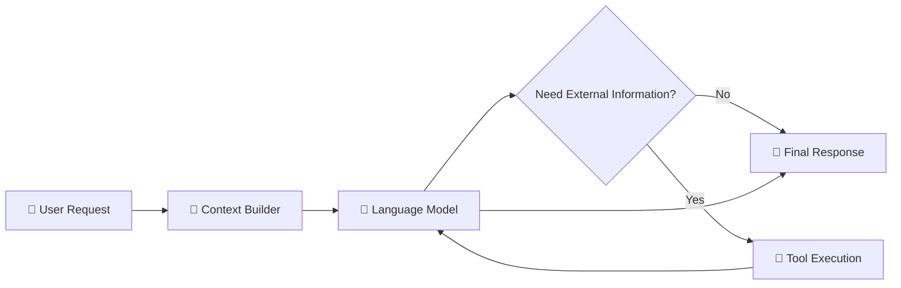
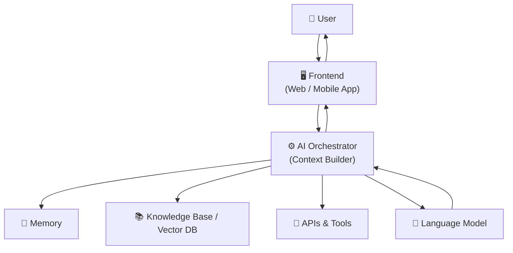

# 1.1 The Lifecycle of an AI Request

Every AI application, whether it's ChatGPT, GitHub Copilot, Claude, Gemini, Cursor, or an AI chatbot embedded inside another product, follows the same fundamental lifecycle. While it may seem like the model simply "reads" your question and instantly produces an answer, that's far from what actually happens. Between the moment you press **Enter** and the moment the first token appears on your screen, your request travels through multiple layers of software, infrastructure, retrieval systems, machine learning models, and sometimes external tools. Understanding this lifecycle is one of the most important foundations in AI engineering because almost every modern LLM application is simply an implementation of this pipeline.

At a high level, an AI request moves through five stages: **the user provides an input, the application constructs context, the language model performs inference, external tools are invoked if necessary, and finally the generated response is returned to the user.** Everything else—from RAG systems to AI agents—is essentially an extension of these same building blocks.

---

## User → Context → Model → Tools → Response

Every AI interaction begins with **human intent**.

A user asks a question, uploads a PDF, sends an image, requests code generation, or simply continues a conversation. Although the user's input might only contain a few words, it rarely contains enough information for the model to produce the best possible answer. Before the request even reaches the language model, the AI application starts building something called **context**.

Context is everything the model should know before it starts thinking.

For example, imagine you simply ask:

> Explain this.

To a human sitting beside you, that sentence might make sense because both of you are looking at the same screen. A language model, however, has no such awareness. The application therefore gathers all the relevant information—the uploaded image, previous conversation, system instructions, user preferences, retrieved documents, memories, and any application-specific information—and packages them together into a single prompt.

In modern AI systems, the **prompt is almost never just the user's message.** Instead, it is a carefully constructed document containing instructions, background information, retrieved knowledge, formatting rules, safety policies, tool definitions, conversation history, and finally the user's latest request. This process is often called **context engineering**, and it has become one of the defining aspects of modern LLM application development.

Once the complete context has been assembled, it is sent to the language model. Contrary to popular belief, the model does not search a database for answers, nor does it browse the internet by default. Instead, it performs **inference**—a forward pass through a neural network containing billions of learned parameters.

The text is first broken into smaller pieces called **tokens**, which are converted into numerical vectors. These vectors pass through multiple Transformer layers where attention mechanisms allow every token to interact with every other relevant token in the prompt. Rather than retrieving a stored sentence, the model continuously predicts the **most probable next token** based on everything it has seen so far.

This prediction happens repeatedly.

The first generated token becomes part of the input for generating the second token, the second helps generate the third, and so on. The response is therefore created one token at a time, often hundreds or even thousands of times per request. This is why you see responses streaming onto your screen instead of appearing all at once.

Sometimes the model realizes that it cannot answer using only the information already present in the prompt.

For example, if you ask for today's weather, yesterday's stock price, recent news, your emails, or information inside a company's internal database, the model itself does not possess this information. Instead, it decides to use one or more **tools**.

The application temporarily pauses generation and executes an external system such as:

- a web search engine,
- a calculator,
- a Python runtime,
- a database,
- an API,
- a vector database,
- or another AI model.

The results from these tools are then injected back into the model as fresh context, allowing generation to continue with up-to-date or application-specific information.

Finally, as tokens are generated, they are streamed back through the application. Before reaching the user, the application may perform additional formatting, render Markdown, execute generated code, display citations, generate images, or attach downloadable files. Once this post-processing is complete, the response is presented to the user, completing the lifecycle of the request.

---

## AI Application Architecture Overview

A useful way to understand AI systems is to separate them into layers, just as we separate a traditional web application into a frontend and backend.

The **frontend** is responsible for interacting with the user. It provides the chat interface, handles uploads, displays streaming responses, renders Markdown, shows citations, and collects user input. Everything the user directly sees belongs to this layer.

Behind the frontend sits the **application server**, often called the orchestration layer. This is the brain of the application—not to be confused with the language model itself. The orchestrator authenticates the user, manages conversations, constructs prompts, retrieves documents, invokes tools, stores memory, applies safety policies, and decides which model should process the request.

The language model is only one component of this architecture.

The orchestrator sends the prepared context to an inference server hosting one or more LLMs. During inference, the model generates tokens, but whenever additional information is required, the orchestrator may pause generation and communicate with external systems such as search engines, databases, APIs, vector stores, or code execution environments. The retrieved information is merged back into the prompt, allowing generation to continue seamlessly.

Finally, the completed response travels back through the application server, where it may be formatted, filtered, cached, or enriched before being displayed to the user.

One important observation is that **the language model is no longer the center of modern AI applications**. Instead, the orchestrator has become equally important because it decides **what information the model receives**, **which tools it can access**, **what memories should be included**, and **how the final answer should be presented**. In many production systems, improving context engineering produces larger quality improvements than switching to a slightly larger language model.

---

## The Inference Pipeline at a Glance

Although inference may appear almost instantaneous, a considerable amount of work happens behind the scenes.

The application first receives the user's request and constructs the complete prompt. This prompt is tokenized into numerical representations that the model can process efficiently. The tokens then pass through dozens of Transformer layers, where self-attention enables the model to determine which parts of the prompt are most relevant for predicting the next token.

Instead of generating an entire paragraph in one computation, the model predicts **only one token at a time**. After generating each token, that token is appended to the existing sequence, and the entire prediction process repeats. This loop continues until the model reaches a stopping condition such as an end-of-sequence token or a predefined output limit.

If tool calling is enabled, inference may temporarily pause while external systems execute a search, perform a calculation, retrieve documents, or run code. The returned results become additional context, allowing inference to resume with more information than was originally available.

From the user's perspective, all of these operations appear as a single continuous conversation. Behind the scenes, however, dozens of components—including retrieval systems, tokenizers, inference servers, GPUs, databases, APIs, and orchestration services—work together in a carefully coordinated pipeline to transform a short human request into an intelligent response. Modern AI applications are therefore not simply "large language models"; they are distributed software systems built around the language model as one of several interconnected components.
