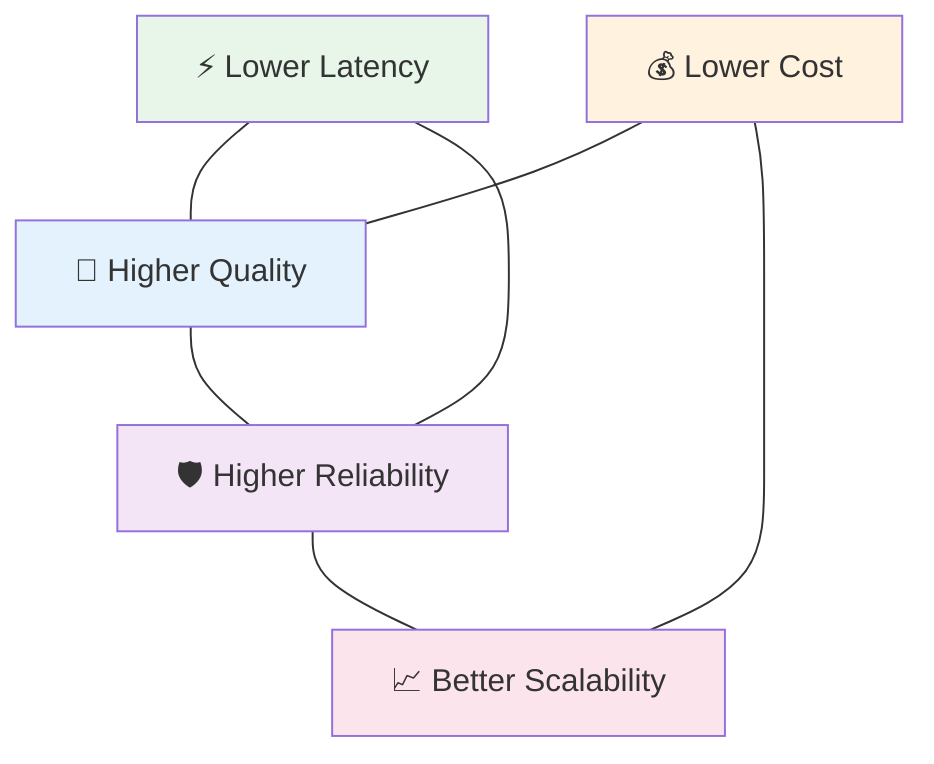

# 1.3 Core Engineering Tradeoffs

An AI application is rarely optimized for a single goal. Making the system faster often reduces answer quality. Using a larger model may improve reasoning but dramatically increase operational costs. Retrieving more documents might reduce hallucinations while simultaneously increasing latency. Running multiple validation steps can improve reliability but make the user wait longer.

These competing priorities are known as **engineering tradeoffs**.

Unlike academic machine learning, where maximizing benchmark accuracy is often the primary objective, production AI engineering is about balancing multiple constraints simultaneously. Every architecture decision—whether choosing a model, designing a retrieval pipeline, or selecting an inference strategy—involves deciding **what you're willing to sacrifice in order to improve something else**.

Throughout this book, you'll notice that there is rarely a universally "best" architecture. Instead, there are architectures that are better suited for particular products, users, and constraints.

---

## Latency

### *The Art of Making AI Feel Instant*

One of the first things users notice about an AI application is not its intelligence—it is its speed.

Latency is the total time taken for a request to travel through the system, beginning the moment a user submits a prompt and ending when the response appears on their screen. Although users often associate latency with "how fast the model is," the language model is only one contributor.

A modern AI request may first pass through authentication, prompt construction, retrieval systems, safety filters, multiple API calls, tool execution, and output formatting before inference even begins. If external tools are involved, additional network requests may further increase response time. Even after the model finishes generating text, the application may still need to render Markdown, upload files, or generate images.

For users, however, none of these implementation details matter.

A response that takes ten seconds feels slow regardless of where those ten seconds were spent.

This explains why production AI systems invest heavily in reducing latency. Developers stream tokens instead of waiting for complete responses, cache frequently used prompts, optimize retrieval pipelines, execute independent tasks in parallel, and route simple requests to smaller models whenever possible.

Interestingly, perceived latency is often just as important as actual latency. Showing the first generated token within a second creates the impression that the system is highly responsive, even if the complete response still requires several more seconds.

---

## Cost

### *Every Token Has a Price*

Unlike traditional software, AI applications have a direct operational cost every time a user interacts with them.

Every prompt consumes tokens. Every generated response consumes additional tokens. Every retrieval request, tool invocation, embedding generation, GPU second, and API call contributes to the overall cost of serving a request.

For small personal projects, these costs may seem negligible.

At production scale, they become one of the largest engineering challenges.

Imagine an application serving ten million requests every day. Increasing the average response length by only one hundred tokens may result in billions of additional generated tokens each month. Similarly, switching from a smaller model to a frontier model might improve answer quality by only a few percentage points while multiplying inference costs several times over.

This is why successful AI products think carefully about **cost efficiency**, not merely capability.

Developers reduce costs by routing requests to models appropriate for the task, compressing conversation history, caching responses, retrieving only the most relevant documents, limiting unnecessary tool execution, and avoiding oversized prompts.

In production systems, reducing cost is rarely about making the AI "worse." It is about ensuring that every token contributes meaningful value to the final answer.

---

## Quality

### *The Pursuit of Better Answers*

Quality is perhaps the most obvious objective of an AI system, yet it is also one of the hardest to define.

What makes one response better than another?

Is it factual correctness?

Is it better reasoning?

Clearer explanations?

Fewer hallucinations?

More natural writing?

The answer depends entirely on the application.

A medical assistant values factual accuracy above creativity. A creative writing assistant values originality. A coding assistant prioritizes syntactic correctness and executable solutions. A customer support chatbot focuses on consistency and helpfulness.

For this reason, quality is not a single metric—it is a collection of characteristics that together determine how useful the response is for the user.

Improving quality often involves much more than upgrading to a larger model. Better retrieval, clearer prompts, structured tool usage, richer context, stronger evaluation pipelines, and domain-specific data frequently produce larger gains than simply increasing model size.

One of the most important lessons in AI engineering is that **better context often beats a bigger model**.

---

## Reliability

### *Building Systems That Behave Predictably*

Users expect AI systems to behave consistently.

If the same request produces completely different answers every few minutes, users quickly lose confidence in the product.

Reliability refers to the ability of an AI application to behave predictably across thousands—or millions—of requests. It encompasses much more than uptime.

A reliable AI system should retrieve the correct documents, invoke the right tools, gracefully handle API failures, recover from network interruptions, avoid producing malformed outputs, respect safety policies, and continue functioning even when external dependencies become unavailable.

Unlike traditional software, reliability in AI systems is challenging because language models are probabilistic rather than deterministic. Two identical prompts may produce slightly different responses due to sampling strategies, temperature settings, or model updates.

To improve reliability, production systems often introduce deterministic workflows around the model. They validate structured outputs, retry failed tool calls, verify generated code before execution, apply guardrails, monitor regressions through evaluation pipelines, and maintain fallback models whenever the primary system becomes unavailable.

In many successful AI products, the surrounding software architecture contributes more to reliability than the language model itself.

---

## Scalability

### Designing for Millions, Not Just One

A prototype that works for a single developer on a laptop is very different from a system serving millions of users simultaneously.

Scalability is the ability of an AI application to maintain performance as demand increases.

When only one request arrives every few minutes, almost any architecture appears successful. Problems emerge when thousands of users begin interacting with the system at the same time.

Inference servers become overloaded.

GPUs run out of memory.

Retrieval systems receive thousands of concurrent searches.

Rate limits are exceeded.

Queues begin to grow.

Latency increases for everyone.

Scalable AI systems are therefore designed with growth in mind. Requests are distributed across multiple inference servers, workloads are balanced dynamically, caching reduces repeated computation, asynchronous processing prevents bottlenecks, and stateless services allow new instances to be added as traffic increases.

Equally important is **horizontal scalability**—adding more machines instead of relying on increasingly powerful individual servers. This philosophy has shaped modern cloud computing and has become equally important in AI infrastructure.

Ultimately, scalability is not simply about handling more traffic. It is about ensuring that the millionth user receives an experience just as responsive and reliable as the first.

---

## The Engineering Triangle

Although we have discussed latency, cost, quality, reliability, and scalability separately, real-world AI engineering rarely allows them to be optimized independently.

Every decision affects multiple dimensions simultaneously.

Choosing a larger reasoning model may improve quality while increasing both latency and cost.

Retrieving additional documents may reduce hallucinations but require more tokens and longer inference times.

Introducing multiple validation steps can improve reliability while making responses slower.

Replacing a frontier model with a smaller model may dramatically reduce costs but lower reasoning capability.

This is why AI engineering is fundamentally an exercise in balancing tradeoffs rather than maximizing individual metrics.

As you continue through this book, you'll discover that nearly every architectural decision can be traced back to these five tradeoffs. Whether you're choosing a language model, designing a retrieval pipeline, implementing an agent, or deploying an inference server, the question is rarely *"What is the best solution?"* The better question is:

> **"Which tradeoff best fits the needs of this application?"**
