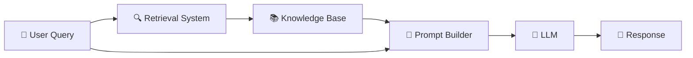
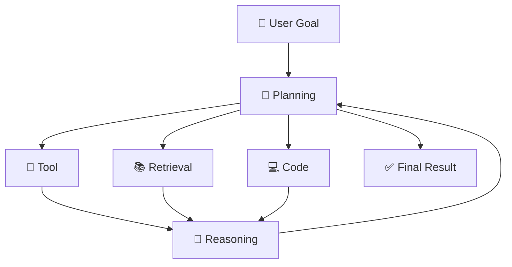

# 1.2 Components of Modern AI Systems

A modern AI application is not just a Large Language Model (LLM). The LLM is only one component in a much larger software system. Around it are prompt builders, retrieval pipelines, memory systems, tool executors, agent frameworks, observability platforms, and evaluation pipelines. Each component has a single responsibility, and together they transform a general-purpose language model into a production-ready AI application.

This shift—from thinking about "the model" to thinking about **the system**—is one of the biggest changes in AI engineering over the past few years. Modern AI products are increasingly **compound AI systems**, where intelligence emerges from multiple cooperating components rather than from the language model alone.

---

# LLMs

The Large Language Model (LLM) is the reasoning engine at the heart of every modern AI application. It is the component responsible for understanding natural language, recognizing patterns, generating text, writing code, answering questions, and reasoning over information.

An important misconception among beginners is that the LLM **contains the entire application**. It does not.

Think of the LLM as an incredibly intelligent employee who has read an enormous portion of the internet, books, research papers, documentation, and source code during training. This employee can understand language remarkably well, but once training is complete, their knowledge becomes largely fixed. They cannot automatically know today's weather, your latest emails, yesterday's GitHub commit, or the contents of your company's database unless someone provides that information during the request.

This explains why modern AI systems spend so much effort building context before the model ever begins generating text.

Internally, an LLM is simply a gigantic neural network built using the **Transformer architecture**, introduced by Google's landmark paper *Attention Is All You Need* in 2017. Instead of memorizing answers, it learns statistical relationships between billions—or even trillions—of tokens during training. During inference, it predicts one token after another, gradually constructing coherent paragraphs, code, or explanations based on everything it has seen in the prompt.

Today, developers rarely train their own LLMs. Instead, they integrate foundation models such as GPT, Claude, Gemini, Llama, Qwen, DeepSeek, or Mistral into larger software systems. The LLM becomes a reasoning engine inside an application rather than the application itself.

---

# Prompt Builders

If the LLM is the brain of an AI application, then the **prompt builder** is the person preparing the information before handing it to the brain.

A beginner might imagine that the model receives exactly what the user typed:

> Explain Transformers.

In reality, production AI applications almost never send such a small prompt.

Instead, the prompt builder constructs a much larger document containing system instructions, safety rules, conversation history, retrieved documents, user preferences, formatting instructions, tool definitions, memory, and finally the user's latest request. By the time the model receives the prompt, the original message might represent only five percent of the total input.

Prompt builders exist because LLMs do not possess working memory between requests. Every request is independent unless the application explicitly reconstructs previous context.

Modern prompt builders are therefore much more than string concatenation utilities. They dynamically assemble prompts based on the user's request, select relevant memories, retrieve documents, inject tool descriptions, manage token budgets, remove unnecessary information, and ensure that the most important context fits within the model's context window. As AI systems become larger and more sophisticated, prompt engineering is evolving into **context engineering**—the discipline of deciding *what information the model should receive*, not merely *how instructions should be worded*.

---

# Retrieval Systems

One of the biggest limitations of language models is that they only know what they learned during training. They cannot magically know the latest company policy, today's news, or the contents of a private PDF uploaded five seconds ago.

Retrieval systems solve this problem.

Instead of expecting the model to remember everything, the application stores external knowledge separately. Whenever a request arrives, the retrieval system searches through documentation, PDFs, databases, vector stores, or company knowledge bases and finds the pieces of information most relevant to the user's question.

These retrieved documents are then inserted into the prompt before inference begins.

This architecture is known as **Retrieval-Augmented Generation (RAG)**.

The beauty of RAG is that the model doesn't become smarter—it simply becomes **better informed**. Rather than retraining a billion-parameter model every time documentation changes, developers only update the knowledge base. The retrieval pipeline ensures the model always receives the latest information at runtime.

This separation between reasoning (the LLM) and knowledge (the retrieval system) has become one of the defining architectural patterns in production AI applications.

---

# Tool Execution

Even with retrieval, the model still cannot directly perform actions.

Suppose a user asks:

> Book a meeting with Sarah tomorrow.

The model can generate a beautiful explanation of how calendar scheduling works, but it cannot actually create the meeting by itself.

This is where **tool execution** enters the architecture.

A tool is any external capability that the model can invoke during inference. Examples include web search, Python execution, SQL databases, GitHub APIs, payment gateways, calculators, image generators, email clients, cloud infrastructure, or internal enterprise systems.

When the model decides it needs one of these capabilities, generation temporarily pauses. The application executes the requested tool, collects its output, inserts the result back into the prompt, and then resumes inference. From the user's perspective, everything appears seamless, even though multiple systems may have communicated behind the scenes.

The language model therefore acts less like a search engine and more like a **reasoning engine that knows when to delegate work**.

As protocols such as the **Model Context Protocol (MCP)** become increasingly common, connecting language models to external software is becoming standardized, making tools a first-class component of modern AI systems.

---

# Agent Frameworks

A single prompt and response is enough for many applications, but not for solving complex problems.

Imagine asking an AI assistant:

> Analyze this repository, identify security issues, write fixes, open a pull request, and summarize everything in a report.

This cannot realistically happen in one model call.

Instead, the AI must break the task into smaller objectives, retrieve documentation, inspect files, call tools, execute code, evaluate intermediate results, recover from failures, and decide what to do next.

This behaviour is what we call an **AI agent**.

Agent frameworks provide the infrastructure required for these multi-step workflows. They manage planning, memory, retries, tool execution, branching logic, task decomposition, and communication between different reasoning steps. Rather than asking the model to solve everything at once, the framework orchestrates a sequence of decisions until the overall objective has been achieved.

In this sense, the LLM acts like a planner, while the agent framework acts like the operating system coordinating every step of execution.

---

# Observability

Traditional software engineers monitor servers, databases, APIs, and network traffic. AI systems require all of that **plus something entirely new**—they need visibility into the model's behaviour.

This discipline is called **LLM observability**.

Suppose users suddenly begin reporting incorrect answers. The application hasn't crashed. CPU usage looks normal. Every API returns HTTP 200. From traditional monitoring tools, everything appears healthy.

Yet the AI is clearly failing.

Observability exists to answer questions such as:

- What prompt did the model receive?
- Which documents were retrieved?
- Which tools were executed?
- How many tokens were consumed?
- Which reasoning path produced the answer?
- Where did latency occur?
- Why did the response become incorrect?

Rather than only measuring infrastructure health, observability captures the complete execution path of an AI request. Developers can replay interactions, inspect prompts, analyze retrieval quality, compare prompt versions, monitor hallucination rates, measure token costs, and identify failure patterns across thousands of requests.

As AI systems become increasingly autonomous, observability is becoming just as essential as logging or debugging in traditional software engineering.

---

# Evaluation Pipelines

Building an AI application is only half the challenge. The other half is ensuring that every change actually improves the system.

Unlike traditional software, AI applications rarely fail with obvious exceptions or crashes. They fail quietly.

A prompt modification might improve one type of question while making another category significantly worse. Swapping to a newer model might reduce hallucinations but increase latency. Adding more retrieved documents could improve factual accuracy while overwhelming the model with unnecessary context.

Without structured evaluation, developers often rely on intuition:

> "The responses feel better."

This approach, sometimes jokingly called the **vibe test**, does not scale.

Evaluation pipelines automate quality measurement. They repeatedly run the AI system against carefully designed datasets, compare outputs with expected behaviour, compute metrics such as accuracy, groundedness, latency, cost, and tool correctness, and immediately detect regressions whenever prompts, retrieval pipelines, or models change.

In production AI engineering, evaluation is no longer considered an optional testing phase. It has become a continuous engineering discipline that allows developers to confidently improve their systems without accidentally making them worse. The most successful AI teams increasingly treat evaluation as a core product capability rather than an afterthought.

---

As you progress through this book, you'll discover that these components rarely exist in isolation. A single user request may travel through a prompt builder, trigger a retrieval pipeline, invoke multiple tools, execute inside an agent framework, generate observability traces, and finally be scored by an evaluation pipeline—all before the response reaches the user. Modern AI engineering is therefore less about building a better language model and more about designing reliable systems around one.
